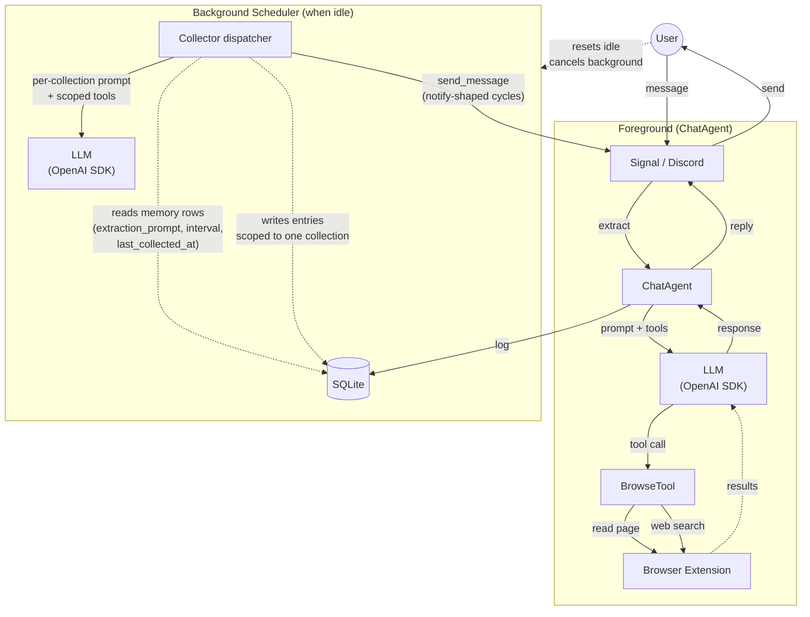

# CLAUDE.md — Penny Chat Agent

## Architecture Overview



- **Channels**: Signal (WebSocket + REST) or Discord (discord.py bot)
- **Ollama**: Local LLM inference (default model: gpt-oss:20b)
- **Vision**: Optional vision model (e.g., qwen3-vl) for processing image attachments from Signal
- **Image Generation**: Optional image model (e.g., x/z-image-turbo) for generating images via the `generate_image` chat tool (config-gated on `LLM_IMAGE_MODEL`)
- **Embedding Model**: Required dedicated embedding model (e.g., embeddinggemma) for preference deduplication and history embeddings — a hard prerequisite (startup fails fast if `LLM_EMBEDDING_MODEL` is unset), so memory never runs in a degraded, embedding-less mode
- **Browser Extension**: Web search and page reading — all web access goes through the connected browser
- **SQLite**: Logs all prompts and messages; stores preferences, thoughts, and conversation history

## Directory Structure

```
penny/
  penny.py            — Entry point. Penny class: creates agents, channel, scheduler
  config.py           — Config dataclass loaded from .env, channel auto-detection
  config_params.py    — ConfigParam + RuntimeParams: runtime-configurable settings with 3-tier lookup
  constants.py        — Enums (SearchTrigger, PreferenceValence), reaction emojis, browse constants
  prompts.py          — LLM prompt templates (chat conversation, vision, email-summarize).  Collector prompts live on memory rows (extraction_prompt) instead
  responses.py        — All user-facing response strings (PennyResponse class)
  startup.py          — Startup announcement message generation (git commit info)
  preflight.py        — Setup-health / preflight checks: one legible startup summary (Preflight → PreflightReport). Hard-fails (PreflightError, caught in main → exit 1) on an unreachable LLM endpoint or an unresolvable chat/embedding model; soft-warns on a missing vision/image model, a disconnected browser addon, or a mis-routed primary channel (routing-bug guard). Runs in Penny.run() after channel connectivity, before backfills
  datetime_utils.py   — Timezone derivation from location (geopy + timezonefinder)
  agents/
    base.py           — Agent base class: agentic loop, tool execution, Ollama integration
    models.py         — ChatMessage, ControllerResponse, MessageRole, ToolCallRecord, GeneratedQuery
    chat.py           — ChatAgent: conversation-mode agent (handles user messages with tools)
    self_state.py     — SelfStateHeader: renders Penny's operational self-state (active mechanisms · recent activity — runs, config mutations, and autonomous sends (#1568) interleaved · store map · durable user facts) into the chat prompt's dynamic tail, deterministically from the registry + ledger (#1555, the ambient inversion)
    collector.py      — Collector: single dispatcher agent driving every per-collection extractor
  scheduler/
    base.py           — BackgroundScheduler + Schedule ABC
    schedules.py      — PeriodicSchedule implementation
    send_queue_drainer.py — SendQueueDrainer: delivers queued send_message output on the send cooldown
  commands/
    __init__.py       — create_command_registry() factory
    base.py           — Command ABC, CommandRegistry
    models.py         — CommandContext, CommandResult, CommandError
    config.py         — /config: view and modify runtime settings
    index.py          — /commands: list available commands
    profile.py        — /profile: user info collection (name, location, DOB, timezone)
  tools/
    base.py           — Tool ABC (declares `args_model` + `run()`: validate args via the Pydantic model, then `execute`), ToolRegistry, ToolExecutor (drives `tool.run`)
    models.py         — ToolCall, ToolResult (uniform structured tool return: message/success/mutated/source_urls/narration), ToolDefinition, and per-tool arg models
    browse.py         — BrowseTool: web search and page reading via browser extension. Optional `extract` micro-instruction (#1588): full page content goes to a fresh single-shot micro-context and only the typed value + fetch handle return to the main loop
    micro_context.py  — MicroContext: single-shot extraction over bulk content (content + instruction, no tools) via the shared model client; output contract enumerated on both sides (EXTRACTED:/NOT_PRESENT: tags, deterministic parse; untagged → one reroll → honest failure); poison screened + re-rolled by the text_validity detectors; returns a small typed MicroContextResult
    generate_image.py — GenerateImageTool: image generation via OllamaImageClient; stored to media, delivered deterministically by id to its own reply (ToolResult.media_id → ControllerResponse.generated_media_ids → send_response) (chat-only, gated on LLM_IMAGE_MODEL)
    content_cleaning.py — Post-processing for browse results (strips navigation, proxy images, boilerplate)
    search_emails.py  — SearchEmailsTool (JMAP + Zoho) — chat surface, config-gated on a mailbox
    read_emails.py    — ReadEmailsTool (JMAP + Zoho) — summarizes fetched bodies against the current message
    list_emails.py    — ListEmailsTool (folder listings; Zoho only)
    list_folders.py   — ListFoldersTool (available mailboxes; Zoho only)
    draft_email.py    — DraftEmailTool (compose + stage draft; Zoho only). All five retired the /email + /zoho commands (epic #1445) — built per turn by ChatAgent's email_tools_builder; NL-dispatch contract: tests/eval/test_email_dispatch.py
    notifications.py  — NotificationsMuteTool / NotificationsUnmuteTool: chat-surface tools over the MuteState row (`db.users`); retired /mute + /unmute
    skill_args.py     — Pydantic arg models for the skill tool surface (skill_create / skill_read)
    skill_tools.py    — `SkillCreateTool` / `SkillReadTool` (#1590): skill authoring by reference to the ledger (certified-by-execution + provenance-inferred holes) and list/render. Chat-only (rides the lifecycle gate in `build_memory_tools`; a cadence collector follows rendered text and never touches skills)
    collection_instantiation.py — the `collection_create` front door's pure pieces (#1591): the skill-resolution union (MATCHED/AMBIGUOUS/NO_SKILL_FOUND/EMBED_FAILED) + its enumerated renders (incl. the #1471 "walk me through it once" elicitation), the idempotency-at-birth results (#1567 active-duplicate refusal + tombstone confirm-shape), the trigger-union parse (`interval` | `run_at`+`max_runs`) + `expires_at`, and the creation echo. DB-free, whole-render tested; the tool (`CollectionCreateTool`) orchestrates embed/resolve/validate/dedup/create
    memory_args.py    — Pydantic arg models for the memory tool surface
    memory_tools.py   — Tool subclasses: each funnels through `db.memory(name)` (the single dispatch) and calls a method on the returned `Memory` object, which refuses wrong-shape ops (collection ops on a log, log_read on a collection) via a base no-op (`WrongShapeError`) and read-only facades via `ReadOnlyMemoryError` — no tool branches on a name or shape. read_similar + memory_metadata are shape-agnostic; `find_mine` (#1558) resolves any object by meaning across the whole registry (collections + logs, archived included) + `skills` entries, plain-cosine, returning each hit's exact identity fused with the deterministic addressing (which tool operates on it) — the guess-free fallback every not-found error (MemoryNotFoundError) points at. build_memory_tools(db, embedding_client, author) factory
  channels/
    __init__.py       — create_channel() factory, channel type constants
    base.py           — MessageChannel ABC, IncomingMessage, shared message handling
    signal/
      channel.py      — SignalChannel: httpx for REST, websockets for receive
      models.py       — Signal WebSocket envelope Pydantic models
    discord/
      channel.py      — DiscordChannel: discord.py bot integration
      models.py       — DiscordMessage, DiscordUser Pydantic models
  database/
    database.py       — Database facade: thin wrapper creating domain stores
    knowledge_store.py — KnowledgeStore: summarized web page content for factual recall
    message_store.py  — MessageStore: log_message, log_prompt, log_command, threads
    thought_store.py  — ThoughtStore: inner monologue persistence
    preference_store.py — PreferenceStore: add, query, dedup, embedding management
    send_queue_store.py — SendQueueStore: durable outbound queue (enqueue, next_pending, mark_sent)
    user_store.py     — UserStore: get_info, save_info, mute/unmute
    memory/           — the memory layer: `Memory` (base, memory_entry row access + shared similarity/cursor reads + shape-op no-ops) → `Collection` / `Log`, and the read-only facades `MessageLogMemory` (messagelog) / `RunLog` (promptlog); `MemoryStore` registry + the `memory(name)` dispatch factory; `types` (enums, errors, inputs); `_similarity` (pure dedup + retrieval math); `LoggedToolCall` (the canonical round-trippable logged-call shape, #1560). `db.memory(name)` returns the right object; `db.memories` is the registry
    mutation_store.py — `MutationStore` (`db.mutations`): the registry-mutation event ledger (#1560) — records + reads create/update/archive/unarchive events (entity, run, actor, what changed) via `mutation_event`; plus `MutationDetail` / `EnumeratedDecision` (the options-presented record shape) and `render_mutation`
  skills.py         — the skill substrate (#1590): pure step/hole models (`SkillStep`/`SkillHole`/`SkillSubstitution`, the `LoggedToolCall` shape + provenance-tagged leaves), `distill_steps` (hole/binding/constant inference by provenance), and `render_skill` (steps + bound params → the numbered TEXT `extraction_prompt`). No engine, no tool imports
  skill_store.py    — `SkillStore` (`db.skills`): the versionless skill registry — `upsert` (create or REPLACE by name), `get`, `list_all`, `resolve_by_meaning` (description-anchor cosine ranking, the fuzzy leg of #1591's name-or-meaning resolution), and (de)serialization of the structured `steps`/`holes` JSON
    cursor_store.py   — CursorStore: per-agent read cursors into log-shaped memories
    media_store.py    — MediaStore: browsed images, matched to outgoing text by embedding at egress (generated images deliver by id to their own reply, then join this pool)
    models.py         — SQLModel tables (see Data Model section)
    migrate.py        — Migration runner: file discovery, tracking table, validation
    migrations/       — Numbered migration files (0001–0025)
  llm/
    client.py         — LlmClient: OpenAI SDK wrapper (chat + embed + list_models via /v1/models) for any OpenAI-compatible backend (Ollama, omlx, etc.). list_models translates SDK errors into the LlmError hierarchy so the preflight can tell an unreachable endpoint from an unverifiable one
    image_client.py   — OllamaImageClient: Ollama-specific HTTP client for image generation and model listing
    models.py         — LlmMessage, LlmResponse, LlmToolCall, LlmError hierarchy (SDK-decoupled Pydantic types)
    embeddings.py     — Re-exports serialize/deserialize/cosine from shared similarity/ package
    similarity.py     — Penny-specific: embed_text, sentiment scores, novelty, preference vectors
  email/
    protocol.py       — EmailClient Protocol — shared interface for JMAP + Zoho email backends
  jmap/
    client.py         — JmapClient: Fastmail JMAP API client (httpx)
    models.py         — JmapSession, EmailAddress, EmailSummary, EmailDetail
  zoho/
    client.py         — ZohoClient: Zoho Mail API client (httpx + OAuth refresh)
    models.py         — Zoho Mail API Pydantic models
  validation/         — Model-I/O validation: the one behaviour taxonomy + the live disposition machinery
    conditions.py     — The behaviour taxonomy (keystone): ConditionKey + BehaviorCondition + CATALOG; one catalog of every condition we classify Penny's behaviour through (supersedes ValidationReason + RunHealthFlag). Dependency-light leaf
    outcomes.py       — ValidationOutcome disposition union (Proceed/Retry/Repair/RejectToolCall/NudgeContinue/Stop), ResponseValidator protocol, LoopContext, run_validators
    response_validators.py — Concrete validators (xml/empty/refusal/hallucinated-url/premature-done/text-instead-of-tool/done-json-bail/repairs), composed per-agent. NOT re-exported from __init__ (imports tools.memory_tools → database; would cycle)
  html_utils.py       — Shared HTML text extraction helpers
  text_validity.py    — Content-validity predicates (degenerate/blank/half-formed-send/description/extraction-prompt/**degeneration-collapse run**/**leaked-Harmony-envelope**), dependency-light leaf shared by the memory write path, the tool arg-validators (memory_args + send_message), the collector readiness gate, the run-health classifier, and the agent-loop reroll guard (`is_degenerate_run` + `has_leaked_harmony_envelope`)
  tests/
    conftest.py       — Pytest fixtures for mocks and test config
    test_embeddings.py, test_similarity.py, test_periodic_schedule.py, test_scheduler.py
    mocks/
      signal_server.py  — Mock Signal WebSocket + REST server (aiohttp)
      llm_patches.py    — MockLlmClient: patches openai.AsyncOpenAI for chat + embed
    agents/           — Per-agent integration tests
      test_chat_agent.py, test_collector.py, test_agentic_loop.py,
      test_context.py
    channels/         — Channel integration tests
      test_signal_channel.py, test_signal_reactions.py, test_signal_vision.py,
      test_signal_formatting.py, test_startup_announcement.py
    commands/         — Per-command tests
      test_commands.py, test_config.py, test_debug.py,
      test_system.py, test_test_mode.py
    database/         — Migration validation tests
      test_migrations.py
    jmap/             — JMAP client tests
      test_client.py
    tools/            — Tool tests
      test_tool_timeout.py, test_tool_not_found.py, test_tool_reasoning.py,
      test_send_message.py, test_notifications.py, test_email_tools.py
Dockerfile            — Python 3.14-slim
pyproject.toml        — Dependencies and project metadata
```

## Agent Architecture

### Agent Base Class (`agents/base.py`)
The base `Agent` class implements the core agentic loop:
- Calls the LLM (via `LlmClient`) with available tools
- Executes tool calls via `ToolExecutor` with parameter validation
- Handles duplicate tool call prevention
- Appends source URLs to responses when model omits them

**System prompt building (template method pattern):**
Each agent overrides `_build_system_prompt(user)` to compose its prompt from reusable building blocks on the base class: `_identity_section()`, `_profile_section()`, `_instructions_section()`, `_context_block()`. No flags or conditionals — each agent explicitly declares what goes in its prompt. Tests assert on the exact full system prompt string to catch structural drift.

**The ambient inversion (#1555)**: the chat system prompt **no longer injects speculative user-content recall**. Instead it opens (in the dynamic tail) with a deterministic **`SelfStateHeader`** (`agents/self_state.py`) — Penny's own operational situation rendered from the registry (`memory` rows) + ledger (`promptlog` runs + `mutation_event`), never a relevance guess: active mechanisms (status · cadence · expiry · last-run outcome), recent activity (runs + config mutations, interleaved, at rollup altitude), the store map (the read index), the durable user-fact core (name · timezone · location), and a pointers line naming the fetch tools. User content is fetched **on demand** via those tools, anchored by the user's message. Taught-behavior firing via ambient `skills` recall is **dark until #1471** re-homes it onto a dedicated channel.

The two-stage recall **machinery below still exists at the store level** (the `inclusion`/`recall` columns and `read_similar_hybrid`/`expand_with_temporal_neighbors` are retained substrate — their removal lands with a later ticket), but it is **no longer wired into the chat prompt**. (The `published` pub/sub column was retired separately by #1557/migration 0086.) The description is kept for the store-level flags and the eventual re-homing.

**Memory recall** was the single mechanism for surfacing memory contents in the system prompt, assembled in **two stages** (the `inclusion`/`recall` flags on `memory` rows):

1. **Stage 1 — collection routing** (`inclusion` flag: `always` / `relevant` / `never`): decides whether a memory participates at all. `always` is unconditional; `relevant` collections **compete** — only the top `RECALL_TOP_K` (default 1) by **current-message** cosine to the memory's content-reflective `description` anchor, clearing `MEMORY_INCLUSION_THRESHOLD` (default 0.40), are admitted; `never` is excluded. This is the prompt-shortening gate — off-topic collections drop out and only the single on-topic collection surfaces (not the long tail of adjacent ones). Scoring on the *current message alone* (not the whole history window) stops a collection from staying "sticky" across later, unrelated turns. `_included_memories`/`_top_relevant` in `agents/chat.py`. (An audit of real chat turns found ~43 recalled entries/message, mostly off-topic; competitive top-1 + current-message anchor is the pare-down.)
2. **Stage 2 — entry rendering** (`recall` flag: `all` / `relevant` / `recent`): for each included memory, picks which entries surface. `recent` is the newest-first slice; `all` is the full set; `relevant` is a hybrid ranking (embedding cosine fused with IDF-weighted lexical coverage via reciprocal-rank fusion, top-N, **no floor** — stage 1 already decided relevance). Lexical fusion surfaces instruction-shaped entries (skills, recipes) whose absolute cosine is low but whose vocabulary overlaps the query.

There is no bespoke per-section retrieval — knowledge, likes, dislikes, thoughts, skills, etc. all surface via this one path. The two flags are orthogonal: e.g. `inclusion=relevant, recall=all` shows every entry but only when the conversation is on-topic.

The chat turns array (alternating user/assistant messages passed via `history=`) is independent of the recall flag — it is reconstructed from the last N messages in `db.messages` regardless of which memories are active.

### Shared LLM Client Instances

All `LlmClient` instances are created centrally in `Penny.__init__()` and shared across agents and commands. `LlmClient` uses the OpenAI Python SDK and targets any OpenAI-compatible endpoint (Ollama's OpenAI-compat layer by default, or omlx/OpenAI cloud with a different `base_url`):

- `model_client`: Text model for all agents and commands
- `vision_model_client`: Optional vision model for image understanding
- `embedding_model_client`: Required embedding model for preference deduplication and similarity recall (always present — the model is a hard prerequisite)
- `image_client`: `OllamaImageClient` for the `generate_image` chat tool (image generation uses Ollama's native REST API, not OpenAI-compatible); wired into the ChatAgent, which registers `generate_image` only when it is present

### Specialized Agents

**ChatAgent** (`agents/chat.py`)
- Handles incoming user messages with the full tool surface (memory + browse)
- Chat-surface tools include `notifications_mute` / `notifications_unmute` (`tools/notifications.py`) — thin toggles over the `MuteState` row (`db.users`) that the model dispatches from natural language ("stop messaging me for a while" / "you can message me again"), replacing the retired `/mute` + `/unmute` commands. NL-dispatch contract: `tests/eval/test_notifications.py`
- Email tools (`search_emails` / `read_emails`, plus `list_emails` / `list_folders` / `draft_email` on Zoho) are config-gated — present only when a mailbox is configured (Fastmail via `FASTMAIL_API_TOKEN`, Zoho via its OAuth triple; both behind the `EmailClient` protocol), retiring the `/email` + `/zoho` commands (epic #1445). Both configured → Fastmail wins (single user, one mailbox). The mailbox client is long-lived (built in `Penny._init_email`, closed in `shutdown`); `ChatAgent._email_tools_builder(user_query, today)` wraps it fresh each turn so `read_emails` summarises against the current question. A seeded skill (migration 0078) is the NL trigger. NL-dispatch contract: `tests/eval/test_email_dispatch.py`
- Likes/dislikes are dispatched from natural language onto the `likes` / `dislikes` memory collections via the always-present memory tools (`collection_write` / `collection_delete_entry` / `collection_read_latest`), replacing the retired `/like` + `/unlike` + `/dislike` + `/undislike` commands (epic #1445). Add ("I'm really into X"), remove-by-meaning ("forget about X" — matched by meaning, never exact text), and list ("what am I into?") are taught by seeded skills (migration 0079). These collections are what the ambient extractor fills and recall reads; the legacy `preference` table is untouched (its fate is #1301). NL-dispatch contract: `tests/eval/test_likes_dislikes.py`
- Prompt: identity + (page hint) + instructions + the **self-state header** (`SelfStateHeader`, the dynamic tail — active mechanisms · recent activity · store map · durable user facts, rendered deterministically from the registry + ledger). No speculative user-content recall (the ambient inversion, #1555); user content is fetched on demand via the tools the header's pointers name
- Conversation history flows independently as alternating user/assistant turns passed via `history=`
- Vision captioning: when images are present and vision model is configured, captions the image first, then forwards a combined prompt to the text LLM
- Image generation: when an image model is configured, the `generate_image` tool is registered (mirroring the retired `/draw` command's conditionality). It generates the image via `OllamaImageClient`, stores it in the `media` table with an embedding of the description, and returns a text result naming what was drawn plus the stored row's id on `ToolResult.media_id`. The loop threads that id onto `ControllerResponse.generated_media_ids` and the channel attaches **exactly that row** to the mirror-back reply at egress (`send_response(media_ids=...)`) — a deterministic generate→deliver link, not a fuzzy match, so a just-drawn image always lands on the reply that describes it (nothing travels through the model). The embedding keeps the drawn image matchable by the nearest-image ladder for future replies

**Collector** (`agents/collector.py`)
- One dispatcher agent for every kind of background extraction.  Each tick it picks the most-overdue ready collection from the `memory` table (where `extraction_prompt IS NOT NULL` and `now - last_collected_at >= collector_interval_seconds`), binds itself to that target via `self._current_target`, runs the agent loop with the target's extraction prompt as instructions and a tool surface scoped to writes against that single collection, then stamps `last_collected_at = now`.
- **Cursor gate (skip-when-no-new-input)** (`_input_pending`/`_live_cursors`, in `_is_ready` after the interval floor): a *log-driven* collection — one that reads a log via `log_read`, leaving a read cursor — is skipped **without entering the model** whenever every one of its live input logs is caught up (`head <= last_read_at`, probed with the same bounded `read_batch` the collector itself uses, uniform across the `messagelog`/`promptlog` facades and real logs). The cursors a collection already holds *are* its declared inputs (no separate spec); the gate ORs across them (any input behind → run). A cursor whose log the current `extraction_prompt` no longer names — left by a since-dropped `log_read` — is pruned (exact identifier substring match) so it can't lie about what the collection consumes. A collection with no live cursor (generative/browse-driven, or one that picks from another *collection*) returns `None` from `_input_pending` — not gate-eligible, runs on its plain interval. This is what lets a quiet log stop a collector cold yet have it resume the instant the log moves, without the catch-up lag a stretched throttle interval caused.
- Replaces what used to be four bespoke agents: preference-extractor, knowledge-extractor, thinking, notify.  Each is now just a row in the `memory` table with its own `extraction_prompt` and `collector_interval_seconds`.
- **Emission is a collection PROPERTY** (`notify` flag, #1557): notification is not a separate consumer — the composed collector prompt is **one continuous numbered program** assembled by `Collector._compose_prompt`: the stored `extraction_prompt` (steps `1..A`, **no `done()`** — a skill render cannot produce one since the chat ledger has no `done` tool, and migration 0087 stripped the legacy seeds' terminal done steps), then — when `notify=true` — the notify steps `A+1..A+4` (`Prompt.COLLECTOR_NOTIFY_STEPS`: read_similar ×2, compose, send_message), then the **injected terminal `done()`** (`Prompt.COLLECTOR_DONE_STEP`) — always, exactly once, owned by assembly (`_injected_steps`/`_max_step_number`: `A` = the highest `^\d+.` leading step number, 0 for unnumbered prose so injected steps start at 1). So a `notify=true` collector gathers, writes, and — in the SAME cycle — reads related past messages, composes a message, and `send_message`s it. Nothing injected is ever written into the stored `extraction_prompt` (uniform for skill-backed and legacy hand-authored collections). A **write-gate STOP** on a no-change cycle (`KEY_EXISTS_UNCHANGED`) ends the run at the chokepoint before the later steps, so no-news never notifies — structurally. The chat agent maps a user's "tell me / keep me posted" request onto the `notify` flag (a `collection_create(notify=…)` param, or `collection_update(notify=…)`); it must NOT add a `send_message` step to a stored prompt. This retired the pub/sub layer (#1557, migration 0086): the `notifier` consumer, the `published` column, `read_published_latest`, and the collector's consumer gates are gone; `send_message` reaches the collector surface only through the injected notify steps. (History: migration 0068 folded the thoughts pipeline onto the old pub/sub model, removing `collection_move` — `collection_merge` still uses the `move` *method* internally; 0086 then moved thoughts onto the `notify` flag.)
- System collections currently driven by collectors:
  - `likes` / `dislikes` — extract user preferences from `user-messages` (300s)
  - `knowledge` — summarize web pages from `browse-results` (300s)
  - `thoughts` — inner-monologue producer (migration 0068): picks a random like, browses, drafts a thought, dedups against itself, writes (`notify=true` since #1557/0086, so its collector's notify suffix delivers each new one; `inclusion=relevant`, so past thoughts surface in chat). Replaces the old `unnotified-thoughts` → `notified-thoughts` move-drain pair (5400s)
  - `skills` — reusable, topic-agnostic workflow patterns the chat agent follows (TRIGGER + STEPS entries surfaced via recall). **Grounded in the real collections that exist** (migration 0069): each cycle the collector calls `collection_catalog` (every user-built collection's intent + extraction_prompt, framework collectors hidden), distils the *kind* behind each, and reconciles against the existing skills — leaving a skill that already covers the kind, folding a *generalizable* recipe improvement into the matching skill's embedded extraction_prompt template (e.g. a collection that grew a "cross-check a reference source" step), but leaving collection-specific quirks (a tag prefix, a skipped media type) in that collection's own prompt, and never deleting. Replaces the old chat-reading loop that minted one-off skills from corrections that never recall-matched. Operate-the-system skills (archive/cadence/flip/scope/one-shot) have no source collection, so the loop never touches them; build-pattern skills (research-notify/silent) refine in place as collections drift. **A skill is always a positive recipe — a TRIGGER (the intent + example phrasings) and numbered tool-call STEPS — never a negative prohibition.** "Don't do X" warnings tied to a since-removed structure (e.g. "don't add a send_message step") are dead weight: the model has no memory of the old structure to need warning against, and the positive form (set `notify: true`) already says everything. Migration 0069 rewrote the seeded skills into this one clean shape; 0086 (#1557) swapped their `published` teaching to `notify` (21600s)
  - `notifier` — **RETIRED** (migration 0086, #1557): the former pub/sub consumer that drained `published` collections via `read_published_latest` and delivered each new entry once. Emission is now a collection property (the `notify` flag + the run-time notify suffix), so the consumer was archived (a visible tombstone) and its `published` side-channel dropped. The seeded row survives archived; nothing dispatches it.
  - `quality` — **RETIRED** (migration 0089, #1569): the former self-correcting collector (seeded 0055, refined through 0073). It reviewed recent runs via `log_read("collector-runs")` and, on confirmed drift, *suggested* a rewritten `extraction_prompt` to the user for approval. It existed to correct drift in prompts **generated from prose** — the model improvising an `extraction_prompt` from a description. That authoring channel is gone (#1590/#1591): a collector's prompt is now a deterministic render of a taught skill, and a wrong prompt is fixed by the **user re-teaching the skill** (re-teach REPLACES it; the collection re-renders) — no prose-generation step left to review, so the model-judgment reviewer retired with the failure mode. Archived (a visible tombstone; `SYSTEM_COLLECTIONS` hides the shell); nothing dispatches it. The shared **`render_run_record`/`classify_run`** run-record machinery it read STAYS — the self-state header and the addon's prompts tab still consume it. That record is now GENERATED from the run's canonical ledger rows (its tool calls + write-gate outcomes + structural counts): `[target] <outcome>` header (the run's structural `RunOutcome`, or the write-gate stop reason — never a model summary; `done()` is argless, #1569) + a structural I/O counts line (`browses: A ok, B failed · reads · writes · sends`) + run-health `⚠` flags + the run's tool trace incl. `done()`. `classify_run` flags five failure modes structurally from stored data: `bailed` (`⚠ NO WORK DONE`), `no_writes` (`⚠ NO WRITES` — a browse failed AND the run wrote nothing), `incomplete` (`⚠ INCOMPLETE`), `tool_failures` (`⚠ TOOL FAILURES (n)`), `degenerate_send` (`⚠ HALF-FORMED SEND`).
- User-defined collections created via chat (`collection_create`, which now INSTANTIATES a skill — the skill's steps render into the collection's `extraction_prompt`, #1591) are picked up automatically on the next tick — no restart required.
- Tool surface: reads (unrestricted — including `collection_catalog`, which lists every user-built collection's description/intent/notify/extraction_prompt, hiding logs + the framework collectors in `PennyConstants.SYSTEM_COLLECTIONS`; this is what the `skills` loop reads to reground on real collections) + entry mutations (`collection_write`, `update_entry`, `collection_delete_entry`) pinned to the bound target via the `_memory_scope()` hook + `log_append` + `send_message` (when channel wired) + browse + done — uniform across every collection. **The registry-shape lifecycle tier is absent** (`collection_create` / `collection_update` / `collection_merge` / archive / `log_create`, #1556): a cadence run reads, writes entries, browses, and notifies — it cannot create, reconfigure, or archive a mechanism (`_include_lifecycle_tools()` → False). `done()` is the argless terminal sentinel (#1569) — the run record is generated from the ledger, so it carries no `success`/`summary` to confabulate.
- Cadence: `COLLECTOR_TICK_INTERVAL` (default 30s, idle-gated) drives the dispatcher; per-collection `collector_interval_seconds` controls each collection's pacing within that.
- **Auto-throttle** (`_apply_throttle`, runs after each non-cancelled cycle): the **fallback** for collections the cursor gate can't reach — generative/collection-driven ones with no live log cursor. Log-driven collections are **exempt** (a live cursor → early return): the gate skips their idle ticks before they run, so they never idle their way into a wider interval — and widening one would only re-introduce the catch-up lag the gate removes (new log entries waiting out a stretched floor). For the non-exempt fallback: after `COLLECTOR_THROTTLE_AFTER` (default 3) consecutive idle cycles a collection doubles its `collector_interval_seconds` (capped at `COLLECTOR_MAX_INTERVAL`, default 604800 = weekly) and resets its idle counter; a productive cycle snaps the interval back to `base_interval_seconds` (the user's intended cadence, stamped on create and re-set when the interval is edited) and clears the counter. (Migration 0064 resets all collectors' throttle state to base for the gate's clean slate.) "Produced work" (`_produced_work`) reads the per-call `ToolCallRecord.mutated` flag — set from each tool's structured `ToolResult` — so it counts a cycle as work only when a tool *actually changed durable state* (a row written, an entry moved/deleted, a message sent). A successful no-op (a duplicate-rejected write, an update/delete/move on a missing key, a muted/cooled-down send) carries `mutated=False` and reads as idle, unlike the old "a write tool didn't error" heuristic which counted duplicate-rejected writes as work and starved the throttle. Reads + `done()` = idle. Deterministic in Python — not the quality/model layer.
- **Scoped tool surface (#1556)**: a cadence-fired collector run cannot reshape the registry — the lifecycle tier (`collection_create` / `collection_update` / `collection_merge` / `collection_archive` / `collection_unarchive` / `log_create`) is ABSENT from its surface (a background poll has no business re-architecting the system). The run type declares this via `Collector._include_lifecycle_tools()` (template method → `build_memory_tools(..., include_lifecycle=False)`); the chat agent keeps the lifecycle tools (the user evolves collections through them). `_collector_tool_surface` mirrors the mask, so an `extraction_prompt` naming a lifecycle tool is rejected at authoring time.
- **Once-shaped trigger (#1556)**: two nullable `memory` columns — `run_at` (delay the first fire until a UTC time) and `max_runs` (retire the collection after that many completed cycles, via the system-actor archive path so the row stays a visible tombstone in the archived-inclusive catalog). Store-level only; the model-facing `collection_create` exposure is #1562's (`start_at`/`review_by` also defer there). A one-shot reminder is `run_at` + `max_runs=1`: it fires once at/after `run_at`, then archives itself. `_is_ready` honors `run_at`; `_archive_if_run_limit_reached` reads the completed-run count from the ledger (`db.messages.count_completed_runs`, cancelled runs excluded) after each cycle. Replaces the retired `schedule` mechanism (its executor injected a stored `prompt_text` as a synthetic user turn — now there are exactly two run entry points, chat turn and collector cycle).

## Scheduler System

The `scheduler/` module manages background tasks:

### BackgroundScheduler (`scheduler/base.py`)
- Runs tasks in priority order (send-queue drainer → collector dispatcher)
- **Skips agents with no work**: when an agent returns False, continues to the next eligible schedule in the same tick. Only breaks when an agent does real work.
- Tracks global idle threshold (default: 60s)
- Notifies schedules when messages arrive (resets timers)
- Passes `is_idle` boolean to schedules (whether system is past global idle threshold)
- **Cancels active background task** when a foreground message arrives (`notify_foreground_start()` calls `task.cancel()`), freeing Ollama immediately for the user's message. Cancelled tasks are idempotent — unprocessed items stay in their queues and are re-picked up on the next cycle
- Commands do NOT interrupt background tasks — they run cooperatively

### Schedule Types (`scheduler/schedules.py`)

**PeriodicSchedule**
- Runs periodically while system is idle at a configurable interval
- Used for the **SendQueueDrainer** (idle-gated, `SEND_QUEUE_DRAIN_INTERVAL` 60s — scheduled before the collector so queued messages deliver promptly) and the Collector dispatcher (idle-gated, COLLECTOR_TICK_INTERVAL default 30s); per-collection cadence lives on `memory.collector_interval_seconds`
- Tracks last run time and fires again after interval elapses
- Resets when a message arrives

Schedules run a `ScheduledTask` (`scheduler/base.py`) — a structural Protocol (`name` + `async execute() -> bool`). The `Collector` satisfies it, and so does the non-LLM `SendQueueDrainer`.

## Channel System

### MessageChannel ABC (`channels/base.py`)
- Defines interface: `listen()`, `wait_until_ready()`, `_send_raw()`, `send_typing()`, `extract_message()`
- Implements shared logic: `handle_message()`, `send_message()`, `send_response()`, `_log_and_send()`, `_typing_loop()`
- Holds references to chat agent, database, and scheduler
- **Startup readiness before proactive sends**: `Penny.run()` starts `channel.listen()` and the scheduler before startup notifications. Startup announcement/profile prompts run in a separate task that awaits `channel.wait_until_ready()` first. Channels whose send path depends on listener startup override readiness (`DiscordChannel` waits for its `_ready` event); channels that can send immediately inherit the no-op default. This prevents proactive startup sends from deadlocking before listeners such as the browser WebSocket server bind.
- **Outgoing chokepoint — every send is logged**: `_send_raw()` is the single abstract per-channel delivery primitive (the raw Signal REST / Discord / browser-WS send) and does NO logging. Both concrete base methods funnel through `_log_and_send()`, which logs an `OUTGOING` row to `messagelog` (so it surfaces in the `penny-messages` facade) immediately before calling `_send_raw()` — so nothing Penny sends can bypass the conversation record. `send_message(recipient, content, ...)` is the plain path (command results, error notices, onboarding/profile prompts, threading rejections, permission prompts, startup announcements) — it logs the text but computes no embedding and attaches no media (the embedding is filled by the startup backfill) and returns the platform external id. `send_response(recipient, content, parent_id, author, ...)` is the conversational path (chat replies, queued collector sends via the drainer, scheduled tasks) — it additionally embeds the text (stored on the row + reused for nearest-image matching) and returns the DB message id. `ChannelManager` overrides only `_send_raw()` to route to the resolved concrete channel, so the inherited base methods log exactly once (using the shared db) and the routed concrete channel never double-logs.
- **Progress tracker hook**: `_begin_progress(message)` is an optional override that returns a `ProgressTracker` (defined in `channels/base.py`). The tracker has two methods: `update(tools)` (called when a tool batch starts) and `clear()` (idempotent, called once on success and once again from the dispatch loop's `finally`). The default `_make_handle_kwargs` wires `progress.update` as `on_tool_start` for free, and the final response is always delivered via `send_response` so attachments and quote-replies work normally. Channels without a progress UI return `None`

### SignalChannel (`channels/signal/channel.py`)
- WebSocket connection for receiving messages
- REST API for sending messages, typing indicators, and reactions
- Handles quote-reply thread reconstruction
- **Startup connectivity validation**: `validate_connectivity()` retries DNS + a `GET /v1/about` probe up to `PennyConstants.SIGNAL_VALIDATE_MAX_ATTEMPTS` times with `SIGNAL_VALIDATE_RETRY_DELAY` between attempts (~60 s budget) so cold-boot startup can wait out signal-cli-rest-api's 30-60 s warmup. Each failed attempt is logged at WARNING; the final exhaustion is logged at ERROR and the `ConnectionError` is caught in `main()` and written to `penny.log` before exiting. `docker-compose.yml` also gates `penny` on a `curl /v1/about` healthcheck against `signal-api` via `depends_on: service_healthy`, so compose-managed Signal startups never even hit the retry loop. That dependency is **`required: false`** and `signal-api` lives behind the **`signal` compose profile**, which the Makefile (`SIGNAL_PROFILE`) enables only when `SIGNAL_NUMBER` is set — so Discord/iOS deployments never start `signal-api` and penny doesn't wait on it (the health gate applies only when Signal is actually configured). Tests pass `max_attempts=1, retry_delay=0` to stay fast
- **In-flight progress as emoji reactions**: when a user message arrives, the channel reacts to it with 💭 (thinking) via `POST /v1/reactions`. As the agent's tool calls fire, `SignalProgressTracker.update()` swaps the reaction to a tool-specific emoji from `Tool.format_progress_emoji()` (BrowseTool returns 🔍 for searches, 📖 for URL reads). Signal limits each user to one reaction per message, so each new emoji cleanly replaces the previous — no clutter. When the agent finishes, `tracker.clear()` issues `DELETE /v1/reactions` to remove the reaction entirely, and the response is sent as a normal new message via `send_response` (with text + attachments + quote-reply, the same shape as before progress was added). The typing indicator runs alongside throughout. Why reactions instead of editing a "thinking..." text bubble: Signal mobile/desktop clients silently drop attachments added via message edit — even though the wire format technically allows them — so any final response with an image would lose its image. Reactions sidestep editing entirely

### DiscordChannel (`channels/discord/channel.py`)
- Uses discord.py for bot integration
- Listens to a single configured channel
- Handles 2000-character message limit by chunking
- Typing indicators auto-expire (no stop needed)
- **Privileged-intents startup guard**: the bot needs the **Message Content Intent** enabled in the Discord developer portal (Bot → Privileged Gateway Intents). Without it `client.start()` raises `discord.errors.PrivilegedIntentsRequired`. `listen()` catches exactly that, logs the actionable `DISCORD_PRIVILEGED_INTENTS_ERROR` one-liner (which intent + the portal link), and re-raises as `ConnectionError` so `main()`'s existing startup-connectivity handler surfaces it in `penny.log` and exits cleanly instead of dumping a raw traceback

### Channel Factory (`channels/__init__.py`)
- `create_channel()` creates appropriate channel based on config
- Auto-detects channel type from credentials if not explicit
- **Primary channel seeds a default device at startup** (Signal with `signal_number`, Discord with `discord_channel_id`; iOS registers its own on pairing). The browser addon stays `is_default=0`. This makes proactive routing structural — `ChannelManager._resolve_channel` prefers the default device's channel over a device-identifier match on the recipient, so proactive/autonomous sends land on the configured primary channel and can never be captured by a browser addon whose label the profile's sender was pinned to during onboarding (#1298). Conversational replies are unaffected — each concrete channel handles its own receive→reply loop and never goes through the manager.

## Command System

Penny supports slash commands sent as messages (e.g., `/config`, `/profile`). Commands are handled before the message reaches the agent loop.

### Architecture (`commands/`)
- **Command ABC** (`base.py`): Each command implements `name`, `description`, `aliases`, and `async execute(context) → CommandResult`
- **CommandRegistry** (`base.py`): Maps command names/aliases to handlers, dispatches messages starting with `/`
- **Factory** (`__init__.py`): `create_command_registry()` registers all built-in commands

### Built-in Commands (always registered)
- **/commands** (`index.py`): Lists all available commands with descriptions
- **/config** (`config.py`): View and modify runtime settings (e.g., `/config idle_seconds 600`). Reads/writes RuntimeConfig table in SQLite; changes take effect immediately
- **/profile** (`profile.py`): View or update user profile (name, location, DOB). Derives IANA timezone from location. Required before Penny will chat

Preferences are no longer slash commands — like/dislike add, remove-by-meaning, and list are dispatched from natural language onto the `likes` / `dislikes` memory collections (see the ChatAgent section). The retired `/like` + `/unlike` + `/dislike` + `/undislike` commands wrote the legacy `preference` table; the collections are what recall + the ambient extractor share.

There are no conditional (config-gated) commands — email retired onto the chat tool surface (see the ChatAgent email-tools bullet above); `/bug`, `/feature`, `/draw`, `/mute`, `/unmute`, `/schedule`, `/unschedule` all retired earlier in epic #1445.

### Runtime Configuration
- `/config` reads and writes to a `RuntimeConfig` table in SQLite
- `ConfigParam` definitions in `config_params.py` declare runtime-configurable settings with types and validation
- `RuntimeParams` class provides attribute access: `config.runtime.IDLE_SECONDS`
- Three-tier lookup chain: DB override → env override → ConfigParam.default
- Config values are read on each use (not cached), so changes take effect immediately
- Groups: Chat (max steps, search URL, context limits, retrieval thresholds, domain permission mode), Background (idle threshold, COLLECTOR_TICK_INTERVAL, COLLECTOR_THROTTLE_AFTER, COLLECTOR_MAX_INTERVAL, BACKGROUND_MAX_STEPS, dedup thresholds), Email (body max length, search/list limits, request timeout)

## Data Model

All tables defined in `database/models.py` as SQLModel classes:

- **PromptLog**: Every LLM call — `model`, `messages` (JSON), `response` (JSON), `thinking`, `duration_ms`, `agent_name`, `run_id`, `run_outcome`/`run_reason`/`run_target`, `tool_failures` (count of failed tool calls in the run, stamped on the last prompt alongside the outcome — the structural signal the run-health classifier reads)
- **MessageLog**: Every user/agent message — `direction`, `sender`, `content`, `parent_id` (thread chain), `external_id` (platform ID), `is_reaction`, `thought_id` FK (notification source). **Emission provenance** (migration 0088, #1568): `mechanism` — the bound collection whose autonomous cycle produced an outgoing send; a by-name reference to `memory.name`, a plain column like `mutation_event.entity_name` (a DB-level FK would close a circular foreign-key cycle with `memory.source_message_id`), served by the partial `ix_messagelog_emission_time` index. NULL for a direct reply (a chat turn with a live triggering user message names no mechanism); the drainer stamps it at delivery time from the queued row's `collection`. Provenance renders where the message renders: the `penny-messages` facade shows `(sent by <mechanism>)` inline on every read, so "which mechanism sent this?" is the same call that read the message
- **UserInfo**: User profile — `name`, `location`, `timezone` (IANA), `date_of_birth`
- **CommandLog**: Command invocations — `command_name`, `command_args`, `response`, `error`
- **RuntimeConfig**: User-configurable settings — `key`, `value` (string, parsed on read)
- **MuteState**: Per-user mute state — row exists = muted, delete = unmuted
- **Device**: Registered devices (Signal, Discord, browser addons) — used for multi-device routing and domain permission prompts
- **DomainPermission**: Per-domain allow/deny state for browser extension web access, synced across addons
- **Thought**: Inner monologue entries — `content` (full monologue), `title`, `image`, `valence`, `preference_id` FK (seed preference), `run_id`, `notified_at`
- **Preference**: Legacy user sentiment signals — `content`, `valence` (positive/negative), `source` (manual/extracted), `mention_count`, `embedding` (serialized float32 vector), `last_thought_at`. Extracted preferences must reach `PREFERENCE_MENTION_THRESHOLD` mentions before becoming thinking candidates. The `/like`-family commands that wrote `manual`-source rows are retired (like/dislike is now NL dispatch onto the `likes` / `dislikes` collections); this table still backs the thoughts pipeline's seed-preference pick and the onboarding profile check, so it stays until #1301 decides its fate
- **Knowledge**: Summarized web page content — `url` (unique), `title`, `summary` (prose paragraph), `embedding`, `source_prompt_id` FK (extraction watermark). One entry per URL, upserted on revisit
- **Memory**: Unified container for the task/memory framework — `name` (PK), `type` (`collection` or `log`), `description` (content-reflective; doubles as the stage-1 routing anchor), `description_embedding` (the anchor vector, backfilled at startup), `inclusion` (stage-1 routing: `always` / `relevant` / `never`), `recall` (stage-2 entry rendering: `all` / `relevant` / `recent`), `notify` (emission-as-property, migration 0085, #1591/#1557: the **sole** emission flag — when true the collection tells the user about new/changed entries via the run-time notify steps appended to its collector prompt before the injected terminal `done()`; set at creation from `collection_create(notify=…)`, flipped by `collection_update(notify=…)`. The `published` pub/sub column + the `notifier` consumer + `read_published_latest` were retired by migration 0086/#1557), `archived`. **Operational-registry provenance + lifecycle** (migration 0081, #1566): `source_message_id` (FK → `messagelog.id`, the spawning user message — linked post-run by `link_source_message`, matched on `created_by_run_id`), `created_by_run_id` (the `promptlog.run_id` of the creating chat run, stamped by `collection_create`), `expires_at` (end condition; consumed by #1562). All nullable — seeded/system rows carry none. `collection_catalog` (archived-inclusive) and `memory_metadata` render these as a shared status/expires/created-from-message block. **Once-shaped trigger** (migration 0082, #1556): `run_at` (delay a collector's first fire until a UTC time) + `max_runs` (archive the collection after that many completed cycles) — both nullable; now model-facing via the reworked `collection_create` trigger union (#1591: `interval` OR `run_at`+`max_runs`). **Skill provenance** (migration 0090, #1603): `skill_name` (a by-name reference to `skill.name` — a plain column, not a DB FK, since a skill is re-teachable/REPLACE-able) + `skill_params` (the params bound into the skill's render, as JSON) — stamped by `collection_create` at instantiation; both nullable, NULL for a hand-authored/seeded collection. `collection_catalog` and `memory_metadata` render them as a `from skill: <name> (<param>=<value>, …)` line (params omitted when the skill had no holes; the whole line absent — byte-identical render — when `skill_name` is NULL), so "which skill made this, and with what?" is a read off the collection's own row and a future rebind/re-render has the bindings as reachable input. Collections are keyed sets with dedup on write; logs are append-only keyless streams
- **MemoryEntry**: One entry in a memory — `memory_name` FK, `key` (nullable for logs), `content`, `author`, `key_embedding`, `content_embedding`. Entries are immutable once written — `update` replaces content for a given key. **Entry-level provenance** (migration 0083, #1560): `created_by_run_id` + `last_written_by_run_id` — the run that first wrote the entry and the run that last rewrote it (a collection entry is overwritten each cycle, so the current-value writer differs from the creator). Stamped at write time by the writing run, threaded as a parameter (no ambient state); both nullable (pre-#1560 / migration-seeded rows carry neither). The run id is the join key into the ledger (the `promptlog` write events); these two stamps are the read-path anchors that keep `read_run_calls` one guess-free hop from wherever an entry renders
- **MutationEvent** (`mutation_event` table, migration 0083, #1560): One durable create / update / archive / unarchive of a registry entity (a collection) — `entity_type`, `entity_name`, `action`, `actor` (`user-run` | `system`), `run_id` (the causing run — the ledger join key), `detail` (JSON `MutationDetail`: changed-field names, a cause note, and the options-presented `EnumeratedDecision` accommodation), `created_at`. The event half of the operational spine (the entity half is #1566's `memory` columns): the `memory` row stays the materialized truth (its `archived` flag), and this table is the audit/provenance trail of how it got there — so "when was this archived, and by what?" is a read. The one ledger table with no other home: an entry write is a `promptlog` tool call and a run is a `promptlog` group, but a *system* archive (the scheduler's `max_runs` / `expires_at` retire) runs no model and logs no prompt. Written at the `MemoryStore` chokepoint (`create` / `_set_archived` / `update_collection_metadata`); read via `db.mutations.history(name)`, rendered into `memory_metadata`'s "Recent changes" block, each line naming its run id (the anchor invariant). Audit, not event sourcing
- **Skill** (`skill` table, migration 0084, #1590): A named, immutable, **versionless** certified-by-execution script distilled from ONE demonstrated run — `name` (PK, unique key; re-teaching REPLACES the row — no version history, since collections carry the rendered TEXT snapshotted at creation), `steps` (JSON `list[SkillStep]` — the `LoggedToolCall` shape copied verbatim from the ledger + per-leaf substitutions), `holes` (JSON `list[SkillHole]` — declared parameters, name + required), `intent` / `description` (+ `description_embedding` for future resolution, populated at write), `source_run_id` (the demonstrated run — the triggering message reachable *through* it), `author` (the teaching agent), `created_at`/`updated_at`. Authored ONLY by `skill_create(name, from_run, steps=<range>)` (a SELECT over one run's ledger — cross-run splicing is structurally impossible): every selected call must have succeeded (certified-by-execution, enforced in `tools/skill_tools.py`), and each argument is factored by provenance — a value verbatim in the run's triggering user message → a hole, a value matching a prior selected step's result → a binding (`the value from step N`), neither → a constant. **No seed library** (code-owner decision on the #1599 revision): the table ships empty, every skill enters through the teaching flow, so the invariant holds universally with no hand-authored exception. #1591's `collection_create` renders a skill + bound params into a collection's `extraction_prompt`
- **AgentCursor**: Per-reader read progress through a log-shaped memory — `(agent_name, memory_name)` PK, `last_read_at` high-water mark. Advanced two-phase by the orchestrator (pending during a run, committed on success). For collectors the cursor owner is the **bound collection name**, not the constant `"collector"` identity — otherwise every collection reading the same log (e.g. the many that read `user-messages`) would collapse onto one shared cursor and starve each other
- **Media**: Images captured while browsing or drawn on request, delivered side-channel — `mime_type`, `data` (raw bytes), `source_url`, `title`, `embedding` (of title+URL for browsed rows, of the description for generated rows). The browse tool stores every page image here; at channel egress `MediaStore.select_image` attaches the most relevant image, most-relevant-first: (1) **exact URL** — if the outgoing message links a page we captured, that page's own image (newest capture); (2) **same domain** — else the embedding-nearest image from a domain the message links; (3) **fallback** — else a uniform-random pick among the top-K embedding-nearest (jitter, so a centroid "magnet" image can't repeat on consecutive messages — applied *only* to this tier; URL/domain matches are deterministic). No floor, so a reply still carries an image whenever one matches. A `generate_image` row is delivered **by id to its own reply** (`send_response(media_ids=...)`, from `ToolResult.media_id`) with precedence over this ladder — never fuzzy-matched for that reply, but in the pool for future ones (#1564). Zero model involvement — no `<media:ID>` tokens, no prompt changes
- **SendQueueItem** (`send_queue` table): Durable outbound message queue — `content`, `collection` (the collector that queued it), `created_at`, `sent_at` (nullable; `NULL` = still pending, single source of truth — no separate flag). `send_message` enqueues here instead of dropping a message when the autonomous-send cooldown hasn't elapsed; the `SendQueueDrainer` delivers the oldest pending row once the cooldown clears — stamping the row's `collection` onto the delivered `messagelog` row's `mechanism` (#1568). Kept after delivery (stamped `sent_at`) as an audit trail

## Message Flow

1. Channel receives message → `extract_message()` → `IncomingMessage`
2. Channel calls `handle_message()`:
   - Checks for slash commands first (dispatches via `CommandRegistry`)
   - Notifies scheduler (resets idle timers, suspends background tasks)
   - Starts typing indicator loop
   - Calls `ChatAgent.handle()` which:
     - Finds parent message if quote-reply (via `external_id` lookup)
     - Walks thread history for context
     - Runs agentic loop with tools
   - Logs incoming message to DB
   - Sends response via `send_response()` (logs + sends); every other outgoing message (commands, status, prompts) goes through `send_message()`, which logs too — all sends funnel through `_log_and_send()` → `_send_raw()`
   - Stops typing indicator, resumes background tasks

## Thread/Context System

- Quote-replying continues a conversation thread
- `MessageLog.parent_id` creates a chain of messages
- `db.messages.get_thread_context()` walks the chain (up to 20 messages)

## Key Design Decisions

- **Browser-based search**: All web access (search, page reading) goes through the browser extension via BrowseTool. Text queries are converted to search URLs (configurable via `SEARCH_URL`). No third-party search APIs
- **Browse micro-contexts (#1588 — bulk content never enters the main run context)**: `browse` takes an optional `extract` micro-instruction (`browse(queries, extract="pull out X")`). When set (the collector/script path; chat never sets it, so chat's browse is unchanged), the fetched page content goes into a FRESH single-shot `MicroContext` (`tools/micro_context.py`) — content + instruction, one model call, no tools — and only the small typed result returns to the main loop: the extracted value (byte-identical to the micro-context's return, never re-transcribed by the parent) plus a typed fetch handle (`browse-results#<id>`) to the full content, which is still stored whole in the browse-results log and retrievable by handle (`Memory.entry_by_id`). The micro-context's output contract is enumerated on BOTH sides of the interface (the enumerated-cases doctrine): the prompt names the two tagged forms (`EXTRACTED: <value>` / `NOT_PRESENT: <reason>`) and classification is a deterministic tag parse — a not-present apology can never be promoted to an extracted value; untagged output gets one reroll of the unchanged context, then an honest failure. Output is also screened by the same degeneracy / leaked-Harmony-envelope detectors as the agent-loop reroll guard (poison discarded + re-drawn on the unchanged context up to `DEGENERATE_REROLL_ATTEMPTS`). The outcome set is closed (`MicroExtractOutcome`: extracted / not-present / extraction-failed / poison-reroll-failed — not-present is a *successful read of an absent fact*, distinct from the extraction-failed escape), never a silent empty. A micro-context is structurally incapable of confabulating a stored value it has never seen. It is a ledger-visible model call — its own `agent_name="browse-extract"` / `prompt_type="browse_micro_context"` (`PennyConstants`) so run traces attribute it (run_target = the browse's author) — but it never inflates the parent run's context. Read-failure signals (`## browse error:` sections) stay visible after the extracted value; a total-failure browse returns its error sections directly (no micro-context). The run trace renders the step as `browse(queries=[…], extract='…')`
- **URL fallback**: If the model's final response doesn't contain any URL, the agent appends the first source URL
- **Duplicate tool blocking**: Agent tracks called tools per message to prevent LLM tool-call loops
- **Tool-result framing (tagged first-person narration)**: every tool result is wrapped by `Tool.format_result(name, arguments, result)` (applied once in `Agent._collect_tool_results`) into a **tagged first-person** header — a narration line + a retained `(<tool> result)` machine tag — then the body: `You used \`<tool>\` and here's the result: (<tool> result)\n<body>` on success, `You tried to use \`<tool>\` but it didn't work: (<tool> result)\n<body>` on failure. The narration is resolved by `Tool._resolve_narration` in priority order: an explicit `ToolResult.narration` frame wins, else the registry-dispatched `Tool.to_result_narration(cls, arguments, result)` — the *result* twin of `to_action_str` (the pre-call status string), branching on `result.success` — else the generic default for an unregistered tool. **`BrowseTool` overrides `to_result_narration` (#1480)**: one first-person line for the whole call summarising search-vs-read from the `queries` arg and the outcome (`You searched for "…"` / `You opened <url>` / on a total failure `… but couldn't read anything`) — the per-page `## browse ...:` section headers stay in the body, so the batch is narrated once, not per section. The call `arguments` + the whole `ToolResult` are threaded from `_execute_single_tool` (which returns the `ToolResult`) → `_collect_tool_results`. **Framework-synthesised failures narrate their own frame (#1482).** The failures a tool can't report itself — tool-not-found (which has NO registered class to dispatch from), timeout, uncaught exception, and arg-validation — set `ToolResult.narration` to a specific first-person frame (`FRAMEWORK_NARRATION_NOT_FOUND` "…but there's no such tool.", `_TIMEOUT` "…but it timed out.", `_EXCEPTION` "…but it errored: `<e>`.", `_INVALID_ARGS` "…but the arguments were wrong:") so `format_result` leads with it instead of the generic line and doesn't double-frame the no-class case; the actionable **remedy** (the #1414 house template's diagnosis + how-to-fix tail — did-you-mean + available list, timeout guidance, "try a different approach", the per-field reasons) stays verbatim in `ToolResult.message`. Remaining per-tool narration overrides land in #1481 (memory/lifecycle). **The tag is load-bearing, not decorative.** The OpenAI `role: "tool"` + `tool_call_id` envelope is the standard "this is a tool result" signal, but gpt-oss:20b doesn't reliably honour it when the body reads like prose — it can mistake fetched data (e.g. a returned user message that itself reads like an instruction) for a fresh directive (#1332's #1 failure class). The terse `Result of your \`<tool>\` call:` header used to carry that disambiguation; a live-model probe showed pure-prose narration with no tag RAISED the call-as-text bail rate (5/6 vs. 3/6 tagged), so the `(<tool> result)` tag stays even as the header reads naturally (see `docs/tool-narration-plan.md`). Read tools additionally lead their body with a `N entries from \`<source>\` (ordering):` header via `_format_entries`. Framing happens after `record.failed` is computed (on the raw result) so failure detection is unaffected. The three tool-*shaped* injections that don't flow through `_collect_tool_results` carry the same tagged envelope at their own sites — but with **bespoke, context-specific narration** (#1485), supplied at the call site (they aren't real registered tool calls, so nothing to registry-dispatch) and composed by the shared `Agent._frame_injected_result(tool_name, narration, body)` helper (`{narration} (<tool> result)\n{body}`, single-sourcing the `RESULT_TAG` so the machine-tag invariant holds uniformly). The narrations live on `Prompt` beside the bodies they frame: the synthetic page-context browse pair (`ChatAgent._inject_page_context`, standard `tool_call_id` envelope via `ChatAgent.PAGE_CONTEXT_TOOL_CALL_ID`) → `PAGE_CONTEXT_NARRATION` ("You looked at the page the user is currently viewing…") — deliberately NOT BrowseTool's `You opened <url>` (#1480): a page-context injection is the page the user is viewing, not a browse Penny ran; the duplicate-tool-call rejection (`Agent._dedup_tool_calls`) → `DUPLICATE_CALL_NARRATION` + the preserved `DUPLICATE_CALL_REJECTION` body; the rejected-tool-calls path (`Agent._append_rejected_tool_calls`, e.g. a premature first-move `done()`) → `REJECTED_CALL_NARRATION` + the preserved rejection body. Each frames — never replaces — the actionable rejection/page body the model must still read. Since bespoke narration is now supplied per site, these sites no longer construct a throwaway `ToolResult` (its only consumer was `format_result`'s generic success/failure branch)
- **Tool argument validation (Django-form pattern)**: every `Tool` declares an `args_model` — the Pydantic model that validates its call arguments — and a base `Tool.run(**kwargs)` constructs/validates it *before* `execute` is ever called (the `ToolExecutor` drives `run`, not `execute`). A `ValidationError` becomes an **actionable error tool response** (`success=False`, naming each bad field with the type+description hint from `parameters` plus any custom-validator message), so `execute` only ever sees valid args and concerns itself with the work + runtime/availability decisions. Validity criteria — required fields, types, and content rules (e.g. `send_message`'s half-formed-body check) — live as field/model validators **on the model**, never ad-hoc inside `execute`. Argless tools default to `NoArgs`. Non-existent tools still return a clear tool-not-found error from the executor. This is the single, uniform pre-execute gate; the premature-`done` guard is the one exception that can't be arg-validation (it depends on run state, so it lives in the loop — see *Collector recovery: nudge vs. error tool response*)
- **Model-I/O validation (one behaviour taxonomy)**: where tool-arg validation gates a tool call's *static* arguments, this gates the model's *dynamic* I/O — the response (text + tool calls). The keystone is `penny/validation/conditions.py`: **one catalog** (`BehaviorCondition` in `CATALOG`, keyed by `ConditionKey`) of every condition we classify Penny's behaviour through, so the user, Penny (her ambient view of her own runs in the self-state header), and a maintainer share a single coherent view rather than a check that means one thing in the loop and another in the run log. Each condition declares *where it applies* as data — `live` (caught during the run, so the model can recover), `run_flag` (surfaces post-hoc as a `⚠` line on the run record), `collector_only`. A condition can be both: `no_work_done` is refused live as a premature `done()` **and** flagged post-hoc as a bail; `half_formed_send` is gated live at the `send_message` arg-validator **and** flagged post-hoc. This catalog supersedes the old split between `ValidationReason` (live) and `RunHealthFlag` (post-hoc); `RunOutcome` (the run's terminal state) stays a separate concern. The live machinery is in `penny/validation/outcomes.py`: a `ResponseValidator` is `check(response, ctx: LoopContext) -> ValidationOutcome`, pure (reads, returns a disposition, mutates nothing); the disposition union is `Proceed` / `Retry(condition, nudge)` / `Repair(response)` / `RejectToolCall(message)` / `NudgeContinue(message)` / `Stop(response)` (a typed return, not an exception — the loop reshapes into control flow immediately). `run_validators` runs an agent's chain in order (repairs thread through; first non-proceed short-circuits). Validators are composed per-agent as class attributes (`Agent.response_validators`, `BackgroundAgent.response_validators` — the same response-shape guards with the collector-flavored empty-response nudge — and `BackgroundAgent.run_shape_validators`) that read like a table of contents — **a new guard is a new validator in the list, not a new branch in the loop.** This replaced base.py's inline `_check_response` if-ladder + the `handle_text_step`/`handle_premature_terminator` guards. The post-hoc `classify_run`/`render_run_record` (`database/memory/objects.py`) source their `⚠` marker/detail strings from the same catalog, so what we enforce live and what we flag after a run are one definition — the strings are **frozen** (the addon TS type mirrors them). **Import-cycle gotcha**: `validation/__init__.py` re-exports only the database-free leaves (`conditions`, `outcomes`); it must NOT import `response_validators` (which pulls `tools.memory_tools` → `penny.database`), because the database layer imports the `conditions` leaf and importing any `penny.validation` submodule runs `__init__` first — eagerly importing `response_validators` there closes a cycle through `penny.database`. Import validators directly from `penny.validation.response_validators`. Design: `docs/model-io-validation.md`
- **Actionable tool failures**: Every tool failure (validation error, rejected/degenerate input, refused operation, missing key, external error) MUST return a `ToolResult` whose message tells the model two things: (1) *what went wrong* — the specific reason, naming the offending field/value — and (2) *how to correct it* — the concrete next action (provide a non-empty value, supply the full replacement text, call the right alternative tool, etc.). The tool result is the model's only feedback channel: a bare "rejected" or a silent no-op gives it nothing to recover from, so it retries the same mistake or gives up. A diagnosis without a remedy is a half-failure. Examples: `check_extraction_prompt` quotes the length and the minimum and points at the prompt shape; `update_entry`'s degenerate-content refusal names the reason *and* suggests `collection_delete_entry` if removal was intended. This is a hard rule, enforced in review — see the error-handling section of `docs/pr-review-guide.md`
- **Write-gate STOP semantics (control flow lives in the tool)**: `collection_write` classifies every entry at the write chokepoint into a closed `WriteGateOutcome` StrEnum (`penny/constants.py`, beside `RunOutcome` — a cycle-free leaf so `tools/models.py` / `agents/models.py` / `database/memory/types.py` import it without a cycle through `penny.database`) — the **change-gate**, computed deterministically in Python, never a model judgment (#1587, epic #1554 via #1562). The union is derived from what `_write_one` actually does: `NEW_KEY` (key didn't exist → written) · `KEY_EXISTS_CHANGED` (exact key, *different* value → news; nothing stored, the run refreshes the baseline via `update_entry` — a collection is new-keys-only) · `KEY_EXISTS_UNCHANGED` (exact key, *identical* value → the watch's "no change" signal) · `DUPLICATE` (content/near-key collided with a *different* key via the similarity dedup disjunction) · `DEGENERATE` (rejected content) · `UNEXPECTED` (honest escape label — never emitted today, the write path is total, but wired end-to-end so an unclassified state surfaces for review rather than silently). The exact-key comparison (`_content_unchanged`, whitespace-trimmed equality) replaces an embedding threshold for the same-vs-different decision — *same value → never news, different value → always news* — and demands **single-field discipline** (one value per key; a volatile sibling in the same body trips a false `CHANGED`). **STOP**: outcomes in the declared `WRITE_GATE_STOP_REASONS` table (data — stage ① ships only `KEY_EXISTS_UNCHANGED`, later stages extend the table not the code) end a **must-act (collector) run at the chokepoint**. `collection_write` carries the STOP on `ToolResult.stop` (only for a collector-scoped write — chat gets the same enumerated text but *never* a loop-stop, chat isn't must-act); `_execute_single_tool` threads it onto `ToolCallRecord.stop_reason`; `Collector.should_stop_loop` exits on it (no trailing `done()` required — a `done()` after STOP is an unreached no-op); `_run_cycle` counts it a clean close (cursor commits); and `Collector._cycle_result` stamps `run_reason` = the declared stop reason with `RunOutcome` = `no_work`/`worked` by whether any state changed. **Renders** detect a STOP structurally (`_ended_via_write_gate_stop` — a clean `no_work`/`worked` outcome with no `done()` call, so no new column): `render_run_record` shows `[target] <stop reason>` + the stop-point trace (no ⚠ flag — a clean stop is healthy), and `render_run_calls`'s conclusion reads `stopped: <reason>` instead of `done:`.
- **Emission provenance (#1568)**: every autonomous send names its mechanism end-to-end — the reverse index (emission → mechanism), so "which mechanism sent this?" is a read, not a diagnosis. `send_message` enqueues with the bound collection (`send_queue.collection`); the `SendQueueDrainer` carries it onto the delivered `messagelog` row's `mechanism` at delivery (`send_response(mechanism=…)` → `_log_and_send` → `log_message`). A **direct reply** (a chat turn with a live triggering user message) stamps `mechanism = NULL`. **No spam-prevention mechanism lives at the send layer** (code-owner decision on the #1568 revision): the structural no-news class is already suppressed by the write-gate STOP (`KEY_EXISTS_UNCHANGED`) before the notify steps run, and the observed duplicate-message class is model-composed prose a content fingerprint cannot catch. **Read side — provenance renders where the message renders, no resolver tool** (second code-owner revision: a bespoke resolver for a join the row carries is a rendering bug wearing a tool costume, and its `message_id` argument was rendered on no surface the model reads): recent autonomous sends are ambient in the **self-state header's activity block** (`sent · <when> · <mechanism> — "<snippet>"`, interleaved with runs + mutations; direct replies excluded — zero calls); older sends render their mechanism **inline on every `penny-messages` read** (`MessageLogMemory._render_content`: `N. [<stamp>] (sent by <mechanism>) <content>`; a NULL-mechanism row renders byte-identical to the unmarked pre-provenance shape), so pulling a message by relevance or recency IS resolving its source — one call; the second hop ("what created that watch?") is `memory_metadata("<mechanism>")`, whose existing #1566 block renders created-when / by-run / from-message with the quoted ask.
- **Queued sends, not dropped**: `send_message` no longer owns *when* a message goes out — it enqueues into `db.send_queue` (after the refusal/truncation/mute content gates) and returns the literal `"Message sent."` (`mutated=True`). The deterministic `SendQueueDrainer` (an idle-gated `PeriodicSchedule`, no LLM) delivers the oldest pending row once the flat-interval cooldown clears: `now - last_penny_message ≥ SEND_COOLDOWN_SECONDS` (bypassed when the user has spoken since Penny's last message — the send is then conversational). So a cooldown *delays* a message instead of losing it. The `"Message sent."` literal is the tool's success signal — enqueue **is** the successful handoff, so a consumer prompt can key on it. Timing lives in Python (the drainer), not model-space. **Message validity vs. delivery decisions are split by where each runs**: a half-formed body (blank / punctuation-only, bare URL, bail-out phrase, an unfinished ellipsis+?/! **tail** like `"Hi there! ......???"`, or an ellipsis-truncated tail) is rejected by a validator on `SendMessageArgs` — so it fails *before* `execute` (the `Tool.run` gate) with `success=False` + the specific, **actionable** reason (the defect + the next move — never a generic "send the COMPLETE message", which misdirected when the send was already substantive) and the model resends a complete message — while refusal / no-recipient / mute are no-op delivery declines that stay in `execute` (they need runtime state). The half-formed validator reuses the shared `half_formed_send_reason` (in **`penny/text_validity.py`** — a dependency-light leaf, so `tools/models.py` can import it without closing an import cycle through `penny.database`), the same rule the run-health classifier flags `⚠ HALF-FORMED SEND` on, so what Penny refuses to send and what she flags as a regression are one definition (the validator is the pre-send refusal; the flag is the after-the-fact backstop). **The send gate judges the message AS A WHOLE, not on a substring hit** (#1386): a substantive, deliberate message that merely EMBEDS a degenerate fragment mid-text (a message quoting the bad send it observed) is a complete message and is delivered — catching an in-flight collapse in the model's *own* output stays the **agent-loop reroll guard's** job (`is_degenerate_run` on raw output). The strict SUBSTRING poison check stays on `degenerate_reason` (the corpus write gate — a collapse run anywhere corrupts a stored entry). `degenerate_reason`/`is_blank`/`is_unfinished_fragment` and the corpus content filter live in `text_validity` too; the `database.memory` package re-exports them so its public import surface is unchanged (`objects.py` imports them directly from `text_validity`). Known gap (#1397): the reroll guard checks `is_degenerate_run` on every serialized tool-call arg incl. `send_message`, so a suggestion quoting a genuine `"......???"` collapse is still discarded upstream of the (now permissive) send gate — pinned in `tests/agents/test_agentic_loop.py`
- **Collector recovery: nudge vs. error tool response**: a collector acts only through tool calls, and the loop corrects three distinct slips differently. (1) *Plain text, no tool call* (the model narrates instead of acting) → `TextInsteadOfToolValidator` appends the stray text + a `COLLECTOR_TOOL_CALL_NUDGE` as a **user turn** and continues. (2) *A coherent but wrong tool call* → an **error tool response** (`success=False` in that call's tool-result field), so the model sees the failure narration (`You tried to use \`<tool>\` but it didn't work: (<tool> result)\nError…`) and retries — never a user-turn nudge. (3) *Empty content, no tool call* → the collector chain's `EmptyResponseValidator` retries with `COLLECTOR_CONTINUE_NUDGE` — a **tool-call demand** naming `done()`, not the chat `CONTINUE_NUDGE` ("Please provide your response."), which would invite an unparseable prose reply (the per-agent nudge is the one entry that differs between `Agent.response_validators` and `BackgroundAgent.response_validators`). The **premature-`done` guard** (`PrematureDoneValidator`) is case (2): a first-move `done()` — before any read/write/browse — is the `⚠ NO WORK DONE` bail (the model declaring "no new matches" without checking), so it's refused with a `COLLECTOR_PREMATURE_DONE_REJECTION` tool-result and the loop continues (a failed `done` doesn't stop it; see `should_stop_loop`); the model must make a real tool call first. Premature only when this step's calls are all `done` AND no non-`done` call has run yet (the same "no real work" test as run-health `bailed`); a batched `[log_read, done]` or a `done` after any read is honoured. Bounded by `max_steps` — on the final step there's no room to retry, so the `done` closes the cycle (like the text-bail fallback). The send-tool's half-formed/truncation gates are case (2) on `send_message`. (4) *A `done()` call emitted as JSON text* — the model composes the argless `done` call as a JSON envelope (`{"name": "done", "arguments": {}}`) but fails to route it through the tool-call channel (gpt-oss's native fallback on Harmony backends; the dominant call-shaped text bail in production) → `DoneJsonBailValidator`, a shape-specific case (1): a **teaching `NudgeContinue`** (`COLLECTOR_DONE_JSON_NUDGE`) that names exactly what the model did (wrote a `done` call as text — nothing was recorded) and the exact next move (make the real, argless `done()` tool call), so the model itself re-emits the call. **Never a `Repair`**: fabricating a tool call the model didn't make would coerce a malformed emission into a healthy one — repair is reserved for well-formed calls that transport/parsing mangled (e.g. the Harmony token strip); anything the *model* got wrong gets a teaching response. Unambiguous by construction (`is_done_json_bail` matches only the `{"name": "done", "arguments": {…}}` envelope naming `done`; `done()` is argless (#1569), so there is no bare `{success, summary}` payload — any other shape falls through to the generic nudge), collector-only (in `BackgroundAgent.run_shape_validators`, ordered before `TextInsteadOfToolValidator` so the specific teaching outranks the generic nudge), surfaced via a WARNING naming the `DONE_JSON_BAIL` condition, and bounded by `max_steps` like the generic text bail.
- **Degeneracy guard (discard-and-reroll)**: gpt-oss:20b occasionally collapses mid-generation into a run of `.`/`…`/`?` ("...??…?..") when its context grows large — measured with a sharp onset around ~4K prompt tokens (a short abortive output, ~59 tokens), most often landing inside a tool-call argument.  The collapse is *poison*: it corrupts the entry/message it lands in, and once fed back into the conversation the next step is ~4× more likely to collapse too.  `Agent._invoke_nondegenerate` (in `agents/base.py`) checks every raw model output — text content, serialised tool-call arguments (the validation chain never sees tool-call responses; they short-circuit), **and** tool-call names — via `is_degenerate_run` / `is_degenerate_tool_name`, and on a hit **discards** the output (never appending it — appending is the contagion path) and re-rolls the *unchanged* context up to `DEGENERATE_REROLL_ATTEMPTS` (3); if it still can't get a clean draw it returns `None`, throwing out the run rather than acting on poison.  The name check applies only to a name that is **unregistered AND collapse-shaped** (`Functions?????`, `funcs.done?` — before the guard, those flowed to a tool-not-found error that kept the poison in context); an unregistered but plausible identifier (a near-miss like `collection_metadata`, or a Harmony-token-wrapped valid name — a repair case for the future Harmony strip, not poison) keeps the executor's tool-not-found path with its "Did you mean X?" hint.  The detector is also folded into `degenerate_reason`, so `collection_write`/`update_entry`/`send_message` refuse poison content — nothing degenerate reaches `memory_entry`/`messagelog` even if the loop guard is bypassed.  The regex is tuned against the prompt-log corpus for zero false positives on legitimate punctuation ("Wait... what?!", code `...`).  Historical `promptlog` rows keep their poison (audit trail; never re-fed to the model).  Named `DEGENERATE_OUTPUT` in the condition catalog
- **Leaked Harmony-envelope guard (discard-and-reroll)**: the sibling of the degeneracy guard, sharing its exact discard-and-reroll machinery.  Some remote OpenAI-compatible backends serving gpt-oss (non-Ollama runners) fail to parse the Harmony tool-call envelope, so the *whole call* leaks into `message.content` as literal control-token text (`<|start|>assistant<|channel|>analysis to=functions.browse code<|message|><|call|>`) with `tool_calls` empty — nothing downstream catches it and a chat text turn would deliver the raw envelope to the user verbatim.  `Agent._invoke_nondegenerate` (renamed helper `_unusable_output_condition`) checks every raw output for both conditions and returns WHICH tripped, so the shared reroll's warning names it honestly.  On a leak it **discards** the output and re-rolls the *unchanged* context (the leak is intermittent — a fresh draw usually comes back clean), aborting the run after `DEGENERATE_REROLL_ATTEMPTS` rather than shipping raw tokens.  **Reject + reroll, never reconstruct** — parsing the envelope grammar ourselves would be brittle and redundant against the runner's own parser.  Sibling of `strip_harmony_control_tokens` (`llm/models.py`), which repairs a leak in the tool-call NAME field; this catches the whole call leaking into content, which the name path never sees.  Detector `has_leaked_harmony_envelope` in `text_validity.py` (keyed on Harmony sentinels, zero-false-positive discipline); named `TOOL_CALL_LEAK` in the condition catalog.  Live-model contract: `tests/eval/test_harmony_leak_recovery.py`; mechanism pinned in `tests/agents/test_agentic_loop.py`
- **Two agent shapes**: ChatAgent (turn-driven, user-facing, full lifecycle + read tools) and Collector (single dispatcher across all collections, scoped read + entry-mutation surface — no lifecycle tools, #1556).  These are the only two run entry points: a chat turn and a collector cycle
- **Priority scheduling**: SendQueueDrainer → Collector dispatcher (Collector returns False when no collection is ready, so the scheduler skips it)
- **Global idle threshold**: Single configurable idle time (default: 60s) controls when idle-dependent tasks become eligible
- **Background cancellation**: Foreground message processing cancels active background tasks (`task.cancel()`) to free the LLM immediately; cancelled work is idempotent and retried next cycle
- **Commands don't interrupt background**: Slash commands run cooperatively without cancelling the active background task
- **Vision captioning**: When images are present and `LLM_VISION_MODEL` is configured, the vision model captions the image first with a vision-specific system prompt, then a combined prompt is forwarded to the text LLM. Search tools are disabled for image messages
- **Image side-channel**: Images never travel through the model. The browse tool decodes each page's image (base64 data URI from the extension), stores the bytes in the `media` table with an embedding of the page title+URL, and the agent loop carries no attachments. At egress (`send_response`), the outgoing text is embedded once (reused for the `penny-messages` log) and `MediaStore.select_image` attaches the most relevant image: the cited page's own capture when the message links a source (exact URL → same domain, both deterministic), else a jittered pick among the top-K embedding-nearest (jitter only on this embedding fallback, so a magnet image can't repeat). No floor, so a reply carries an image whenever one matches (a tangential or funny mismatch beats no image — confirmed product behavior: every message gets an image). **Generated images take a deterministic path with precedence over that ladder** (#1564): the `generate_image` chat tool stores the drawn image with an embedding of the description and stamps the row's id onto `ToolResult.media_id`; the loop threads it onto `ControllerResponse.generated_media_ids` and `send_response(media_ids=...)` fetches **exactly that row** by id and attaches it to the mirror-back reply — the fuzzy ladder doesn't run for that reply (previously the drawn image was fuzzy-matched like everything else, giving it only ~1-in-K odds of landing on its own reply). The embedding keeps the drawn image in the nearest-image pool for future replies. This whole scheme replaced a model-carried `<media:ID>`/inline-URL token scheme that couldn't reliably thread image references through multi-page replies
- **Channel abstraction**: Signal and Discord share the same interface; easy to add more platforms
- **Async throughout**: asyncio, httpx.AsyncClient, openai.AsyncOpenAI, discord.py
- **Host networking**: Docker container uses --network host for simplicity (all services on localhost)
- **Pydantic everywhere**: All external data validated with Pydantic models
- **Table-to-bullets**: Markdown tables converted to bullet points in Python (saves model tokens vs. prompting "no tables")
- **Normal casing**: All user-facing strings (status messages, error messages, acknowledgments) use standard sentence casing — not all lowercase
- **Memory framework (Stages 1–5, 9, 10)**: A unified data primitive — *memory* — with two shapes (collection and log) and one access class `MemoryStore`. Collections dedup on write via a three-signal disjunction (key TCR, key cosine, content cosine — each with strict and relaxed thresholds in `PennyConstants`). Any strict hit, or any two relaxed hits, rejects the write. Logs append without dedup. Stage 2a added 21 model-facing memory tools (`memory_tools.py`). Stage 3 added `build_recall_block` (`recall.py`) — assembles ambient recall context for the chat agent's system prompt by dispatching each active memory by recall mode (`recent`/`relevant`/`all`); paired logs (`user-messages` + `penny-messages`) merge chronologically into a single Conversation section. **Polymorphic `Memory` objects + system-log facades**: the memory layer is a class per shape/backing (`penny/database/memory/`). `db.memory(name)` is the single dispatch — it returns a `Collection` or `Log` (both `memory_entry`-backed, the native store on the base) or a read-only facade, and every tool/recall/addon caller operates on that object polymorphically (wrong-shape ops refuse via base no-ops; nothing branches on a name or shape). `user-messages`/`penny-messages` are `MessageLogMemory` facades over `messagelog` (the object overrides the row primitives to read by direction, synthesizing `MemoryEntry`; a message has two authors — the user/incoming or Penny/outgoing; `append` refuses) and `collector-runs` is a `RunLog` facade over `promptlog` (renders each completed run as a record; `append` refuses) — no duplicated `memory_entry` rows, and the facade marker rows are seeded by migration so dispatch finds them. The cursor *read* logic lives on the `Log` base, uniform across backings; the reader's pending/commit cursor lifecycle stays in `LogReadTool`. `browse-results` is the one remaining real memory log (the browse tool writes it; it has no canonical table behind it). `messagelog.embedding` (for `read_similar` over messages) is filled by the startup backfill, which vectorizes any embedding-bearing table — nothing is copied between tables. Author is passed explicitly as a constructor argument or method parameter — write-capable tools take `author: str` at construction (`build_memory_tools(db, embedding_client, author)`), `BrowseTool(..., author=...)` is built per-agent with `author=self.name`, and `channel.send_response(..., author=...)` requires callers to pass it. No ambient/contextvar state. Embeddings are computed at write time (not lazily) so similarity reads work the moment a memory is reconfigured. `db.memories` replaces the per-domain stores that agents will be ported onto in subsequent stages. See `docs/task-framework-plan.md` (design) and `docs/memory-implementation-plan.md` (staged rollout)

## Dependencies

- `websockets`, `httpx`, `python-dotenv`, `pydantic`, `sqlmodel`, `openai`, `discord.py`, `psutil`, `dateparser`, `timezonefinder`, `geopy`, `pytz`, `PyJWT`
- Dev: `ruff` (lint/format), `ty` (type check), `pytest`, `pytest-asyncio`, `aiohttp` (mock Signal server)
- Python 3.14+

## Database Migrations

File-based migration system in `database/migrations/` (currently 0001–0025):
- Each migration is a numbered Python file (e.g., `0001_initial_schema.py`) with a `def up(conn)` function
- Two types: **schema** (DDL — ALTER TABLE, CREATE INDEX) and **data** (DML — UPDATE, backfills), both use `up()`
- Runner in `database/migrate.py` discovers files, tracks applied migrations in `_migrations` table
- Runs on startup before `create_tables()` in `penny.py`
- `make migrate-test`: copies production DB, applies migrations to copy, reports success/failure
- `make migrate-validate`: checks for duplicate migration number prefixes (also runs in `make check`)
- Rebase-only policy: if two PRs create the same migration number, the second must rebase and renumber
- Run standalone: `python -m penny.database.migrate [--test] [--validate] [db_path]`

Notable migrations:
- 0001: Initial schema (all core tables)
- 0002: `thought.notified_at` column
- 0003: Preference deduplication
- 0004: Drop `entity` and `fact` tables (old knowledge system removed)
- 0005: `preference.last_thought_at` column
- 0006: `messagelog.thought_id` FK (links messages to notification thoughts)
- 0007: `thought.preference_id` FK (links thoughts to seed preferences)
- 0008: `preference.source` + `preference.mention_count` (mention threshold gating)
- 0009: Drop `searchlog.extracted` column
- 0010: Reset reaction `processed` state
- 0011: Drop `preference.source_period_start/end` columns
- 0012: Fix `is_reaction` flag on historical reaction rows
- 0013: Reset conversation history watermarks
- 0014: Add embedding columns (preference, knowledge, etc.)
- 0015: `thought.title` column
- 0016: `device` table (multi-device routing)
- 0017: `thought.image_url` column
- 0018: `thought.valence` column
- 0019: `domain_permission` table (browser extension allowlist)
- 0020: Rename `thought.image_url` → `thought.image`
- 0021: `promptlog.agent_name` + `promptlog.run_id` columns
- 0022: `promptlog.outcome` + `thought.run_id` columns
- 0023: Add `knowledge` table, drop `conversationhistory` (replaced by knowledge + related messages)
- 0024: Drop legacy `searchlog` table (never written to since browser-based search)
- 0025: Add `memory`, `memory_entry`, `agent_cursor`, `media` tables (task/memory framework Stage 1)
- 0026: Seed system log memories — `user-messages`, `penny-messages`, `browse-results` (Stage 9)
- 0027: Backfill memory framework from existing tables — `messagelog` → user/penny logs, `preference` → likes/dislikes, `thought` → notified/unnotified-thoughts, `knowledge` → knowledge collection (Stage 10)
- 0028: Disable ambient recall for `penny-messages` — duplicates the conversation turns array
- 0029: Re-enable ambient recall for `penny-messages` — chat-turn duplication is now handled by the self-match exclusion (#1006) and short-anchor noise by the low-info filter, so historical Penny replies should surface again
- 0030–0042: extraction-prompt fixes and incremental collector/collection tweaks (see individual files)
- 0043: Seed the `skills` collection — workflow patterns (TRIGGER + STEPS) the chat agent follows via recall, plus a collector that extracts/refines/removes skills from chat over time
- 0044: Split the single `recall` flag into two-stage recall — add `inclusion` (`always`/`relevant`/`never`, stage-1 routing) and `description_embedding` columns, derive inclusion from the old recall value (off→never, recent/all→always, relevant→relevant), collapse `recall=off`→`recent`, and force `skills`/`user-messages`/`penny-messages`/`user-profile`/`likes`/`dislikes`/`knowledge` to `inclusion=always`
- 0045: Rewrite the seeded skills that taught the old single-flag model (`recall: "off"` for silent — now an invalid enum) to the inclusion/recall split; nulls their content embeddings so the startup backfill re-vectorizes
- 0046: Add `title` and `embedding` columns to the `media` table (image side-channel: stores title+URL embedding for nearest-image egress matching)
- 0047: Add composite `(run_id, timestamp)` index on `promptlog` (serves the addon's run-pagination GROUP BY + run-outcome lookups); drop the redundant single-column `run_id` index from 0021
- 0048: Add composite `(agent_name, run_id, timestamp)` index on `promptlog` (serves the addon's per-agent prompt-log filter — without it the filtered GROUP BY full-scans and freezes the asyncio loop)
- 0049: Partition collector read-cursors per collection — seed `(collection, log)` cursors from the old shared `(collector, log)` value, then drop the dead `collector`/`knowledge-extractor`/`preference-extractor` rows (companion to keying the cursor on the bound collection in `get_tools`)
- 0050: Add `memory.intent` — the user's stated goal for a collection, set once at create (immutable by the agent's `collection_update` tool; editable only via the user/UI path). `collection_update` **accepts** an `intent` argument but does not apply it — it's serialized in the metadata the model reads, so the model naturally passes it back on an edit; rather than reject the whole call over the immutable field (which made the model give up mid-edit), the tool applies everything else and explains that `intent` was left unchanged
- 0051: Add `promptlog_fts` FTS5 full-text index (over `response`+`thinking`) + sync triggers for the addon's prompt search — a leading-wildcard LIKE can't use a B-tree index
- 0052: Rebuild `promptlog_fts` to drop the `messages` column for instances that applied the original 3-column 0051 (input scaffolding is shared across runs and made search match boilerplate)
- 0053: Add `memory.base_interval_seconds` (snap-back cadence, backfilled from `collector_interval_seconds`) + `memory.consecutive_idle_runs` for collector auto-throttle
- 0054: Replace `promptlog.run_success` (bool) with `run_outcome` (tri-state `RunOutcome`: failed | no_work | worked | cancelled) — backfilled best-effort (success→worked, failure→failed); the work/no-work split isn't recoverable for old rows
- 0055: Seed the `quality` self-correcting collector (inclusion=never, 1h base interval) + its extraction_prompt — graduates the prototype so every instance gets it
- 0056: Switch the quality collector to cursor-based log reads (so the auto-throttle can't widen its window past unread entries)
- 0057: Unify `log_read_next`/`log_read_recent` into one caller-dispatched `log_read` across all seeded extraction_prompts; drop the notify collector's `penny-messages` read (structural dedup via `collection_move`); quality reviews the whole batch
- 0058: Rework the quality prompt around run inspection — read the `collector-runs` index, `log_get` the suspicious runs for their full trace, judge behaviour-vs-intent; drop the `penny-messages` read (cursor drift); skip `❌` run failures as capacity, not drift
- 0059: System-log facades (one migration for the refactor) — rename read tools in stored prompts (`read_latest(`→`collection_read_latest(`, `collection_metadata(`→`memory_metadata(`); rewrite the `quality` prompt to review runs via plain `log_read("collector-runs")` (a `promptlog` facade; no `log_get`/`penny-messages`) and `notify` to pick with `collection_read_random`; drop the dead `memory_entry` rows for `collector-runs`/`user-messages`/`penny-messages` (now facades over `promptlog`/`messagelog`; marker rows stay); add the `ix_promptlog_completed_runs` partial index for bounded run-index reads
- 0061: Add the `send_queue` table — durable outbound message queue (`content`, `collection`, `created_at`, nullable `sent_at`) with a partial index on the pending tail (`WHERE sent_at IS NULL`). Backs `send_message`'s enqueue + the `SendQueueDrainer`
- 0062: Add the `ix_promptlog_target_runs` partial index on `promptlog (run_target, timestamp) WHERE run_outcome IS NOT NULL` — the addon's per-collection collector-runs panel filters by `run_target`, which the `timestamp`-only 0059 index couldn't seek; a sparse collection scanned the whole completed-run history (multi-second freeze on memory click). The 0059 index stays for the unscoped `collector-runs` log
- 0065: Add the `published` pub/sub flag to `memory` (opt-in, default 0) — a collection's new entries are a consumable stream a consumer drains via `read_published_latest`; orthogonal to `inclusion`/`recall`
- 0066: Rewrite the seeded research/notify skills for the `published` flag — notify = set `published=true` (no `send_message` step in the producer body), flip = toggle the flag, scope = broaden the prompt; collapses the old notify/silent skill duplication
- 0067: Seed the `notifier` consumer collection — drains the published stream (`read_published_latest` → ground → send), once-only by cursor; the prompt is the eval's validated `notifier-delivers-published` contract
- 0068: Unify the thoughts pipeline onto pub/sub — collapse `unnotified-thoughts`/`notified-thoughts` into one published `thoughts` producer the notifier drains; move existing thoughts in, seed the notifier cursor to head (no backlog re-send), archive the old pair. The `collection_move` tool is removed with it
- 0069: Reground the `skills` collector on the real collections — rewrite its `extraction_prompt` to read `collection_catalog` and reconcile skills against the collections that exist (distil the kind, fold generalizable recipe improvements into the matching skill, leave collection-specific quirks, never delete) instead of reading chat. Also cleans the skill set: scrub the chat-derived `author='skills'` one-offs (generic) + the orphan `Scheduled digest` seed, and rewrite the surviving seeded skills into the one clean shape (positive TRIGGER + numbered tool-call STEPS — dropping legacy `send_message` negatives and the redundant `[key]` self-title prefix). Touches only universal data (seeded skills by key + generic criteria), never deployment-specific chat-created entries — those the reconcile loop fixes at runtime. Adds the `collection_catalog` read tool + `PennyConstants.SYSTEM_COLLECTIONS` (built-in collectors the catalog hides)
- 0071: Add `promptlog.tool_failures` (nullable INTEGER) — the per-run count of failed tool calls (`ToolCallRecord.failed`), stamped on the run's last prompt by `set_run_outcome`.  Persists the otherwise-lost failure signal so the run-health classifier reads it structurally instead of parsing tool-result text
- 0072: Teach the `quality` collector the new run-health flags, conservatively — the shared run record now also carries `⚠ INCOMPLETE` / `⚠ TOOL FAILURES` / `⚠ HALF-FORMED SEND`, so the quality prompt is rewritten to act on `⚠ HALF-FORMED SEND` (tier 1: the collector sent the user junk; the fix composes the complete message before the one send) while explicitly IGNORING `⚠ INCOMPLETE` and `⚠ TOOL FAILURES` as capacity/transience (never a rewrite — avoids over-correcting healthy collectors).  Validated by eval contracts in `tests/eval/test_quality_correction.py` (a half-formed-send repair + two over-correction guards)
- 0073: Switch the `quality` collector from applying `collection_update` to **suggesting** a fix via `send_message` for user approval (it had made destructive edits to a healthy collection); detection stays structural, the edit moves to the chat agent after the user OKs it
- 0074: Delete `memory_entry` rows corrupted by a gpt-oss **degeneration collapse** — a run of `.`/`…`/`?` ("...??…?..") the model emits mid-generation on a large context, which before the loop guard could land in a stored entry.  A one-time *generic content-shape* cleanup (frozen copy of `is_degenerate_run`, applied in Python over each row); fresh installs match nothing.  Going forward the agent-loop reroll guard + the corpus write gate keep new poison out
- 0076: Seed the "Mute or unmute notifications" skill — a TRIGGER + numbered STEPS recipe teaching the chat agent to dispatch a pause/resume request onto the `notifications_mute` / `notifications_unmute` tools (the retired `/mute` + `/unmute` commands).  Operate-the-system skill (`author='system'`, no source collection), so the skills reconcile loop leaves it alone.  Lifts the NL-dispatch reliability the `tests/eval/test_notifications.py` contract gates
- 0077: Seed the schedule-dispatch skills — TRIGGER + numbered STEPS teaching the chat agent to route "every morning send me X" → `schedule_create`, "you can stop the morning summaries" → `schedule_delete` (by meaning), and "what's scheduled?" → `schedule_list`. Retires the `/schedule` + `/unschedule` commands onto the chat tool surface (epic #1445). Operate-the-system skills (no source collection), `author='system'`, idempotent
- 0078: Seed the "Look up email" skill — TRIGGER + numbered STEPS teaching the chat agent to route email questions ("did I get an email from X?", "check my email for Y") onto `search_emails` → `read_emails` → answer (with `list_emails`/`list_folders`/`draft_email` when available), and to stay quiet on a casual grumble about email volume. Retires the `/email` + `/zoho` commands onto the chat tool surface (epic #1445). Operate-the-system skill, `author='system'`, idempotent. NL-dispatch contract: `tests/eval/test_email_dispatch.py`
- 0079: Seed the likes/dislikes-dispatch skills — TRIGGER + numbered STEPS teaching the chat agent to route "I'm really into X" → `collection_write("likes"|"dislikes")`, "forget about X" → `collection_delete_entry` (matched by meaning, never index/exact text), and "what am I into?" → `collection_read_latest`. Retires the `/like` + `/unlike` + `/dislike` + `/undislike` commands onto the `likes` / `dislikes` memory collections (epic #1445, issue #1451). The legacy `preference` table is untouched (its fate is #1301). Operate-the-system skills (no source collection), `author='system'`, idempotent. NL-dispatch contract: `tests/eval/test_likes_dislikes.py`
- 0081: Add the operational-registry provenance + lifecycle columns to `memory` (epic #1554, issue #1566) — three nullable columns: `source_message_id` (FK → `messagelog.id`, the spawning user message), `created_by_run_id` (the `promptlog.run_id` of the creating run), and `expires_at` (the end condition, consumed by #1562's lifecycle axis). Schema only, no deployment-specific rows. `collection_create` stamps `created_by_run_id` at creation (threaded as a parameter from the chat turn's run id — no ambient state); the channel logs the incoming message after the run and then calls `db.memories.link_source_message(run_id, message_id)` to link the spawning message structurally (the id isn't known until the run returns). `collection_catalog` becomes **archived-inclusive** and both it and `memory_metadata` render a shared lifecycle block (`status: active | archived <when>` · `expires: <datetime | never>` · `created: <datetime> by run <id> from message <id> ("<first ~80 chars of the ask>")`) — so a mechanism can state who asked for it, what created it, whether it's live, and when it ends, and an archived one stays enumerable
- 0082: Retire the `schedule` mechanism (epic #1554, issue #1556, Wave 1) — DROP the `schedule` table (existing rows are dropped, NOT migrated to collectors; the drop logs the count + cadence labels so it's diagnosable, never silent), DELETE the 0077-seeded schedule-dispatch skills by their known keys (they taught the model to call the now-removed `schedule_create`/`_delete`/`_list` tools; re-teaching deferred to #1471), and ADD the once-shaped-trigger columns `memory.run_at` + `memory.max_runs` (nullable; store-level, no model-facing create args — #1562). The schedule executor (which replayed a stored `prompt_text` as a synthetic user turn) is deleted with it, leaving exactly two run entry points: a chat turn and a collector cycle
- 0083: Ledger provenance closure (epic #1554, issue #1560, Wave 1) — the event half of the operational spine. ADD `memory_entry.created_by_run_id` + `memory_entry.last_written_by_run_id` (entry run-id stamps) and CREATE the `mutation_event` table (one durable row per collection create/update/archive/unarchive: entity, run, actor, what changed, when) with a `(entity_name, created_at)` index. Schema only. The ledger is a *property* over existing stores, not an event-sourcing supertable: a run is a `promptlog` group (`run_target` already records the entity it served), a tool call is stored verbatim in `promptlog.response` (`raw.model_dump()` — round-trippable, proven by the `LoggedToolCall` shape, not changed), and `mutation_event` is the one table with no other home (system archives run no model, log no prompt). `read_run_calls` generalizes to chat runs and renders the canonical projection (numbered steps + compact results + egress/media trace), every id named with its type
- 0084: Skill substrate table (epic #1554, issue #1590, stage ④ of #1562) — CREATE the versionless `skill` table (one row per name; `steps`/`holes` JSON, `intent`/`description`/`description_embedding`, `source_run_id`, `author`). **Table only, no seeded rows** (code-owner decision on the #1599 revision): every skill enters through the real `skill_create` teaching flow, so the certified-by-execution invariant holds universally with no hand-authored exception, and a fresh install starts with an honestly-empty registry (`skill_read()` says so). Schema idempotent (`CREATE TABLE IF NOT EXISTS`). Backs `db.skills`, the `skill_create`/`skill_read` chat tools, and #1591's `collection_create` render
- 0085: Add `memory.notify` (epic #1554, issues #1591/#1557, stage ⑤ of #1562) — the emission-as-property flag (default 0), seeded from `published` (a column-wide copy) so a collection that already notified keeps notifying. `notify` supersedes the `published` pub/sub side-channel; they coexisted in the interim until 0086
- 0086: Retire the notifier consumer + the `published` pub/sub side-channel (epic #1554, issue #1557) — archives the migration-seeded `notifier` collection (a visible tombstone), DROPs the `published` column (`notify` is the sole emission flag now, driving the run-time notify steps), and rewrites the seeded skills that taught `published` (the 0069 research-notify/silent/flip recipes + the skills collector's own prompt) to teach `notify`. Removes `read_published_latest`, the collector's consumer gates (`_is_consumer`/`_published_pending`), and `PUBLISHED_COLDSTART_LOOKBACK_SECONDS`; `collection_create`'s `notify→published` mirror is gone and `collection_update`'s `published` arg becomes `notify`. Universal (seeded rows by known key + a column drop)
- 0088: Emission provenance (epic #1554, issue #1568) — `messagelog.mechanism` (the mechanism that sent an autonomous message; NULL for a direct reply) plus the partial `ix_messagelog_emission_time` index over emission rows (the self-state hot-path scan). Schema only, universal, idempotent. Backs the reverse index — emission → mechanism — so "make it stop" is a lookup: the drainer's provenance stamping, the inline `(sent by <mechanism>)` render on `penny-messages` reads, and the self-state activity block's `sent · …` lines
- 0089: Argless `done()` seeded-prompt cleanup + retire the `quality` collector (epic #1554, issue #1569) — `done()` is now an argless sentinel (the run record is GENERATED from the ledger, no model `success`/`summary`), so (1) the live `skills` collector prompt's two compound `done(success=…, summary=…)` conditionals (survivors of 0087's strip) are surgically rewritten to `done()` — else they'd tell the model to pass forbidden args; and (2) the `quality` collection is ARCHIVED (visible tombstone, same pattern as 0086's notifier): the prose-generation channel it reviewed is gone (a collector's prompt is now a taught-skill render; a wrong prompt is fixed by re-teaching), so the model-judgment reviewer retires with the failure mode. `render_run_record`/`classify_run` stay (self-state header + addon consume them). Universal, idempotent over seeded data
- 0087: Strip the terminal bare-`done()` step from stored `extraction_prompt`s (epic #1554, issue #1557 revision) — the terminal `done()` is assembly's now (injected as the composed prompt's final numbered step, after the notify steps when the collection notifies), so a stored prompt is steps `1..A` with no terminal. Generic content-shape match, not known keys: a numbered step line that is *nothing but* a done call (`N. done().` / `N. Call done().` / with args) with no numbered step after it. Strips likes/dislikes/knowledge/quality/thoughts (+ the archived notifier/unnotified-thoughts shells); compound terminal steps (`skills` step 8, `notified-thoughts` step 4) and prose *descriptions* of done behaviour survive (zero-false-positive). Universal, idempotent over seeded data
- 0090: Add the collection→skill provenance columns to `memory` (epic #1554, mini-epic #1562, issue #1603) — two nullable columns: `skill_name` (a by-name reference to `skill.name`, the skill #1591's front door instantiated the collection from) + `skill_params` (the params bound into that skill's render, as JSON). `collection_create` stamps both at instantiation; `collection_catalog` and `memory_metadata` render them as a `from skill: <name> (<param>=<value>, …)` line (params omitted for a hole-less skill; the whole line absent — byte-identical render — for a hand-authored/seeded collection where `skill_name` is NULL). So "which skill made this, and with what?" is a read off the collection's own row, and the rebind/re-render substrate (#1603's follow-on) has the current bindings as reachable input. Schema only, universal, idempotent

## Extending

- **New tool**: Subclass `Tool` in tools/, implement `name`, `description`, `parameters`, `async execute()`, add to agent's tool list in penny.py
- **New channel**: Implement `MessageChannel` ABC, create models, add to `create_channel()` factory
- **New agent type**: Subclass `Agent`, implement `execute()` for background tasks or custom `handle()` for message processing
- **New command**: Subclass `Command` in commands/, implement `name`, `description`, `execute()`, register in `create_command_registry()`
- **New schedule type**: Subclass `Schedule`, implement `should_run()`, `reset()`, `mark_complete()`
- **New LLM backend**: Any OpenAI-compatible endpoint works via `LlmClient` — just set `base_url` / `api_key`. Non-OpenAI-compatible backends can implement the `LlmClient` interface directly (`async chat()`, `async embed()`)

## Test Infrastructure

Strongly prefer end-to-end integration tests over unit tests. Test through public entry points with mocks for external services. Prefer folding new assertions into existing tests over adding new test functions — only add a new test when no existing test covers the relevant code path.

**Mocks** (in `tests/mocks/`):
- `MockSignalServer`: WebSocket + REST server using aiohttp, captures outgoing messages and typing events
- `MockLlmClient` (`llm_patches.py`): Monkeypatches `openai.AsyncOpenAI` so `LlmClient` returns canned `LlmResponse` objects; configurable via `set_default_flow()` or `set_response_handler()`; tracks `requests` and `embed_requests` for assertions

**Fixtures** (in `tests/conftest.py`):
- `TEST_SENDER`: Standard test phone number constant
- `signal_server`: Starts mock Signal server on random port
- `mock_llm`: Patches the OpenAI SDK with configurable responses
- `make_config`: Factory for creating test configs with custom overrides
- `running_penny`: Async context manager for running Penny with cleanup (uses WebSocket detection, not sleep)
- `setup_llm_flow`: Factory to configure mock LLM for message + background task flow
- `wait_until(condition, timeout, interval)`: Polls a condition every 50ms until true or timeout (10s default)

**Test Timing** — never use `asyncio.sleep(N)` in tests:
- Use `wait_until(lambda: <condition>)` to poll for expected side effects (DB state, message count, etc.)
- `scheduler_tick_interval` is set to 0.05s in test config (vs 1.0s production) so scheduler-dependent tests complete quickly
- `running_penny` detects WebSocket connection via `signal_server._websockets` instead of sleeping
- For negative assertions (nothing should happen), verify immediately — don't sleep to "make sure"

**Test Flow**:
1. Start mock Signal server (random port)
2. Monkeypatch the OpenAI SDK (via `mock_llm`)
3. Create Penny with test config pointing to Signal mock
4. Push message through mock Signal WebSocket
5. `wait_until` the expected side effect (outgoing message, DB change, etc.)
6. Assert on captured messages, LLM requests, DB state

**Performance**: Test suite runs in ~30s (`scheduler_tick_interval` set to 0.05s in tests)

### Live-model eval suite (`tests/eval/`)

A separate suite of **contract tests against a real Ollama model** — the canonical
coverage of Penny's core use cases and the yardstick for swapping models. It's
gated behind the `eval` marker (excluded from `make check`/`make pytest`; run via
`make eval`, default 5 samples/case, `EVAL_SAMPLES=N` to override). Cases drive the
real chat/collector loops and score persisted DB state + sends at a `pass_rate`
threshold (`min_pass_rate=None` = report-only). The coverage matrix is the two
agent shapes × answer-from-memory vs. browse-and-reason: `test_chat_response.py`,
`test_collection_lifecycle.py`, `test_extractors.py`, `test_skills_extractor.py`,
`test_collector_honesty.py`, `test_retrieval.py`,
`test_peripheral.py`, `test_notifications.py` (NL-dispatch of the mute/unmute
tools that retired `/mute` + `/unmute`), `test_command_tools.py` (NL-dispatch
contracts for the command-retirement tools), `test_email_dispatch.py`
(NL-dispatch of the email tools that retired `/email` + `/zoho`),
`test_likes_dislikes.py` (NL-dispatch of like/dislike add/remove-by-meaning/list
onto the `likes` / `dislikes` collections, retiring `/like` + `/unlike` +
`/dislike` + `/undislike`). Browse is stubbed; a case injects realistic pages via the
`browse=` kwarg (query-aware `install_browse` / `CannedPage` in `conftest.py`) to
score multi-step tool reasoning. A `CannedPage(fails=True)` makes a matched read
*error* (renders `## browse error:` without the real retry backoff), and the
shared `ALL_BROWSES_FAIL` catch-all makes every source unreachable — the way to
exercise read-failure honesty (a cycle that browsed a lot, read nothing, and must
not confabulate a write/success at `done()`). See `docs/self-improvement-loop.md`.

**Scoring is graded, not binary.** A chat scorer returns either failure strings (binary:
empty = pass) or a list of `Check`s (partial credit: the sample scores checks-passed/total;
the case metric is the mean). Prefer graded `Check`s for a multi-step contract — each
expected tool call and outcome is its own named check, so the report shows exactly which
expectation missed (e.g. a discuss turn answered from ambient recall dings the
"memory_metadata called" check instead of hiding behind a green PASS).

**Presenting eval runs on a PR (the report-as-comment process).** The harness emits a
verbatim per-case markdown report when `EVAL_REPORT_DIR` is set (`make eval` passes it
through). The **PR body stays a stable description**; **every tweak + re-run pushes the
commit and ADDS A NEW COMMENT** with that run's report — never rewrite the body, never
overwrite a prior comment — so the iteration history (each review round's before/after)
survives. See `docs/agent-task-workflow.md` §4.

#### Every model-facing change ships a durable eval contract — validated per change, not batched

Any change that alters how the model behaves — a prompt/`extraction_prompt` edit,
a tool description, a loop/nudge/retry/validation mechanism, a tool-surface
change, **or a change to what the model READS** (how a run record, tool result,
or recall block is rendered) — **must land with a `tests/eval/` case that encodes
the behaviour it establishes or fixes.** The eval suite is both the regression net
(a future prompt tweak can't silently undo it) and the *written contract* for what
we expect the model to do. A model-facing change without an eval contract is
incomplete — the next change will regress it and nothing will catch it.

**Validate each change as you build it, not in one batch at the end.** A multi-part
change (e.g. honest-`done()` guidance, then a structural counts line, then a flag the
self-review reads) is several independent asks of the model — each needs its own
`make eval` gate *as it lands*, because a single eval at the end can't tell you *which*
lever the model did or didn't understand. Shipping the code first and "evaluating later"
has shipped levers here that the model ignored (a phase-1 `done()` guidance scored 0/3
until its wording was sharpened — measurable only because it was eval'd on its own, with
a no-change baseline to beat). Run a **baseline first** when you can (the change vs. its
absence) so the eval shows the lever is load-bearing, not just that the case passes.

**Changes to what the model reads get a NON-REGRESSION eval against the EXISTING cases.**
A rendering change (a new line/flag in a run record, a collector prompt edit) is an input
shift to every consumer of that surface, even though it may edit no prompt. It ships green
only after the existing cases that read that surface (e.g. `test_collector_honesty.py`,
`test_extractors.py`) are re-run on the branch and shown to still hold. The shared
`render_run_record` is read by the self-state header and the addon, so one rendering
edit moves both; the existing suite is the proof it didn't regress them.

**Authoring a case is not running it.** Every prompt change must be *dry-run through
the harness against the live model* (`make eval` / a focused case) and the result read
**before you commit the prompt** — a case you wrote but didn't run tells you nothing
about whether the model actually complies, and "coverage" without execution has shipped
broken prompts here before. When it fails, read the model's thinking (auto-dumped on
failed samples), not just the scorer line — that's where the reason lives.

**The eval runs the SHIPPED prompts, and a failure is often stale data — not model
incapacity.** A fresh eval DB is built exactly like prod (`create_tables()` then
`migrate()`), so the seeded skills / `extraction_prompt`s the model follows are the ones
migrations ship — the eval tests them as deployed, not a hand-built copy. Two consequences:

- *Make a migration the single source of truth for a seeded prompt.* Have the eval drive
  the **migration-seeded** version (seed only the case's inputs, not a second copy of the
  prompt) so what's validated is byte-for-byte what ships — no fixture copy to drift.
- *Suspect stale seeded data before model incapacity.* Real example from this codebase: the
  chat agent set a new `published` flag **correctly** but *also* bolted on a `send_message`
  step and created duplicate collections — not because it couldn't reason about the flag,
  but because the seeded **skills** still taught the old pattern. We nearly renamed a schema
  field chasing a "comprehension" problem that was actually stale data. The thinking trace
  tells you which; fix at the highest rung (data/skill > prompt > code — see the root
  Design Principles). Corollary: adding a seeded collection in a migration changes the chat
  agent's Memory Inventory, so the verbatim system-prompt test will fail until you update
  its expected string — that's the test working, not a regression.

The workflow:

1. **While iterating**, drive the fix with `replay.py` / focused low-N runs (below) — fast, throwaway, may read the local prod DB.
2. **Before opening the PR**, lift the validated behaviour into a committable, privacy-safe `tests/eval/` case: genericize any real data into synthetic topics (per the log→test→fix loop), and assert on persisted DB state / sends / run outcome, never on wording.
3. **If the failure is stochastic** and can't be reproduced by seeding alone, *force the trigger deterministically and let the real model drive the rest* — e.g. `nudge_eval`'s `_InjectTextBail` forces one plain-text bail, then the live model must recover through the production nudge — so the contract is exercised on every run, not ~25% of them.
4. **Pair it with a deterministic mock test in `tests/`** when there's a mechanism to pin (loop control, branching, bounds): `make check` owns the fast mechanism proof, `make eval` owns the live model-behaviour contract.

#### The log → test → fix loop (durable process for correcting model behaviour)

This is the canonical way to identify and fix *any* undesired model behaviour — never
guess at a fix from the code, drive it from a real failing example:

1. **Find candidates in the DB.** The `promptlog` records every model call (messages,
   tools, response, outcome). Query it for real instances of the failure (e.g. collector
   runs whose only tool call is `done()`). There are almost always plenty.
2. **Pull the full verbatim input.** Extract the *entire* JSON the model saw — system
   prompt, every chat/tool turn, the tool definitions — the exact one, not a paraphrase.
   `penny/tests/eval/replay.py` does this: it reads a `promptlog` row **by id** and
   replays it against the live model (so the harness itself carries no prompt content —
   privacy-safe to commit while the real prompt stays in the local, gitignored DB).
3. **Run it to confirm the failure reproduces** verbatim. If it doesn't, you haven't
   captured the real trigger yet — keep looking.
4. **Genericize for privacy.** Swap out any PII / real-topic mentions for synthetic
   equivalents (the repo is public — see the privacy rule). This is what turns a
   verbatim replay into a committable `fixtures.py` case.
5. **Run it again to confirm the genericized version still reproduces** the failure. If
   genericizing killed the repro, the trigger was in the specifics — narrow it back.
6. **Now tweak the prompt to correct it**, re-running the (now report-only or gated)
   eval case until it passes — and watch the *other* cases to catch over-correction.

Caveat: the loop only applies when the failure is a *model decision on a visible input*.
If the model is making the right call on what it's shown but the input itself is wrong
(e.g. a bailout run rendered header-only, so a reader can't see it), that's a
data/rendering bug — fix it in Python first (so the signal is visible), *then* the loop
applies. Distinguish "model ignored the signal" from "model was never shown the signal"
before reaching for a prompt change.

Second caveat — **check the scorer before you blame the model.** A surprising `0/N`
(especially on a report-only case) is as often a mis-specified scorer as a real
failure: read the model's actual tool calls (the auto-dumped thinking) and confirm it
did the wrong thing before tuning the prompt. This session, two `0/3`s were both scorer
bugs — one counted a *distinct* seeded skill as a "duplicate", another penalised a bare
`example.com` that appeared only in an example phrasing. The model was correct; the
contract was wrong. Verify the scorer encodes the intended contract first.

#### Iterating fast: focused low-N first, full suite last

Live-model cases are slow — a collector cycle is ~120-180s **per sample**, so a careless
`4 cases × N=5` loop is ~60 min. Don't iterate that way. While converging a fix:

- Run ONLY the case(s) you're actively changing, at low N — `EVAL_SAMPLES=3 pytest
  "…::test_repairs_done_only_bailout" -m eval -s`. That's ~9 min, not ~60.
- Add a guard case (e.g. `test_healthy` for over-correction) only when a change could
  plausibly affect it, not every loop.
- To inspect *why* a single run failed, run one cycle against the seeded fixture and
  dump its promptlog rows (input messages, thinking, tool calls) — one cycle, ~3 min,
  shows exactly what the model saw and did at each step.
- Run the FULL suite at the default N **once, at the end**, to confirm nothing
  regressed — not as the iteration loop.

#### Always read the model's thinking on a failure — that's where the "why" lives

When a prompt change doesn't move the pass rate, the reason is almost never visible
from the scorer's one-line failure — it's in the model's **thinking trace**. (Real
example: the publish-flag cases failed not because the model misunderstood `published`
— it set it correctly — but because a *stale seeded skill* still told it to add a
`send_message` step. Only the thinking + tool trace made that obvious.) So **reviewing
the thinking is a required step of every prompt-iteration loop, not a last resort.**

The harness does this for you: `_dump_thinking` (in `tests/eval/conftest.py`) prints
each LLM call's thinking + tool calls for **every failed sample automatically** —
pytest surfaces captured stdout for failed tests, so the traces land in the failure
report with no flag needed. Set `EVAL_DUMP_THINKING=1` to also dump passing samples
when you want the full picture. The eval DB is an ephemeral `--rm` container, so this
read-before-discard is the only place the reasoning survives — don't skip it.
