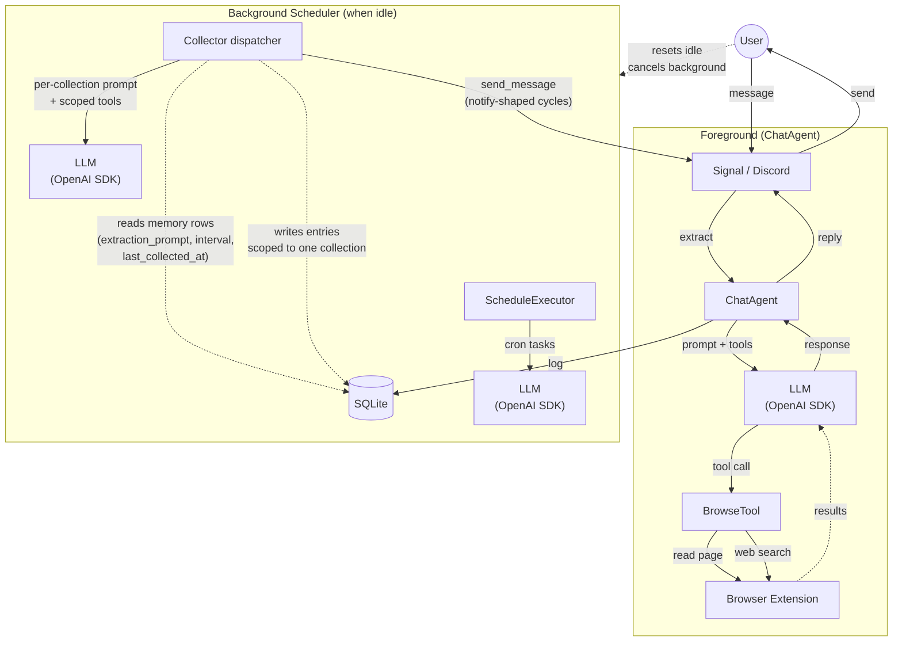

# CLAUDE.md — Penny Chat Agent

## Architecture Overview



- **Channels**: Signal (WebSocket + REST) or Discord (discord.py bot)
- **Ollama**: Local LLM inference (default model: gpt-oss:20b)
- **Vision**: Optional vision model (e.g., qwen3-vl) for processing image attachments from Signal
- **Image Generation**: Optional image model (e.g., x/z-image-turbo) for generating images via `/draw` command
- **Embedding Model**: Optional dedicated embedding model (e.g., embeddinggemma) for preference deduplication and history embeddings
- **Browser Extension**: Web search and page reading — all web access goes through the connected browser
- **SQLite**: Logs all prompts and messages; stores preferences, thoughts, and conversation history

## Directory Structure

```
penny/
  penny.py            — Entry point. Penny class: creates agents, channel, scheduler
  config.py           — Config dataclass loaded from .env, channel auto-detection
  config_params.py    — ConfigParam + RuntimeParams: runtime-configurable settings with 3-tier lookup
  constants.py        — Enums (SearchTrigger, PreferenceValence), reaction emojis, browse constants
  prompts.py          — LLM prompt templates (chat conversation, vision, email/zoho).  Collector prompts live on memory rows (extraction_prompt) instead
  responses.py        — All user-facing response strings (PennyResponse class)
  startup.py          — Startup announcement message generation (git commit info)
  datetime_utils.py   — Timezone derivation from location (geopy + timezonefinder)
  agents/
    base.py           — Agent base class: agentic loop, tool execution, Ollama integration
    models.py         — ChatMessage, ControllerResponse, MessageRole, ToolCallRecord, GeneratedQuery
    chat.py           — ChatAgent: conversation-mode agent (handles user messages with tools)
    recall.py         — build_recall_block: assembles ambient recall context from active memories
    collector.py      — Collector: single dispatcher agent driving every per-collection extractor
  scheduler/
    base.py           — BackgroundScheduler + Schedule ABC
    schedules.py      — PeriodicSchedule, AlwaysRunSchedule, DelayedSchedule implementations
    schedule_runner.py — ScheduleExecutor: runs user-created cron-based scheduled tasks
  commands/
    __init__.py       — create_command_registry() factory
    base.py           — Command ABC, CommandRegistry
    models.py         — CommandContext, CommandResult, CommandError
    github_issue.py   — GitHubIssueCommand base class for /bug and /feature
    preference_base.py — PreferenceBaseCommand, PreferenceAddCommand, PreferenceRemoveCommand
    config.py         — /config: view and modify runtime settings
    index.py          — /commands: list available commands
    profile.py        — /profile: user info collection (name, location, DOB, timezone)
    schedule.py       — /schedule: create and list recurring background tasks
    unschedule.py     — /unschedule: delete a scheduled task
    mute.py           — /mute: silence Penny's notifications
    unmute.py         — /unmute: resume Penny's notifications
    like.py           — /like: show or add positive preferences
    unlike.py         — /unlike: remove positive preferences
    dislike.py        — /dislike: show or add negative preferences
    undislike.py      — /undislike: remove negative preferences
    draw.py           — /draw: generate images via Ollama image model (optional)
    bug.py            — /bug: file GitHub issues (optional, requires GitHub App)
    feature.py        — /feature: file GitHub feature requests (optional, requires GitHub App)
    email.py          — /email: search Fastmail email via JMAP (optional)
    zoho.py           — /zoho: search Zoho Mail via Zoho Mail API (optional)
  tools/
    base.py           — Tool ABC, ToolRegistry, ToolExecutor
    models.py         — ToolCall, ToolResult (uniform structured tool return: message/success/mutated/source_urls), ToolDefinition, and per-tool arg models
    browse.py         — BrowseTool: web search and page reading via browser extension
    content_cleaning.py — Post-processing for browse results (strips navigation, proxy images, boilerplate)
    search_emails.py  — SearchEmailsTool (JMAP + Zoho)
    read_emails.py    — ReadEmailTool (JMAP + Zoho)
    list_emails.py    — ListEmailsTool (folder listings)
    list_folders.py   — ListFoldersTool (available mailboxes)
    draft_email.py    — DraftEmailTool (compose + stage draft)
    memory_args.py    — Pydantic arg models for the memory tool surface
    memory_tools.py   — Tool subclasses: each funnels through `db.memory(name)` (the single dispatch) and calls a method on the returned `Memory` object, which refuses wrong-shape ops (collection ops on a log, log_read on a collection) via a base no-op (`WrongShapeError`) and read-only facades via `ReadOnlyMemoryError` — no tool branches on a name or shape. read_similar + memory_metadata are shape-agnostic. build_memory_tools(db, embedding_client, author) factory
  channels/
    __init__.py       — create_channel() factory, channel type constants
    base.py           — MessageChannel ABC, IncomingMessage, shared message handling
    signal/
      channel.py      — SignalChannel: httpx for REST, websockets for receive
      models.py       — Signal WebSocket envelope Pydantic models
    discord/
      channel.py      — DiscordChannel: discord.py bot integration
      models.py       — DiscordMessage, DiscordUser Pydantic models
  database/
    database.py       — Database facade: thin wrapper creating domain stores
    knowledge_store.py — KnowledgeStore: summarized web page content for factual recall
    message_store.py  — MessageStore: log_message, log_prompt, log_command, threads
    thought_store.py  — ThoughtStore: inner monologue persistence
    preference_store.py — PreferenceStore: add, query, dedup, embedding management
    user_store.py     — UserStore: get_info, save_info, mute/unmute
    memory/           — the memory layer: `Memory` (base, memory_entry row access + shared similarity/cursor reads + shape-op no-ops) → `Collection` / `Log`, and the read-only facades `MessageLogMemory` (messagelog) / `RunLog` (promptlog); `MemoryStore` registry + the `memory(name)` dispatch factory; `types` (enums, errors, inputs); `_similarity` (pure dedup + retrieval math). `db.memory(name)` returns the right object; `db.memories` is the registry
    cursor_store.py   — CursorStore: per-agent read cursors into log-shaped memories
    media_store.py    — MediaStore: browsed images, matched to outgoing text by embedding at egress
    models.py         — SQLModel tables (see Data Model section)
    migrate.py        — Migration runner: file discovery, tracking table, validation
    migrations/       — Numbered migration files (0001–0025)
  llm/
    client.py         — LlmClient: OpenAI SDK wrapper (chat + embed) for any OpenAI-compatible backend (Ollama, omlx, etc.)
    image_client.py   — OllamaImageClient: Ollama-specific HTTP client for image generation and model listing
    models.py         — LlmMessage, LlmResponse, LlmToolCall, LlmError hierarchy (SDK-decoupled Pydantic types)
    embeddings.py     — Re-exports serialize/deserialize/cosine from shared similarity/ package
    similarity.py     — Penny-specific: embed_text, sentiment scores, novelty, preference vectors
  email/
    protocol.py       — EmailClient Protocol — shared interface for JMAP + Zoho email backends
  jmap/
    client.py         — JmapClient: Fastmail JMAP API client (httpx)
    models.py         — JmapSession, EmailAddress, EmailSummary, EmailDetail
  zoho/
    client.py         — ZohoClient: Zoho Mail API client (httpx + OAuth refresh)
    models.py         — Zoho Mail API Pydantic models
  html_utils.py       — Shared HTML text extraction helpers
  tests/
    conftest.py       — Pytest fixtures for mocks and test config
    test_embeddings.py, test_similarity.py, test_periodic_schedule.py, test_scheduler.py
    mocks/
      signal_server.py  — Mock Signal WebSocket + REST server (aiohttp)
      llm_patches.py    — MockLlmClient: patches openai.AsyncOpenAI for chat + embed
    agents/           — Per-agent integration tests
      test_chat_agent.py, test_collector.py, test_agentic_loop.py,
      test_context.py
    channels/         — Channel integration tests
      test_signal_channel.py, test_signal_reactions.py, test_signal_vision.py,
      test_signal_formatting.py, test_startup_announcement.py
    commands/         — Per-command tests
      test_commands.py, test_config.py, test_debug.py, test_draw.py, test_email.py,
      test_feature.py, test_mute.py, test_preferences.py,
      test_schedule.py, test_bug.py, test_system.py, test_test_mode.py
    database/         — Migration validation tests
      test_migrations.py
    jmap/             — JMAP client tests
      test_client.py
    tools/            — Tool tests
      test_tool_timeout.py, test_tool_not_found.py, test_tool_reasoning.py
Dockerfile            — Python 3.14-slim
pyproject.toml        — Dependencies and project metadata
```

## Agent Architecture

### Agent Base Class (`agents/base.py`)
The base `Agent` class implements the core agentic loop:
- Calls the LLM (via `LlmClient`) with available tools
- Executes tool calls via `ToolExecutor` with parameter validation
- Handles duplicate tool call prevention
- Appends source URLs to responses when model omits them

**System prompt building (template method pattern):**
Each agent overrides `_build_system_prompt(user)` to compose its prompt from reusable building blocks on the base class: `_identity_section()`, `_profile_section()`, `_instructions_section()`, `_context_block()`. No flags or conditionals — each agent explicitly declares what goes in its prompt. Tests assert on the exact full system prompt string to catch structural drift.

**Memory recall** is the single mechanism for surfacing memory contents in the system prompt, assembled in **two stages** (`_recall_section` in `agents/chat.py`):

1. **Stage 1 — collection routing** (`inclusion` flag: `always` / `relevant` / `never`): decides whether a memory participates at all. `always` is unconditional; `relevant` participates only when the conversation window embeds close to the memory's content-reflective `description` anchor (cosine ≥ `MEMORY_INCLUSION_THRESHOLD`, default 0.40); `never` is excluded. This is the prompt-shortening gate — off-topic collections drop out entirely.
2. **Stage 2 — entry rendering** (`recall` flag: `all` / `relevant` / `recent`): for each included memory, picks which entries surface. `recent` is the newest-first slice; `all` is the full set; `relevant` is a hybrid ranking (embedding cosine fused with IDF-weighted lexical coverage via reciprocal-rank fusion, top-N, **no floor** — stage 1 already decided relevance). Lexical fusion surfaces instruction-shaped entries (skills, recipes) whose absolute cosine is low but whose vocabulary overlaps the query.

There is no bespoke per-section retrieval — knowledge, likes, dislikes, notified-thoughts, skills, etc. all surface via this one path. The two flags are orthogonal: e.g. `inclusion=relevant, recall=all` shows every entry but only when the conversation is on-topic.

The chat turns array (alternating user/assistant messages passed via `history=`) is independent of the recall flag — it is reconstructed from the last N messages in `db.messages` regardless of which memories are active.

### Shared LLM Client Instances

All `LlmClient` instances are created centrally in `Penny.__init__()` and shared across agents and commands. `LlmClient` uses the OpenAI Python SDK and targets any OpenAI-compatible endpoint (Ollama's OpenAI-compat layer by default, or omlx/OpenAI cloud with a different `base_url`):

- `model_client`: Text model for all agents and commands
- `vision_model_client`: Optional vision model for image understanding
- `embedding_model_client`: Optional embedding model for preference deduplication
- `image_model_client`: `OllamaImageClient` for `/draw` (image generation uses Ollama's native REST API, not OpenAI-compatible)

### Specialized Agents

**ChatAgent** (`agents/chat.py`)
- Handles incoming user messages with the full tool surface
- Prompt: identity + (profile + recall block + page hint) + instructions; recall block routes memories by `inclusion` (stage 1) then renders entries by `recall` (stage 2)
- Conversation history flows independently as alternating user/assistant turns passed via `history=`
- Vision captioning: when images are present and vision model is configured, captions the image first, then forwards a combined prompt to the text LLM

**Collector** (`agents/collector.py`)
- One dispatcher agent for every kind of background extraction.  Each tick it picks the most-overdue ready collection from the `memory` table (where `extraction_prompt IS NOT NULL` and `now - last_collected_at >= collector_interval_seconds`), binds itself to that target via `self._current_target`, runs the agent loop with the target's extraction prompt as instructions and a tool surface scoped to writes against that single collection, then stamps `last_collected_at = now`.
- Replaces what used to be four bespoke agents: preference-extractor, knowledge-extractor, thinking, notify.  Each is now just a row in the `memory` table with its own `extraction_prompt`, `collector_interval_seconds`, and (for notify-shaped cycles) a system prompt that calls `send_message`.
- System collections currently driven by collectors:
  - `likes` / `dislikes` — extract user preferences from `user-messages` (300s)
  - `knowledge` — summarize web pages from `browse-results` (300s)
  - `unnotified-thoughts` — inner monologue, picks a random like and drafts a thought (1200s)
  - `notified-thoughts` — picks an unnotified thought, calls `send_message`, moves the entry into its own collection (300s)
  - `skills` — workflow patterns the chat agent follows (TRIGGER + STEPS entries surfaced via recall); its collector extracts/refines/removes skills from chat as the user teaches Penny new behavior (21600s)
  - `quality` — self-correcting collector (migration 0055, prompt refined through 0060): reviews recent runs via `log_read("collector-runs")` — a **read facade over `promptlog`** that renders each run as a record (`[target] summary` header + the worked run's tool trace: the entries written, the exact message sent) — and judges that behaviour against the collection's `intent`, rewriting whichever `extraction_prompt` has drifted, dry-running each candidate with `prompt_test` before applying it, then messaging the user (apply-then-notify). A `❌`/`💤` run (failure or idle) renders header-only — nothing to judge — and is skipped. (3600s base, auto-throttles toward the weekly cap on quiet cycles like any other collector)
- User-defined collections created via chat (`/collection_create` with an `extraction_prompt`) are picked up automatically on the next tick — no restart required.
- Tool surface: reads (unrestricted) + entry mutations (`collection_write`, `update_entry`, `collection_delete_entry`, `collection_move`) pinned to the bound target via the `_memory_scope()` hook + `log_append` + `send_message` (when channel wired) + browse + done. The `quality` cycle additionally gets `prompt_test` (dry-runs a candidate prompt on a throwaway `_DryRunCollector` — captured writes/sends, non-consuming reads, no DB clone), gated by bound-target name in `get_tools` — see `docs/self-improvement-loop.md`.
- Cadence: `COLLECTOR_TICK_INTERVAL` (default 30s, idle-gated) drives the dispatcher; per-collection `collector_interval_seconds` controls each collection's pacing within that.
- **Auto-throttle** (`_apply_throttle`, runs after each non-cancelled cycle): after `COLLECTOR_THROTTLE_AFTER` (default 3) consecutive idle cycles a collection doubles its `collector_interval_seconds` (capped at `COLLECTOR_MAX_INTERVAL`, default 604800 = weekly) and resets its idle counter; a productive cycle snaps the interval back to `base_interval_seconds` (the user's intended cadence, stamped on create and re-set when the interval is edited) and clears the counter. "Produced work" (`_produced_work`) reads the per-call `ToolCallRecord.mutated` flag — set from each tool's structured `ToolResult` — so it counts a cycle as work only when a tool *actually changed durable state* (a row written, an entry moved/deleted, a message sent). A successful no-op (a duplicate-rejected write, an update/delete/move on a missing key, a muted/cooled-down send) carries `mutated=False` and reads as idle, unlike the old "a write tool didn't error" heuristic which counted duplicate-rejected writes as work and starved the throttle. Reads + `done()` = idle. Deterministic in Python — not the quality/model layer.

**ScheduleExecutor** (`scheduler/schedule_runner.py`)
- Background task: runs user-created cron-based scheduled tasks
- Checks every 60 seconds for due schedules (based on user timezone)
- Executes the schedule's prompt text via the agentic loop
- Sends results to the user via channel

## Scheduler System

The `scheduler/` module manages background tasks:

### BackgroundScheduler (`scheduler/base.py`)
- Runs tasks in priority order (schedule executor → collector dispatcher)
- **Skips agents with no work**: when an agent returns False, continues to the next eligible schedule in the same tick. Only breaks when an agent does real work.
- Tracks global idle threshold (default: 60s)
- Notifies schedules when messages arrive (resets timers)
- Passes `is_idle` boolean to schedules (whether system is past global idle threshold)
- **Cancels active background task** when a foreground message arrives (`notify_foreground_start()` calls `task.cancel()`), freeing Ollama immediately for the user's message. Cancelled tasks are idempotent — unprocessed items stay in their queues and are re-picked up on the next cycle
- Commands do NOT interrupt background tasks — they run cooperatively

### Schedule Types (`scheduler/schedules.py`)

**AlwaysRunSchedule**
- Runs regardless of idle state at a configurable interval
- Used for ScheduleExecutor (60s interval)
- Not affected by idle threshold — scheduled tasks run even during active conversations

**PeriodicSchedule**
- Runs periodically while system is idle at a configurable interval
- Used for the Collector dispatcher (idle-gated, COLLECTOR_TICK_INTERVAL default 30s); per-collection cadence lives on `memory.collector_interval_seconds`
- Tracks last run time and fires again after interval elapses
- Resets when a message arrives

**DelayedSchedule**
- Runs after system becomes idle + random delay
- Available for future use (not currently used by any agent)

## Channel System

### MessageChannel ABC (`channels/base.py`)
- Defines interface: `listen()`, `send_message()`, `send_typing()`, `extract_message()`
- Implements shared logic: `handle_message()`, `send_response()`, `_typing_loop()`
- Holds references to chat agent, database, and scheduler
- **Progress tracker hook**: `_begin_progress(message)` is an optional override that returns a `ProgressTracker` (defined in `channels/base.py`). The tracker has two methods: `update(tools)` (called when a tool batch starts) and `clear()` (idempotent, called once on success and once again from the dispatch loop's `finally`). The default `_make_handle_kwargs` wires `progress.update` as `on_tool_start` for free, and the final response is always delivered via `send_response` so attachments and quote-replies work normally. Channels without a progress UI return `None`

### SignalChannel (`channels/signal/channel.py`)
- WebSocket connection for receiving messages
- REST API for sending messages, typing indicators, and reactions
- Handles quote-reply thread reconstruction
- **Startup connectivity validation**: `validate_connectivity()` retries DNS + a `GET /v1/about` probe up to `PennyConstants.SIGNAL_VALIDATE_MAX_ATTEMPTS` times with `SIGNAL_VALIDATE_RETRY_DELAY` between attempts (~60 s budget) so cold-boot startup can wait out signal-cli-rest-api's 30-60 s warmup. Each failed attempt is logged at WARNING; the final exhaustion is logged at ERROR and the `ConnectionError` is caught in `main()` and written to `penny.log` before exiting. `docker-compose.yml` also gates `penny` on a `curl /v1/about` healthcheck against `signal-api` via `depends_on: service_healthy`, so compose-managed startups never even hit the retry loop. Tests pass `max_attempts=1, retry_delay=0` to stay fast
- **In-flight progress as emoji reactions**: when a user message arrives, the channel reacts to it with 💭 (thinking) via `POST /v1/reactions`. As the agent's tool calls fire, `SignalProgressTracker.update()` swaps the reaction to a tool-specific emoji from `Tool.format_progress_emoji()` (BrowseTool returns 🔍 for searches, 📖 for URL reads). Signal limits each user to one reaction per message, so each new emoji cleanly replaces the previous — no clutter. When the agent finishes, `tracker.clear()` issues `DELETE /v1/reactions` to remove the reaction entirely, and the response is sent as a normal new message via `send_response` (with text + attachments + quote-reply, the same shape as before progress was added). The typing indicator runs alongside throughout. Why reactions instead of editing a "thinking..." text bubble: Signal mobile/desktop clients silently drop attachments added via message edit — even though the wire format technically allows them — so any final response with an image would lose its image. Reactions sidestep editing entirely

### DiscordChannel (`channels/discord/channel.py`)
- Uses discord.py for bot integration
- Listens to a single configured channel
- Handles 2000-character message limit by chunking
- Typing indicators auto-expire (no stop needed)

### Channel Factory (`channels/__init__.py`)
- `create_channel()` creates appropriate channel based on config
- Auto-detects channel type from credentials if not explicit

## Command System

Penny supports slash commands sent as messages (e.g., `/config`, `/profile`). Commands are handled before the message reaches the agent loop.

### Architecture (`commands/`)
- **Command ABC** (`base.py`): Each command implements `name`, `description`, `aliases`, and `async execute(context) → CommandResult`
- **CommandRegistry** (`base.py`): Maps command names/aliases to handlers, dispatches messages starting with `/`
- **Factory** (`__init__.py`): `create_command_registry()` registers all built-in commands

### Built-in Commands (always registered)
- **/commands** (`index.py`): Lists all available commands with descriptions
- **/config** (`config.py`): View and modify runtime settings (e.g., `/config idle_seconds 600`). Reads/writes RuntimeConfig table in SQLite; changes take effect immediately
- **/profile** (`profile.py`): View or update user profile (name, location, DOB). Derives IANA timezone from location. Required before Penny will chat
- **/schedule** (`schedule.py`): Create and list recurring cron-based background tasks (uses LLM to parse natural language timing)
- **/unschedule** (`unschedule.py`): Delete a scheduled task. `/unschedule` shows numbered list; `/unschedule <N>` deletes
- **/mute** (`mute.py`): Silence Penny's autonomous notifications
- **/unmute** (`unmute.py`): Resume Penny's notifications
- **/like** (`like.py`): Show positive preferences or add one (e.g., `/like dark roast coffee`)
- **/unlike** (`unlike.py`): Remove a positive preference by number
- **/dislike** (`dislike.py`): Show negative preferences or add one
- **/undislike** (`undislike.py`): Remove a negative preference by number

### Conditional Commands (registered based on config)
- **/draw** (`draw.py`): Generate images via Ollama image model (requires `LLM_IMAGE_MODEL`)
- **/bug** (`bug.py`): File a bug report on GitHub (requires GitHub App config)
- **/feature** (`feature.py`): File a feature request on GitHub (requires GitHub App config)
- **/email** (`email.py`): Search Fastmail email via JMAP (requires `FASTMAIL_API_TOKEN`)
- **/zoho** (`zoho.py`): Search Zoho Mail via the Zoho Mail API (requires `ZOHO_API_ID`, `ZOHO_API_SECRET`, `ZOHO_REFRESH_TOKEN`)

### Runtime Configuration
- `/config` reads and writes to a `RuntimeConfig` table in SQLite
- `ConfigParam` definitions in `config_params.py` declare runtime-configurable settings with types and validation
- `RuntimeParams` class provides attribute access: `config.runtime.IDLE_SECONDS`
- Three-tier lookup chain: DB override → env override → ConfigParam.default
- Config values are read on each use (not cached), so changes take effect immediately
- Groups: Chat (max steps, search URL, context limits, retrieval thresholds, domain permission mode), Background (idle threshold, COLLECTOR_TICK_INTERVAL, COLLECTOR_THROTTLE_AFTER, COLLECTOR_MAX_INTERVAL, BACKGROUND_MAX_STEPS, dedup thresholds), Email (body max length, search/list limits, request timeout)

## Data Model

All tables defined in `database/models.py` as SQLModel classes:

- **PromptLog**: Every LLM call — `model`, `messages` (JSON), `response` (JSON), `thinking`, `duration_ms`, `agent_name`, `run_id`, `outcome`
- **MessageLog**: Every user/agent message — `direction`, `sender`, `content`, `parent_id` (thread chain), `external_id` (platform ID), `is_reaction`, `thought_id` FK (notification source)
- **UserInfo**: User profile — `name`, `location`, `timezone` (IANA), `date_of_birth`
- **CommandLog**: Command invocations — `command_name`, `command_args`, `response`, `error`
- **RuntimeConfig**: User-configurable settings — `key`, `value` (string, parsed on read)
- **Schedule**: User-created cron tasks — `cron_expression`, `prompt_text`, `user_timezone`
- **MuteState**: Per-user mute state — row exists = muted, delete = unmuted
- **Device**: Registered devices (Signal, Discord, browser addons) — used for multi-device routing and domain permission prompts
- **DomainPermission**: Per-domain allow/deny state for browser extension web access, synced across addons
- **Thought**: Inner monologue entries — `content` (full monologue), `title`, `image`, `valence`, `preference_id` FK (seed preference), `run_id`, `notified_at`
- **Preference**: User sentiment signals — `content`, `valence` (positive/negative), `source` (manual/extracted), `mention_count`, `embedding` (serialized float32 vector), `last_thought_at`. Extracted preferences must reach `PREFERENCE_MENTION_THRESHOLD` mentions before becoming thinking candidates; manual (`/like`) preferences bypass this gate
- **Knowledge**: Summarized web page content — `url` (unique), `title`, `summary` (prose paragraph), `embedding`, `source_prompt_id` FK (extraction watermark). One entry per URL, upserted on revisit
- **Memory**: Unified container for the task/memory framework — `name` (PK), `type` (`collection` or `log`), `description` (content-reflective; doubles as the stage-1 routing anchor), `description_embedding` (the anchor vector, backfilled at startup), `inclusion` (stage-1 routing: `always` / `relevant` / `never`), `recall` (stage-2 entry rendering: `all` / `relevant` / `recent`), `archived`. Collections are keyed sets with dedup on write; logs are append-only keyless streams
- **MemoryEntry**: One entry in a memory — `memory_name` FK, `key` (nullable for logs), `content`, `author`, `key_embedding`, `content_embedding`. Entries are immutable once written — `update` replaces content for a given key
- **AgentCursor**: Per-reader read progress through a log-shaped memory — `(agent_name, memory_name)` PK, `last_read_at` high-water mark. Advanced two-phase by the orchestrator (pending during a run, committed on success). For collectors the cursor owner is the **bound collection name**, not the constant `"collector"` identity — otherwise every collection reading the same log (e.g. the many that read `user-messages`) would collapse onto one shared cursor and starve each other
- **Media**: Images captured while browsing, delivered side-channel — `mime_type`, `data` (raw bytes), `source_url`, `title`, `embedding` (of title+URL). The browse tool stores every page image here; at channel egress the outgoing message text is embedded and the single nearest image (no floor) is attached. Zero model involvement — no `<media:ID>` tokens, no prompt changes

## Message Flow

1. Channel receives message → `extract_message()` → `IncomingMessage`
2. Channel calls `handle_message()`:
   - Checks for slash commands first (dispatches via `CommandRegistry`)
   - Notifies scheduler (resets idle timers, suspends background tasks)
   - Starts typing indicator loop
   - Calls `ChatAgent.handle()` which:
     - Finds parent message if quote-reply (via `external_id` lookup)
     - Walks thread history for context
     - Runs agentic loop with tools
   - Logs incoming message to DB
   - Sends response via `send_response()` (logs + sends)
   - Stops typing indicator, resumes background tasks

## Thread/Context System

- Quote-replying continues a conversation thread
- `MessageLog.parent_id` creates a chain of messages
- `db.messages.get_thread_context()` walks the chain (up to 20 messages)

## Key Design Decisions

- **Browser-based search**: All web access (search, page reading) goes through the browser extension via BrowseTool. Text queries are converted to search URLs (configurable via `SEARCH_URL`). No third-party search APIs
- **URL fallback**: If the model's final response doesn't contain any URL, the agent appends the first source URL
- **Duplicate tool blocking**: Agent tracks called tools per message to prevent LLM tool-call loops
- **Tool-result framing**: every tool result is wrapped by `Tool.format_result(name, body)` (applied once in `Agent._collect_tool_results`) into `Result of your \`<tool>\` call:\n<body>`. The OpenAI `role: "tool"` + `tool_call_id` envelope is the standard "this is a tool result" signal, but gpt-oss:20b doesn't reliably honour it when the body reads like prose — it can mistake fetched data (e.g. a returned user message that itself reads like an instruction) for a fresh directive. Read tools additionally lead their body with a `N entries from \`<source>\` (ordering):` header via `_format_entries`. Framing happens after `record.failed` is computed (on the raw string) so failure detection is unaffected
- **Tool parameter validation**: Tool parameters validated before execution; non-existent tools return clear error messages
- **Two agent shapes**: ChatAgent (turn-driven, user-facing, lifecycle tools only) and Collector (single dispatcher across all collections, scoped entry-mutation tools).  Plus ScheduleExecutor for user-defined cron tasks
- **Priority scheduling**: Schedule executor → Collector dispatcher (Collector returns False when no collection is ready, so the scheduler skips it)
- **Always-run schedules**: User-created schedules run regardless of idle state; the Collector waits for idle
- **Global idle threshold**: Single configurable idle time (default: 60s) controls when idle-dependent tasks become eligible
- **Background cancellation**: Foreground message processing cancels active background tasks (`task.cancel()`) to free the LLM immediately; cancelled work is idempotent and retried next cycle
- **Commands don't interrupt background**: Slash commands run cooperatively without cancelling the active background task
- **Vision captioning**: When images are present and `LLM_VISION_MODEL` is configured, the vision model captions the image first with a vision-specific system prompt, then a combined prompt is forwarded to the text LLM. Search tools are disabled for image messages
- **Image side-channel**: Browsed images never travel through the model. The browse tool decodes each page's image (base64 data URI from the extension), stores the bytes in the `media` table with an embedding of the page title+URL, and the agent loop carries no attachments. At egress (`send_response`), the outgoing text is embedded once (reused for the `penny-messages` log) and the single nearest image is attached — no floor, so a reply carries an image whenever anything has been browsed (a tangential or funny mismatch beats no image). `/draw` and other command images use `send_message` directly and are untouched. This replaced a model-carried `<media:ID>`/inline-URL token scheme that couldn't reliably thread image references through multi-page replies
- **Channel abstraction**: Signal and Discord share the same interface; easy to add more platforms
- **Async throughout**: asyncio, httpx.AsyncClient, openai.AsyncOpenAI, discord.py
- **Host networking**: Docker container uses --network host for simplicity (all services on localhost)
- **Pydantic everywhere**: All external data validated with Pydantic models
- **Table-to-bullets**: Markdown tables converted to bullet points in Python (saves model tokens vs. prompting "no tables")
- **Normal casing**: All user-facing strings (status messages, error messages, acknowledgments) use standard sentence casing — not all lowercase
- **Memory framework (Stages 1–5, 9, 10)**: A unified data primitive — *memory* — with two shapes (collection and log) and one access class `MemoryStore`. Collections dedup on write via a three-signal disjunction (key TCR, key cosine, content cosine — each with strict and relaxed thresholds in `PennyConstants`). Any strict hit, or any two relaxed hits, rejects the write. Logs append without dedup. Stage 2a added 21 model-facing memory tools (`memory_tools.py`). Stage 3 added `build_recall_block` (`recall.py`) — assembles ambient recall context for the chat agent's system prompt by dispatching each active memory by recall mode (`recent`/`relevant`/`all`); paired logs (`user-messages` + `penny-messages`) merge chronologically into a single Conversation section. **Polymorphic `Memory` objects + system-log facades**: the memory layer is a class per shape/backing (`penny/database/memory/`). `db.memory(name)` is the single dispatch — it returns a `Collection` or `Log` (both `memory_entry`-backed, the native store on the base) or a read-only facade, and every tool/recall/addon caller operates on that object polymorphically (wrong-shape ops refuse via base no-ops; nothing branches on a name or shape). `user-messages`/`penny-messages` are `MessageLogMemory` facades over `messagelog` (the object overrides the row primitives to read by direction, synthesizing `MemoryEntry`; a message has two authors — the user/incoming or Penny/outgoing; `append` refuses) and `collector-runs` is a `RunLog` facade over `promptlog` (renders each completed run as a record; `append` refuses) — no duplicated `memory_entry` rows, and the facade marker rows are seeded by migration so dispatch finds them. The cursor *read* logic lives on the `Log` base, uniform across backings; the reader's pending/commit cursor lifecycle stays in `LogReadTool`. `browse-results` is the one remaining real memory log (the browse tool writes it; it has no canonical table behind it). `messagelog.embedding` (for `read_similar` over messages) is filled by the startup backfill, which vectorizes any embedding-bearing table — nothing is copied between tables. Author is passed explicitly as a constructor argument or method parameter — write-capable tools take `author: str` at construction (`build_memory_tools(db, embedding_client, author)`), `BrowseTool(..., author=...)` is built per-agent with `author=self.name`, and `channel.send_response(..., author=...)` requires callers to pass it. No ambient/contextvar state. Embeddings are computed at write time (not lazily) so similarity reads work the moment a memory is reconfigured. `db.memories` replaces the per-domain stores that agents will be ported onto in subsequent stages. See `docs/task-framework-plan.md` (design) and `docs/memory-implementation-plan.md` (staged rollout)

## Dependencies

- `websockets`, `httpx`, `python-dotenv`, `pydantic`, `sqlmodel`, `openai`, `discord.py`, `psutil`, `dateparser`, `timezonefinder`, `geopy`, `pytz`, `croniter`, `PyJWT`
- Dev: `ruff` (lint/format), `ty` (type check), `pytest`, `pytest-asyncio`, `aiohttp` (mock Signal server)
- Python 3.14+

## Database Migrations

File-based migration system in `database/migrations/` (currently 0001–0025):
- Each migration is a numbered Python file (e.g., `0001_initial_schema.py`) with a `def up(conn)` function
- Two types: **schema** (DDL — ALTER TABLE, CREATE INDEX) and **data** (DML — UPDATE, backfills), both use `up()`
- Runner in `database/migrate.py` discovers files, tracks applied migrations in `_migrations` table
- Runs on startup before `create_tables()` in `penny.py`
- `make migrate-test`: copies production DB, applies migrations to copy, reports success/failure
- `make migrate-validate`: checks for duplicate migration number prefixes (also runs in `make check`)
- Rebase-only policy: if two PRs create the same migration number, the second must rebase and renumber
- Run standalone: `python -m penny.database.migrate [--test] [--validate] [db_path]`

Notable migrations:
- 0001: Initial schema (all core tables)
- 0002: `thought.notified_at` column
- 0003: Preference deduplication
- 0004: Drop `entity` and `fact` tables (old knowledge system removed)
- 0005: `preference.last_thought_at` column
- 0006: `messagelog.thought_id` FK (links messages to notification thoughts)
- 0007: `thought.preference_id` FK (links thoughts to seed preferences)
- 0008: `preference.source` + `preference.mention_count` (mention threshold gating)
- 0009: Drop `searchlog.extracted` column
- 0010: Reset reaction `processed` state
- 0011: Drop `preference.source_period_start/end` columns
- 0012: Fix `is_reaction` flag on historical reaction rows
- 0013: Reset conversation history watermarks
- 0014: Add embedding columns (preference, knowledge, etc.)
- 0015: `thought.title` column
- 0016: `device` table (multi-device routing)
- 0017: `thought.image_url` column
- 0018: `thought.valence` column
- 0019: `domain_permission` table (browser extension allowlist)
- 0020: Rename `thought.image_url` → `thought.image`
- 0021: `promptlog.agent_name` + `promptlog.run_id` columns
- 0022: `promptlog.outcome` + `thought.run_id` columns
- 0023: Add `knowledge` table, drop `conversationhistory` (replaced by knowledge + related messages)
- 0024: Drop legacy `searchlog` table (never written to since browser-based search)
- 0025: Add `memory`, `memory_entry`, `agent_cursor`, `media` tables (task/memory framework Stage 1)
- 0026: Seed system log memories — `user-messages`, `penny-messages`, `browse-results` (Stage 9)
- 0027: Backfill memory framework from existing tables — `messagelog` → user/penny logs, `preference` → likes/dislikes, `thought` → notified/unnotified-thoughts, `knowledge` → knowledge collection (Stage 10)
- 0028: Disable ambient recall for `penny-messages` — duplicates the conversation turns array
- 0029: Re-enable ambient recall for `penny-messages` — chat-turn duplication is now handled by the self-match exclusion (#1006) and short-anchor noise by the low-info filter, so historical Penny replies should surface again
- 0030–0042: extraction-prompt fixes and incremental collector/collection tweaks (see individual files)
- 0043: Seed the `skills` collection — workflow patterns (TRIGGER + STEPS) the chat agent follows via recall, plus a collector that extracts/refines/removes skills from chat over time
- 0044: Split the single `recall` flag into two-stage recall — add `inclusion` (`always`/`relevant`/`never`, stage-1 routing) and `description_embedding` columns, derive inclusion from the old recall value (off→never, recent/all→always, relevant→relevant), collapse `recall=off`→`recent`, and force `skills`/`user-messages`/`penny-messages`/`user-profile`/`likes`/`dislikes`/`knowledge` to `inclusion=always`
- 0045: Rewrite the seeded skills that taught the old single-flag model (`recall: "off"` for silent — now an invalid enum) to the inclusion/recall split; nulls their content embeddings so the startup backfill re-vectorizes
- 0046: Add `title` and `embedding` columns to the `media` table (image side-channel: stores title+URL embedding for nearest-image egress matching)
- 0047: Add composite `(run_id, timestamp)` index on `promptlog` (serves the addon's run-pagination GROUP BY + run-outcome lookups); drop the redundant single-column `run_id` index from 0021
- 0048: Add composite `(agent_name, run_id, timestamp)` index on `promptlog` (serves the addon's per-agent prompt-log filter — without it the filtered GROUP BY full-scans and freezes the asyncio loop)
- 0049: Partition collector read-cursors per collection — seed `(collection, log)` cursors from the old shared `(collector, log)` value, then drop the dead `collector`/`knowledge-extractor`/`preference-extractor` rows (companion to keying the cursor on the bound collection in `get_tools`)
- 0050: Add `memory.intent` — the user's stated goal for a collection, set once at create (immutable by the agent's `collection_update` tool; editable only via the user/UI path)
- 0051: Add `promptlog_fts` FTS5 full-text index (over `response`+`thinking`) + sync triggers for the addon's prompt search — a leading-wildcard LIKE can't use a B-tree index
- 0052: Rebuild `promptlog_fts` to drop the `messages` column for instances that applied the original 3-column 0051 (input scaffolding is shared across runs and made search match boilerplate)
- 0053: Add `memory.base_interval_seconds` (snap-back cadence, backfilled from `collector_interval_seconds`) + `memory.consecutive_idle_runs` for collector auto-throttle
- 0054: Replace `promptlog.run_success` (bool) with `run_outcome` (tri-state `RunOutcome`: failed | no_work | worked | cancelled) — backfilled best-effort (success→worked, failure→failed); the work/no-work split isn't recoverable for old rows
- 0055: Seed the `quality` self-correcting collector (inclusion=never, 1h base interval) + its extraction_prompt — graduates the prototype so every instance gets it
- 0056: Switch the quality collector to cursor-based log reads (so the auto-throttle can't widen its window past unread entries)
- 0057: Unify `log_read_next`/`log_read_recent` into one caller-dispatched `log_read` across all seeded extraction_prompts; drop the notify collector's `penny-messages` read (structural dedup via `collection_move`); quality reviews the whole batch
- 0058: Rework the quality prompt around run inspection — read the `collector-runs` index, `log_get` the suspicious runs for their full trace, judge behaviour-vs-intent; drop the `penny-messages` read (cursor drift); skip `❌` run failures as capacity, not drift
- 0059: System-log facades (one migration for the refactor) — rename read tools in stored prompts (`read_latest(`→`collection_read_latest(`, `collection_metadata(`→`memory_metadata(`); rewrite the `quality` prompt to review runs via plain `log_read("collector-runs")` (a `promptlog` facade; no `log_get`/`penny-messages`) and `notify` to pick with `collection_read_random`; drop the dead `memory_entry` rows for `collector-runs`/`user-messages`/`penny-messages` (now facades over `promptlog`/`messagelog`; marker rows stay); add the `ix_promptlog_completed_runs` partial index for bounded run-index reads

## Extending

- **New tool**: Subclass `Tool` in tools/, implement `name`, `description`, `parameters`, `async execute()`, add to agent's tool list in penny.py
- **New channel**: Implement `MessageChannel` ABC, create models, add to `create_channel()` factory
- **New agent type**: Subclass `Agent`, implement `execute()` for background tasks or custom `handle()` for message processing
- **New command**: Subclass `Command` in commands/, implement `name`, `description`, `execute()`, register in `create_command_registry()`
- **New schedule type**: Subclass `Schedule`, implement `should_run()`, `reset()`, `mark_complete()`
- **New LLM backend**: Any OpenAI-compatible endpoint works via `LlmClient` — just set `base_url` / `api_key`. Non-OpenAI-compatible backends can implement the `LlmClient` interface directly (`async chat()`, `async embed()`)

## Test Infrastructure

Strongly prefer end-to-end integration tests over unit tests. Test through public entry points with mocks for external services. Prefer folding new assertions into existing tests over adding new test functions — only add a new test when no existing test covers the relevant code path.

**Mocks** (in `tests/mocks/`):
- `MockSignalServer`: WebSocket + REST server using aiohttp, captures outgoing messages and typing events
- `MockLlmClient` (`llm_patches.py`): Monkeypatches `openai.AsyncOpenAI` so `LlmClient` returns canned `LlmResponse` objects; configurable via `set_default_flow()` or `set_response_handler()`; tracks `requests` and `embed_requests` for assertions

**Fixtures** (in `tests/conftest.py`):
- `TEST_SENDER`: Standard test phone number constant
- `signal_server`: Starts mock Signal server on random port
- `mock_llm`: Patches the OpenAI SDK with configurable responses
- `make_config`: Factory for creating test configs with custom overrides
- `running_penny`: Async context manager for running Penny with cleanup (uses WebSocket detection, not sleep)
- `setup_llm_flow`: Factory to configure mock LLM for message + background task flow
- `wait_until(condition, timeout, interval)`: Polls a condition every 50ms until true or timeout (10s default)

**Test Timing** — never use `asyncio.sleep(N)` in tests:
- Use `wait_until(lambda: <condition>)` to poll for expected side effects (DB state, message count, etc.)
- `scheduler_tick_interval` is set to 0.05s in test config (vs 1.0s production) so scheduler-dependent tests complete quickly
- `running_penny` detects WebSocket connection via `signal_server._websockets` instead of sleeping
- For negative assertions (nothing should happen), verify immediately — don't sleep to "make sure"

**Test Flow**:
1. Start mock Signal server (random port)
2. Monkeypatch the OpenAI SDK (via `mock_llm`)
3. Create Penny with test config pointing to Signal mock
4. Push message through mock Signal WebSocket
5. `wait_until` the expected side effect (outgoing message, DB change, etc.)
6. Assert on captured messages, LLM requests, DB state

**Performance**: Test suite runs in ~30s (`scheduler_tick_interval` set to 0.05s in tests)
