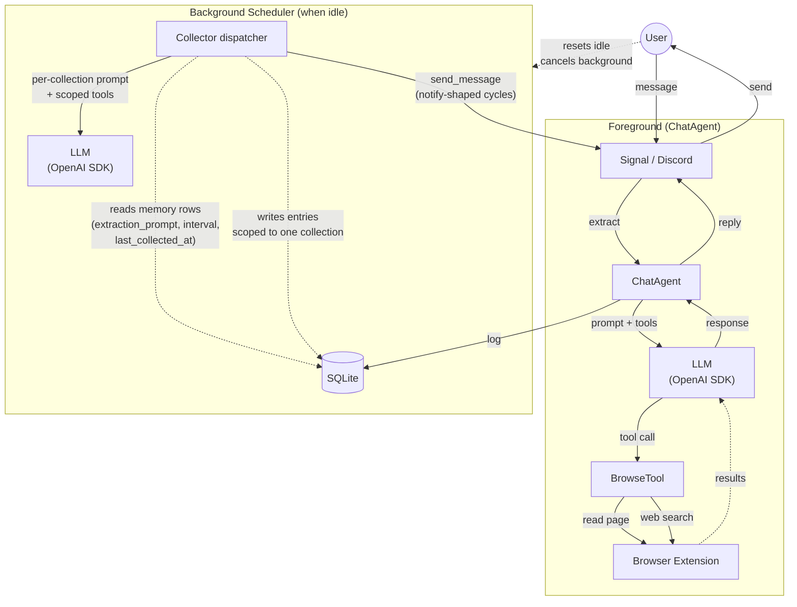

# CLAUDE.md — Penny Chat Agent

## Architecture Overview


```mermaid
flowchart TD
    User((User)) -->|message| Channel[Signal / Discord]

    subgraph Foreground["Foreground (ChatAgent)"]
        Channel -->|extract| CA[ChatAgent]
        CA -->|"prompt + tools"| FG_Ollama["LLM<br>(OpenAI SDK)"]
        FG_Ollama -->|tool call| Browse[BrowseTool]
        Browse -->|"read page"| Browser[Browser Extension]
        Browse -->|"web search"| Browser
        Browser -.->|results| FG_Ollama
        FG_Ollama -->|response| CA
    end

    CA -->|reply| Channel -->|send| User
    CA -->|log| DB[(SQLite)]

    subgraph Scheduler["Background Scheduler (when idle)"]
        direction TB

        Coll[Collector dispatcher] -->|"per-collection prompt<br>+ scoped tools"| FG_Ollama3["LLM<br>(OpenAI SDK)"]
        Coll -.->|"reads memory rows<br>(extraction_prompt, interval,<br>last_collected_at)"| DB
        Coll -.->|"writes entries<br>scoped to one collection"| DB
        Coll -->|"send_message<br>(notify-shaped cycles)"| Channel
    end

    User -.->|"resets idle<br>cancels background"| Scheduler
```

- **Channels**: Signal (WebSocket + REST) or Discord (discord.py bot)
- **Ollama**: Local LLM inference (default model: gpt-oss:20b)
- **Vision**: Optional vision model (e.g., qwen3-vl) for processing image attachments from Signal
- **Image Generation**: Optional image model (e.g., x/z-image-turbo) for generating images via the `generate_image` chat tool (config-gated on `LLM_IMAGE_MODEL`)
- **Embedding Model**: Required dedicated embedding model (e.g., embeddinggemma) for memory dedup and similarity recall — a hard prerequisite (startup fails fast if `LLM_EMBEDDING_MODEL` is unset), so memory never runs in a degraded, embedding-less mode
- **Browser Extension**: Web search and page reading — all web access goes through the connected browser
- **SQLite**: Logs all prompts and messages; stores the memory framework (collections, logs, skills) and conversation history

## Directory Structure

```
penny/
  penny.py            — Entry point. Penny class: creates agents, channel, scheduler
  config.py           — Config dataclass loaded from .env, channel auto-detection
  config_params.py    — ConfigParam + RuntimeParams: runtime-configurable settings with 3-tier lookup
  constants.py        — Enums (SearchTrigger), reaction emojis, browse constants
  prompts.py          — LLM prompt templates (chat conversation, vision, email-summarize).  Collector prompts live on memory rows (extraction_prompt) instead
  responses.py        — All user-facing response strings (PennyResponse class)
  startup.py          — Startup announcement message generation (git commit info)
  preflight.py        — Setup-health / preflight checks: one legible startup summary (Preflight → PreflightReport). Hard-fails (PreflightError, caught in main → exit 1) on an unreachable LLM endpoint or an unresolvable chat/embedding model; soft-warns on a missing vision/image model, a disconnected browser addon, or a mis-routed primary channel (routing-bug guard). Runs in Penny.run() after channel connectivity, before backfills
  datetime_utils.py   — Timezone derivation from location (geopy + timezonefinder)
  conversation_machine.py — The conversation state machine (#1706): the model fills states, it never walks them. `ConversationState` (idle · elicit · learn · request · apply) + the `OUT_EDGES` edge table, the CANONICAL `STATE_DEFINITIONS` (one stable definition per state, rendered identically everywhere — a state means one thing regardless of where the machine stands) and the `TRANSITIONS` function (the condition selecting each (current, target) move — the half that legitimately varies by current state; IDLE is the DECLARED DEFAULT, rendered last as `DEFAULT_TRANSITION` = "in all other cases", so a message meeting no positive condition has an unambiguous home). Data, not prose — every classifying state carries the break-out edge → idle; learn never returns to elicit (once instructions have been given there is nothing left to elicit) but DOES reach apply, because the demonstrated round ends by OFFERING to set the routine running, so the machine is parked in learn at the moment the user accepts and the acceptance has to be answerable from there — and what the skill needs comes from the round that just ran, so accepting never restates it (before the run-end auto-attach was removed in #1768, learning instantiated implicitly and this edge had no work to do); apply has NO out-edges, its reset is structural. `MachineSnapshot` (the scoped classifier input: assistant's last turn, parked task anchor, ranked skill candidates), `StateClassifier` (one tagged draw per incoming message over the CURRENT state's out-edges via `MicroContext.classify_state`, customer #3), `presented_edges` (every SKILL-GATED state withheld when there are no skill candidates — the structural false-apply guard), `next_state` (fail → stay: only a DECIDED draw moves the machine), and `build_snapshot` (the PRODUCTION snapshot builder: EVERY skill offered as name + description + parameters, from `db.skills.list_all()` — **no ranking, no cap, no embedding** (code-owner ruling on #1706): a relevance gate here would contradict #1471, which renders the whole registry to chat wholesale precisely because gates HID skills, and this list is strictly smaller than the full recipes chat already carries every turn. Offering everything also means classifier and chat reason over the SAME set. An empty registry still withholds the gated states — reached by there being nothing to offer, not by anything failing). **`SKILL_GATED_STATES` = apply + request**: each one's transition condition directs a second `SKILL: <name>` line (membership-validated against the candidates) so the decision always binds an actionable skill (`StateDecision.skill`) — apply ENACTS a skill (covered AND fully bound), request NEGOTIATES one (covered but something it needs is missing, so the assistant names the skill and asks; parked, with three exits — apply when the details arrive or the skill is confirmed, elicit when it was the wrong skill and the task is still wanted, idle on a bail). **`ConversationMachine`** is the machine itself (#1706 persistence): `advance(message)` settles any STRUCTURAL move first (a state with no out-edges — apply — resets to idle, recorded as its own `cause=structural` row; completion is never a self-report the model is asked for), builds the snapshot with the ANCHOR resolved from the machine's own row, classifies, then records the draw and applies `next_state`. It owns the **anchor lifecycle** — set entering a parked state FROM idle, KEPT for the duration of the round (a reply three messages later is still classified against the ask it answers), cleared on the break-out to idle — and records **every** draw including the held ones (`outcome` carries the `StateDrawOutcome`, so fail → stay is distinguishable from a decided idle → idle; a ledger of only successful moves would report a perfect classifier by construction). Appending the move IS moving the machine (`db.machine`), so a failed write leaves it where it was rather than moving it silently off-ledger. `link_message(run_id, message_id)` back-fills the provoking message once it HAS an id — the channel logs the incoming message only after the turn (so it never doubles into that turn's own recall), the same deferred-link shape `link_source_message` uses (#1566) — and stamps it as the round's anchor when that turn's move opened a round. **Wired into the turn** (`MessageChannel._classify_state`): it runs BEFORE the chat agent, so the turn is entered with its state already decided; a classifier failure is logged and swallowed rather than costing the user a reply (fail → stay already leaves the machine put). **Per-state chat instructions (#1706)**: `STATE_INSTRUCTIONS` maps EVERY state to its one instruction and `conversation_prompt(state)` composes `Prompt.CONVERSATION_HEAD` + that instruction + `Prompt.CONVERSATION_TAIL`. The map is TOTAL by construction (pinned by a test) and indexes directly — **there is no default and no fallback**: the machine always has a state, so a missing instruction is a programming error, not a case to absorb (a fallback would mean the state failed to determine the prompt, the one thing the machine exists to fix). No instruction names a state, mentions another state, or hints a classifier ran. `Prompt.CONVERSATION_PROMPT` — what the chat agent uses when no machine decided the turn — is *defined as* idle's composition, so it can never drift from it. The #1687 four-case union (`SKILL_PATH_DEFAULT`) is DELETED: it existed only to help the model work out which case applied, and that question is answered in Python before the turn begins. The pure pieces (`presented_edges` / `render_classifier_content` / `next_state`) stay callable with no database, which is what the classifier eval drives
  skill_extraction.py — SkillExtractor: distils a skill from a LEARN chat turn's ledger at run end (#1658/#1665/#1770/#1850). **Extraction fires only in the `learn` state, and has NO shape requisites (#1850, code-owner ruling)**: `SkillExtractor.extract(run_id, state=…)` yields a skill if and only if the turn's landed machine state is `learn` — any sequence of tool calls during a learn turn becomes a skill, and no other state produces one. The state is a PARAMETER, threaded channel → `ChatAgent.handle(state=…)` → the turn-scoped `_turn_state` → `extract` (this module never reads `db.machine`, so what a run yields cannot disagree with the state the turn ran under); absence of machine history is idle, so a cold machine never learns by accident. A non-learn refusal is the named `ExtractionGate.NOT_LEARN`, logged with the state that produced it — never a silent skip. This closed the measured escape (PR #1849): an APPLY turn's extra enactment (a browse + a write) qualified on shape alone and minted a brand-new skill framed from a round that taught nothing, landing beside the skill it had just applied; an idle one-off that browses and writes reached the same place. The **read+write taxonomy qualification is DELETED** with it — a learn run that only read and one that only wrote both extract now, since a routine's shape is not the framework's to judge. **Learning attaches NOTHING (#1706)**: the run-end auto-attach (#1687 split 6 — binding the just-learned skill to a collection the same run created) is REMOVED. The conversation state machine makes teaching and instantiating two clear turns — `learn` runs the round, reports it, and offers; `apply` binds the skill via `collection_set` when the user asks — so the framework no longer folds them at run end. A demonstrated round leaves a naive `collection_write` behind: a collection holding the value, with no `skill_name`, no rendered `extraction_prompt`, and nothing scheduled. What remains beside the state gate is MECHANICS, not qualification: chat run · ≥1 tool call · ≥1 SUCCEEDED, COLLECTOR-runnable, non-ORIENTATION call (the `BAILED` health gate retired with the nudge markers it keyed on, #1839; registry-navigation verbs — `find`/`skill_read`/`memory_metadata`/`collection_catalog` — are still dropped from the recipe, since a re-run re-orients itself and a `find` result echoing its query manufactured a false binding, #1665). A learn turn that captures nothing stays `NoExtraction` and #1839's honest learn-failure reply fires — learn's one valid terminal state is a skill in the registry → distill (`distill_steps` over the certified, non-`done`, non-orientation steps) → **label** every spot via a single-shot leaf-labelling micro-context (#1828: one `LABEL <current>: <semantic_name> — <what belongs there each run>` line per spot, poison-screened + re-rolled). It JUDGES NOTHING — every leaf is a placeholder unconditionally, so no draw is asked where a value came from (#1824: the per-candidate provenance verdict it replaces pinned at ~0.7-0.8 across three wording interventions and compounded with every extra leaf). A labelled spot becomes a `SkillSubKind.PLACEHOLDER` substitution carrying its description — never the frozen demonstrated value — and stops being a parameter; the draw is accepted only if it covers EVERY offered spot with exactly one well-formed line (#1828 — a decayed tag, a repeat, or a line for a spot nobody offered fails the WHOLE draw, re-drawn for the whole budget), so an unlabelled spot means the whole draw failed and every spot keeps its arg-derived required parameter; an attachment-marked leaf is a placeholder either way, because a destination is never a parameter (#1827 principle 4). → **frame** the routine's INTERFACE beside it, from the user's ask ALONE (#1830, `MicroContext.frame_skill`): the two draws run at the same seam, share no inputs and no outputs, and either may fail alone. The framer's `NAME:`/`DESCRIPTION:` and one `PARAMETER <name> — <what to supply>` line per minted parameter become the skill's name, description and `parameters`; a failed framing falls back to the deterministic slug of the triggering message with NO parameters (the #1829 interim, now the failure rung). The dedup embedding anchors on the framer's GENERIC description, so two demonstrations of the same routine on different occasions converge. **Declared interim of that beat**: nothing joins a framed parameter to a leaf of the rendered program yet (the runtime join is next), so the parameters live at SKILL level — rendered by `render_skill_brief`'s `needs:` tail, enforced by `collection_set`'s unbound-required-parameter validation, decisive for `is_same_job` tier 1 — over a recipe that still reads in the labeller's placeholder descriptions → dedup (REPLACE by name, or by same tool-sequence shape + generic-description-embedding match keeping the existing name). Returns a typed SkillExtracted (carrying the demonstrated-on origin message for the narration frame) / NoExtraction(gate) — never a silent None. There is NO skill_create tool
  agents/
    base.py           — Agent base class: agentic loop, tool execution, Ollama integration
    models.py         — ChatMessage, ControllerResponse, MessageRole, ToolCallRecord, GeneratedQuery
    chat.py           — ChatAgent: conversation-mode agent (handles user messages with tools). Declares chat's `invalid_draw_conditions` (call-shaped text only, #1839); THREADS the turn's landed machine state (`handle(state=…)` → `_turn_state`, held for the span of the turn like `_current_message` and cleared with it) into run-end skill extraction, which fires only in `learn` (#1850); and enforces the LEARN terminal at run end (`_enforce_learn_terminal`: a learn turn whose extraction returned NoExtraction has its reply replaced by `PennyResponse.LEARN_NOTHING_LEARNED`, the machine left parked in learn — reading the SAME state the extractor was handed, so a non-learn turn's refusal can never fail a turn)
    self_state.py     — SelfStateHeader: renders Penny's operational self-state (active mechanisms · recent activity — runs, config mutations, and autonomous sends (#1568) interleaved · store map · taught skills as ONE ROW EACH (#1471/#1804 — `render_skill_brief`: name · what it's for · what it needs, so instantiation is 0-call and the recipe is one `skill_read(name=<name>)` away) · durable user facts) into the chat prompt's dynamic tail, deterministically from the registry + ledger (#1555, the ambient inversion)
    collector.py      — Collector: single dispatcher agent driving every per-collection extractor
  scheduler/
    base.py           — BackgroundScheduler + Schedule ABC
    schedules.py      — PeriodicSchedule implementation
    send_queue_drainer.py — SendQueueDrainer: delivers queued send_message output on the send cooldown
  commands/
    __init__.py       — create_command_registry() factory
    base.py           — Command ABC, CommandRegistry
    models.py         — CommandContext, CommandResult, CommandError
    config.py         — /config: view and modify runtime settings
    index.py          — /commands: list available commands
    profile.py        — /profile: user info collection (name, location, DOB, timezone)
  tools/
    base.py           — Tool ABC (declares `args_model` + `run()`: validate args via the Pydantic model, then `execute`), ToolRegistry, ToolExecutor (drives `tool.run`)
    models.py         — ToolCall, ToolResult (uniform structured tool return: message/success/mutated/source_urls/narration), ToolDefinition, and per-tool arg models
    browse.py         — BrowseTool: web search and page reading via browser extension. Optional `extract` micro-instruction (#1588): full page content goes to a fresh single-shot micro-context and only the typed value + fetch handle return to the main loop
    micro_context.py  — MicroContext: single-shot extraction over bulk content (content + instruction, no tools) via the shared model client; output contract enumerated on both sides (EXTRACTED:/NOT_PRESENT: tags, deterministic parse; the tag must OPEN the output and the EXTRACTED value is EVERYTHING after it — a multi-line digest/list is served whole, #1682 — while the NOT_PRESENT reason stays a single line; untagged → re-rolled → honest failure); poison screened + re-rolled by the text_validity detectors; returns a small typed MicroContextResult. **Second customer (#1828, the #1824 inversion)**: `label_skill` NAMES every spot in a demonstrated routine and judges nothing — one `LABEL <current>: <semantic_name> — <one-line description of what belongs there each run>` line per spot, keyed by the current arg-derived name so the mapping back needs no guess → typed `SkillLabels` carrying `labels: dict[str, LeafLabel]`. The `PARAM` line, the `NAME:`/`DESCRIPTION:` lines, `ParameterVerdict` and the grouped-by-verdict response (#1807) are DELETED from this customer: provenance is not asked at all now, and the routine's interface (name · description · parameters) is the FRAMER's separate draw from the user's ask alone, so neither sees the other's evidence. Its user turn is the rendered document ALONE (the classifier's bare-content template — the ask lives wholly in the system prompt), and it rides the SAME poison/reroll `_draw_clean` loop with its own system prompt + ledger attribution. **COVERAGE is the runtime constraint (`accepts`), and an accepted draw never contains an invalid line (#1828, code-owner ruling)**: the caller passes the offered spots' current names, and the draw is accepted only when EVERY one has exactly one well-formed line and nothing else does. A missing line (the observed failure — the tag decaying mid-draw, which the parse rightly refuses), a spot named twice, or a line for a spot nobody offered (a spot INVENTED — the shared-spot split) are each a contract violation like the classifier drawing an out-of-set state: discarded and re-drawn on the unchanged context, then an honest WHOLE-draw failure and every spot keeps its arg-derived name. Correctness of accepted results over salvage — no partial rescue. **The wire tag is a short, common, non-compound word (#1842, the #1826 long-literal decay class)**: the eleven-character `PLACEHOLDER` it replaced came back as `PLACEBLODER`, `PLACEHOLER` (three times in one draw), `PLACEHOlder`, and once carrying a zero-width character — and since the parse matches tags EXACTLY (no fuzzy matching, by standing ruling), each decayed line read as no line and failed a whole labelling whose judgments were themselves perfect. The ruling changed the WORD, never the matching: a literal the model has to spell is a literal it can misspell. The #1770 PER_ITEM best-effort tolerance was built for the verdict labeller, where absence had a safe meaning; here the caller KNOWS the offered set, so a hole is a defect the validator can see. The grammar stays permissive (a customer that can't check coverage keeps the best-effort read); the one per-spot path left is a line that stops after its name, which is well-formed, so the draw stands and the CONSUMER reads the blank description as no label rather than rendering an empty slot. Model-facing names are carried VERBATIM; hardening one into a binding key is `slug_parameter_name`'s, applied where a name becomes a key (the runtime-join beat). **Third customer (#1706)**: `classify_state` picks the conversation machine's next state from the CURRENT state's out-edges (tagged `STATE: <name>`, MEMBERSHIP-validated — a drawn state outside the offered union is a contract violation like an untagged draw: re-rolled, then an honest `INVALID` the machine reads as no-transition) → typed `StateDraw` (+ `skill` when the decided state is the caller-declared skill-gated one: the `SKILL:` second line, membership-validated against the offered skills — missing/out-of-set = the same violation); string-typed on purpose (this module never imports the machine's state enum — `conversation_machine.py` imports this module, not the reverse). **The output shape is DECLARED AS DATA (#1814)**: each customer names a `MicroContextShape` (`micro_context_shape.py`) instead of owning a bespoke `str.partition`/`startswith` parser, the prompt's tagged-lines block is RENDERED from that declaration (`render_line`), and `MicroContext._valid_draw` is the ONE validate step — poison screen → `parse_draw` against the shape → the caller's runtime constraint (`accepts`, where membership sets live, since a static shape can't carry them) → reroll while violated, on ONE budget shared with poison (`DEGENERATE_REROLL_ATTEMPTS`, #1839's ruling carried forward: a violation is DETECTED against the declared shape / offered set / membership union rather than judged, so a detected-invalid draw is cheap to throw away and redraw — the fallback stays the honest end after the budget, not a thing to reach one draw sooner) → a typed `DrawFailure` (`POISON` | `INVALID`) each customer maps onto its own enumerated outcome (`POISON_REROLL_FAILED`/`EXTRACTION_FAILED`, `POISON_REROLL_FAILED`/`INVALID`, `None`+slug fallback). A customer reads named fields off the `ParsedDraw` (`DrawField`) and partitions nothing. **Fourth customer (#1830)**: `frame_skill` writes a routine's public INTERFACE — a generic name, a one-line description, and one MINTED parameter per piece the user would have to say again (tagged `NAME:`/`DESCRIPTION:` + one PER_ITEM `PARAMETER <name> — <what the user supplies>` line, the two-field carve the labeller's placeholder line has) → typed `SkillSignature` carrying `parameters: tuple[FramedParameter, ...]`. Its content is the round's USER turns and NOTHING else (`build_framing_content`, the bare-content user template): what a routine is FOR is answered by the ask, and every other thing a round leaves behind is evidence of HOW it was carried out — measured, a values list handed over with the ask argued four of five draws into treating every value as something to be supplied. It offers NO set, so it mints rather than sorts, which is what lets it decide a piece the demonstration never separated out. Name and parameters come out of ONE decision, which is what makes them unable to contradict (a routine cannot call itself a price watcher and then ask what to watch). **The system prompt is a WHOLESALE code-owner rewrite (round 6)**: five rounds of measured fixes each landed as another clause on the previous wording and produced an obscure private dialect, so the whole prompt was restated once — read the ask · name the routine · decide the parameters, with the PARAMETER line's own schema inline where that line is described. Everything the rounds measured is kept: the parameter question and the not-a-parameter list (what the framing carries · storage · cadence · notification); **one value** per parameter, never a list (run 1 — all five two-sources samples drew one `sites — list of URLs`); a **generic name + what-to-supply description**, never this occasion's value (run 2); **distinct names** for two things of the same kind (run 3 — which asked in its own thinking whether two lines could share a name); the value's own **KIND**, never a piece decomposed out of it (run 4 — deliberate url-templating, "the site always same base"); and **no examples** in the description (run 5). Two deliberate absences, code-owner ruled: no worked example of a filled line in this version (its return is a measurement, not an assumption), and the type nouns `url`/`topic` ARE the contract being taught rather than fixture leakage. **Round 8 (code-owner ruling) changed the parameter step's ROOT to ENUMERATE-then-FILTER**: every earlier version asked the minimal-information question *hypothetically* ("picture the user coming back — what would they have to give?"), and an imagined occasion admits imagined needs — the measured class was parameters INVENTED whole (a `search_term`/`search_keyword` promoted for an ask that named a page and no search), which nothing forbade because the question never said where a parameter may come FROM. The step now says to LIST, in reasoning, the pieces the user actually provided, then keep only those they would have to provide again — so a parameter can only be one of those pieces and an invention is structurally unavailable rather than discouraged. The filter clauses are unchanged; they now filter a set that exists. **Its runtime constraint (`accepts`) is that the signature is USABLE**, each violation re-rolled then an honest whole-draw failure: no parameter at all (the floor — a routine that needs nothing said can only repeat its demonstration), a MALFORMED `PARAMETER` line, or the same parameter name twice (compared HARDENED — a name is a binding key, and two lines under one key means one silently disappearing). With no offered set there is no coverage gap to notice a dropped line by, so `parse_draw` COUNTS the tag-carrying lines it dropped (`ParsedDraw.malformed`) and the framer refuses any. Parameter names are hardened HERE by `slug_parameter_name` (moved to this module with the framer — the mint IS the key), unlike a leaf label's, which is carried verbatim. **Fifth customer (#1867)**: `bind_skill` fills an EXISTING routine's declared parameters from the user's own words — the framer's apply-time sibling, and the customer that makes task identity deterministic. Where the framer MINTS an interface once from the round that taught it, this one runs every time that routine is asked for again: the parameter set is an INPUT, so nothing here decides what a routine needs, only which part of the user's words fills each thing it already needs. Two PER_ITEM tags, both short common non-compound words (#1842): `VALUE <parameter_name>: <the value, in the user's own words>` and `MISSING <parameter_name>` → the typed union `BoundValues(values)` | `MissingParameters(names, values)`, `None` the honest escape. **The SHORTFALL is part of the contract from the first line, not a failure**: a parameter the words supply nothing for gets its own MISSING line, so "they didn't say" is a POSITIVE statement the draw made rather than an inference from a line that never arrived (the structural `request` signal, wired later) — and the values the words DID supply travel with it, so reporting one missing parameter never costs a correct binding. **Its runtime constraints (`accepts`) are all structural**, each violation re-rolled then an honest whole-draw failure: no MALFORMED line (#1830's rule, since every line here is PER_ITEM and a dropped one is a parameter answered by nothing); the drawn names, HARDENED, equal the declared names as a MULTISET — one comparison covering coverage, membership and repeats at once, #1828's rule for a customer that knows its offered set exactly; and **every VALUE a literal span of what the USER said**, which is the check the whole customer exists for (the measured defect being a bound url carrying an underscore that appears nowhere in the message). The span tolerance is declared once (`spoken_form`: whitespace runs collapsed to one space, trimmed, case-folded) and is deliberately small — punctuation, spelling and word order compare exactly, and it is PUBLIC so the eval scores through the same definition production validates with. `bind_skill(content, declared, spoken)` takes the user's turns SEPARATELY from the rendered document on purpose: the document renders the signature too, and a value copied out of a parameter's own description is a confabulation wearing the document's clothes
    micro_context_shape.py — the DECLARED output shape of a tagged-line micro-context (#1814): a small line GRAMMAR as frozen Pydantic models (the `validation.conditions` CATALOG pattern — data walked by one dispatcher — not the `Tool.args_model` pattern, because the wire format is tagged lines and a model would need a parser either way). `LineSpec` (tag · `LineRole` · `PayloadSpan` · `LineAnchor` · fields) + `FieldSpec` (name · model-facing `placeholder` · `FieldShape` · required · terminating `Separator`); `render_line` emits the contract-block line so the prompt and the parser are one declaration read twice; `parse_draw` is the single parse → `ParsedDraw` (`singles` by tag + per-item `items`), `None` = contract violation. **`LineRole` is the strict/best-effort axis**: `REQUIRED` (missing or malformed → invalid draw → reroll) · `ALTERNATIVE` (at least one must match — extract's two opening tags) · `OPTIONAL` (singular, malformed reads as absent — the conditionally-required `SKILL:` line) · `PER_ITEM` (repeats; a malformed one is DROPPED), so "absence is never a verdict" (#1770) is a declared property rather than a convention each parser remembered — while what absence MEANS stays the customer's: one that knows the exact set it offered declares COVERAGE as a runtime constraint (`accepts`) and an incomplete draw is a violation like any other (the leaf labeller, #1828), so the grammar stays permissive for the customers that can't check. **Tolerance is declared once**: whitespace-delimited dash variants (the en-dash-for-em-dash draw that made a parameter's semantic name swallow its own description and persisted a 60-character binding key), markdown decoration on the TAG'S OWN LINE (list markers, `**bold**` — never on a multi-line value's later lines, which are the value), and one matched pair of wrapping quotes on a field value. **`FieldShape.NAME` is the plausibility gate**: a name is a token (word characters, spaces, hyphens), not a sentence — the contract block's own "a single lowercase word or snake_case" relaxed to the case+spaces the downstream hardener already fixes, so a "name" carrying its own description is a MALFORMED line rather than a value. Dependency-light leaf (pydantic + `text_validity`).
    generate_image.py — GenerateImageTool: image generation via OllamaImageClient; stored to media, delivered deterministically by id to its own reply (ToolResult.media_id → ControllerResponse.generated_media_ids → send_response) (chat-only, gated on LLM_IMAGE_MODEL)
    content_cleaning.py — Post-processing for browse results (strips navigation, proxy images, boilerplate)
    search_emails.py  — SearchEmailsTool (JMAP + Zoho) — chat surface, config-gated on a mailbox
    read_emails.py    — ReadEmailsTool (JMAP + Zoho) — summarizes fetched bodies against the current message
    list_emails.py    — ListEmailsTool (folder listings; Zoho only)
    list_folders.py   — ListFoldersTool (available mailboxes; Zoho only)
    draft_email.py    — DraftEmailTool (compose + stage draft; Zoho only). All five retired the /email + /zoho commands (epic #1445) — built per turn by ChatAgent's email_tools_builder; NL-dispatch contract: tests/eval/test_email_dispatch.py
    notifications.py  — NotificationsMuteTool / NotificationsUnmuteTool: chat-surface tools over the MuteState row (`db.users`); retired /mute + /unmute
    skill_args.py     — Pydantic arg models for the skill READ surface (skill_read); there is no skill_create tool (#1658)
    skill_tools.py    — `SkillReadTool` (#1590) + the TWO skill renders (#1804, because the consumers want different things): `render_skill_full` (name · intent · parameters block · numbered recipe) is what `skill_read` returns for ONE skill — its only consumer, since an explicit read is the one place the steps are the answer; `render_skill_brief` (`<name> — <what it's for> (needs: <parameter> — <what to supply>; …)`, one line, no steps at any step count) is what the surfaces that JUDGE a skill read — the ambient `### Skills and rules` section and the run-end narration frame. Deliberately the same shape as the state classifier's `SkillCandidate.render` (same facts, same words, so the two surfaces can't disagree from different evidence); not single-sourced because `conversation_machine` is a leaf that must not import the database package. **There is NO `skill_create` tool** — skills are distilled automatically at chat-run end (#1658, `penny/skill_extraction.py`); the model only READS them (skill_read) and INSTANTIATES them (collection_create / collection_update). Chat-only read surface (rides the lifecycle gate in `build_memory_tools`; a cadence collector follows rendered text and never touches skills)
    collection_instantiation.py — the `collection_create` front door's pure pieces (#1591): the skill-resolution union (MATCHED/AMBIGUOUS/NO_SKILL_FOUND/EMBED_FAILED) + its enumerated renders (incl. the reshaped #1471/#1629 elicitation that NARRATES the two-step teach bootstrap: set up the inert container → walk me through once → learned automatically as a skill (#1658) → attach via collection_update), the idempotency-at-birth tombstone confirm-shape (#1567; its active-duplicate REFUSAL sibling is deleted — an active duplicate is updated in place now, #1775), the **schedule** parse (`parse_schedule` — one `schedule` arg, ONE grammar: an RRULE line with an optional leading `DTSTART:` line, validated by `dateutil`'s `rrulestr`, with `COUNT=`/`UNTIL=` lifted into `max_runs`/`expires_at`, #1857) + `render_schedule_clause` (renders the stored rule back VERBATIM — display == invocation) + `parse_expires_at` (ISO first, then `dateparser` in the user's timezone, the zone passed in as a parameter so this module stays DB-free), the creation echo, and the **inert echo** (#1629 — the skill-less create's honest "storage only, no job yet" confirm-shape). DB-free, whole-render tested; the tool (`CollectionCreateTool`) orchestrates embed/resolve/validate/create (inert or skill), with duplicate detection one level up on `CollectionSetTool` — the registered front door, and the only place that can answer a duplicate by UPDATING the collection we already have
    memory_args.py    — Pydantic arg models for the memory tool surface
    memory_tools.py   — Tool subclasses: each funnels through `db.memory(name)` (the single dispatch) and calls a method on the returned `Memory` object, which refuses wrong-shape ops (collection ops on a log, log_read on a collection) via a base no-op (`WrongShapeError`) and read-only facades via `ReadOnlyMemoryError` — no tool branches on a name or shape. read_similar + memory_metadata are shape-agnostic; `find` (#1558; the `_mine` suffix dropped in #1640 — everything it searches is hers) resolves anything of Penny's own by meaning across the whole registry (collections + logs, archived included) + taught skills (the `skill` table, #1624) + stored entries (`memory_entry` content/key anchors across the non-archived collections + real logs — #1640), plain-cosine, ONE fused best-first list (same embedding space, so entry and object cosines rank directly; each entry scores as the max over its content/key facets), returning each hit's exact identity fused with the deterministic addressing (which tool operates on it) — and for a stored-entry hit the value it holds, so a short fact's find IS the answer. The guess-free fallback every not-found error (MemoryNotFoundError) points at. **Ledger read surface (#1580)**: `read_run_calls(target=<'chat' | collector>)` BROWSES a source's recent runs as tool-call sequences (cursored batch); `get_event(event_id='run <id>')` RESOLVES the single run the self-state header's typed `run <id>` anchor names (a point lookup, same `render_run_calls` projection) — the run-id ↔ target unification that makes the rendered `run <id>` consumable verbatim (n≤1). `get_event` is run-only (send provenance is a render, #1568/#1608; mutations render their detail inline in `memory_metadata` + name their causing `run <id>` here, so no `mut` arm until a surface renders that anchor). The per-collector-records verb `collector_run_history` retired here — it overlapped `read_run_calls(target)` and its consumer (the quality collector) was retired (#1569); a collector's run history is now reachable via `read_run_calls(target)` + the ambient header + `log_read("collector-runs")`. build_memory_tools(db, embedding_client, author) factory
  channels/
    __init__.py       — create_channel() factory, channel type constants
    base.py           — MessageChannel ABC, IncomingMessage, shared message handling
    signal/
      channel.py      — SignalChannel: httpx for REST, websockets for receive
      models.py       — Signal WebSocket envelope Pydantic models
    discord/
      channel.py      — DiscordChannel: discord.py bot integration
      models.py       — DiscordMessage, DiscordUser Pydantic models
  database/
    database.py       — Database facade: thin wrapper creating domain stores
    knowledge_store.py — KnowledgeStore: summarized web page content for factual recall
    email_rule_store.py — EmailRuleStore (`db.email_rules`): create / list-active / mark-applied for the `email_rule` table (plugin email backends). Deals only in the row's serialized JSON — the typed condition/action models live in the owning plugin, so the DB layer imports no plugin
    message_store.py  — MessageStore: log_message, log_prompt, log_command, threads
    send_queue_store.py — SendQueueStore: durable outbound queue (enqueue, next_pending, mark_sent)
    user_store.py     — UserStore: get_info, save_info, mute/unmute
    memory/           — the memory layer: `Memory` (base, memory_entry row access + shared similarity/cursor reads + shape-op no-ops) → `Collection` / `Log`, and the read-only facades `MessageLogMemory` (messagelog) / `RunLog` (promptlog); `MemoryStore` registry + the `memory(name)` dispatch factory; `types` (enums, errors, inputs); `_similarity` (pure dedup + retrieval math); `LoggedToolCall` (the canonical round-trippable logged-call shape, #1560). `db.memory(name)` returns the right object; `db.memories` is the registry
    machine_store.py  — `MachineStore` (`db.machine`): the conversation state machine's durable half (#1706) — ONE append-only table, `state_transition`, and the machine's whole state is a fold over it (`latest_transition`: the newest row's `to_state` IS where the machine stands, its `anchor_message_id` IS the parked round's ask, its `created_at` IS when it last moved). No materialized current-state twin: it would carry nothing that isn't derivable and would mean two writes per move that can disagree — so `record_transition` is the SINGLE write that both advances the machine and audits it, and (unlike `MutationStore.record`) it is deliberately NOT best-effort, since a swallowed failure would lose the move itself. Deals in plain state STRINGS — `conversation_machine.py` imports the database package only function-locally to stay a leaf, so the typing seam lives there and this layer never imports the state enum (the same discipline `micro_context` keeps)
    mutation_store.py — `MutationStore` (`db.mutations`): the registry-mutation event ledger (#1560) — records + reads create/update/archive/unarchive events (entity, run, actor, what changed) via `mutation_event`; plus `MutationDetail` / `EnumeratedDecision` (the options-presented record shape) and `render_mutation`
  skills.py         — the skill substrate (#1590): pure step/parameter models (`SkillStep`/`SkillParameter`/`SkillSubstitution`, the `LoggedToolCall` shape + provenance-tagged leaves), `distill_steps` (STRUCTURAL provenance, #1659: a leaf that equals / occurs as a whole whitespace-delimited span of / wraps a prior step's result → binding; every other string leaf → a required parameter, never a silent default — the utterance-substring test is gone; that last rule is a DEFAULT the run-end labeller's per-spot labels resolve, #1770/#1828). **EVERY leaf goes through that one process (#1783)** — whatever tool it sits on, whatever argument it fills: no write target, no privileged argument, no tool whitelist anywhere in the path (a skill is a learned sequence of ARBITRARY tool calls, so any rule keyed to a tool name assumes a shape it cannot know). A leaf whose demonstrated VALUE names one of Penny's own COLLECTIONS additionally carries the **attachment mark** (`SkillSubstitution.attachment`, registry-derived, set by comparing values against the names `distill_steps` is handed): applying the routine somewhere is what decides such a leaf. Nothing clears the mark since #1828 — a destination is never a parameter (#1827 principle 4) — so `retarget_writes` binds every marked leaf, and `WRITE_TARGET_DESCRIPTION` ("the collection this is set up on") survives as the description for a marked leaf the labelling draw never named, plus the legacy rows migrations 0101/0103 back-fill, and `render_skill` (steps + bound params → the numbered TEXT `extraction_prompt`; a `SkillSubKind.PLACEHOLDER` leaf renders as `{<what belongs there>}` from the substitution's `description`, never the demonstrated value). Parameters are SKILL-level — semantic name (the binding key) + optional one-line description (#1668), not tool-arg echoes. **The apply-time pair (#1867)**: everything above is the round that TAUGHT a routine; `build_binding_content` (+ `render_spoken_turns`) renders the document the BINDER micro-context reads — the signature as it already stands, then the user's own turns, in that order because the words are what is being read — and `derive_collection_name(skill_name, values)` is the pure (skill, values in declared parameter order) → container name that makes a job's identity deterministic instead of a naming judgment. The scheme: slug the skill name, then each value in declared order, joined with hyphens, lowercase throughout — with a url normalised to host + path first (scheme, `www.`, credentials/port, query, fragment and trailing slash dropped), so one page written four ways is one job. `monitor_price` pointed at `https://faux-market.example/keel-lantern` derives `monitor-price-faux-market-example-keel-lantern` — the whole point being that the name is obvious with nothing to resolve. The length policy is a READING budget (`DERIVED_NAME_MAX_LENGTH`, the name renders as one clause among others on a line), spent on WHOLE tokens with **no hash and no ellipsis**, and spent ROUND-ROBIN across the values so every parameter stays represented — a plain tail truncation would drop the last value's tokens first and collapse two jobs differing only in their last parameter onto one name. **Collision posture**: same skill + same values → same name, and that IS the point (re-asking for a job finds the container you already have — tier-1 dedup by construction, #1775); two different jobs collide only if they agree token for token to the budget, which is accepted rather than defended against, since the alternative is a disambiguating suffix nobody can read. No engine, no tool imports
  skill_store.py    — `SkillStore` (`db.skills`): the versionless skill registry — `upsert` (create or REPLACE by name), `get`, `list_all`, `resolve_by_meaning` (description-anchor cosine ranking, the fuzzy leg of #1591's name-or-meaning resolution), and (de)serialization of the structured `steps`/`parameters` JSON
    cursor_store.py   — CursorStore: per-agent read cursors into log-shaped memories
    media_store.py    — MediaStore: browsed images, matched to outgoing text by embedding at egress (generated images deliver by id to their own reply, then join this pool)
    models.py         — SQLModel tables (see Data Model section)
    migrate.py        — Migration runner: file discovery, tracking table, validation
    migrations/       — Numbered migration files (0001–0025)
  llm/
    client.py         — LlmClient: OpenAI SDK wrapper (chat + embed + list_models via /v1/models) for any OpenAI-compatible backend (Ollama, omlx, etc.). list_models translates SDK errors into the LlmError hierarchy so the preflight can tell an unreachable endpoint from an unverifiable one
    image_client.py   — OllamaImageClient: Ollama-specific HTTP client for image generation and model listing
    models.py         — LlmMessage, LlmResponse, LlmToolCall, LlmError hierarchy (SDK-decoupled Pydantic types)
    embeddings.py     — Re-exports serialize/deserialize/cosine from shared similarity/ package
    similarity.py     — Penny-specific: embed_text (safe single-text embedding helper)
  email/
    models.py         — Provider-agnostic email models: EmailAddress, EmailSummary, EmailDetail (shared by the JMAP + Zoho clients, the EmailClient protocol, and the zoho plugin)
    protocol.py       — EmailClient Protocol — shared interface for JMAP + Zoho email backends
  plugins/            — Plugin system (opt-in integrations, loaded at startup from the PLUGINS env list; see "Plugin System" below)
    __init__.py       — Plugin base (is_configured/get_tools/close) + load_plugins(config)
    fastmail/         — Fastmail JMAP client relocated into plugins/ (client.py: JmapClient; models.py: JmapSession). A plain package, NOT a Plugin subclass — email stays auto-gated on FASTMAIL_API_TOKEN via Penny._init_email, not the PLUGINS list
    zoho/             — ZohoPlugin: Zoho Mail client relocated into the plugin (mail_client.py: ZohoClient; mail_models.py: ZohoCredentials/ZohoAccount/ZohoFolder/ZohoSession) — the mail client stays auto-gated on the ZOHO OAuth triple via Penny._init_email, not the PLUGINS list — plus Mail organisation + Calendar + Projects tools (email_tools/calendar_tools/project_tools + their clients; email-rule persistence in rules.py)
    invoiceninja/     — InvoiceNinjaPlugin: invoice + expense tools (tools.py + client.py + models.py)
  validation/         — Model-I/O validation: the one behaviour taxonomy + the live disposition machinery
    conditions.py     — The behaviour taxonomy (keystone): ConditionKey + BehaviorCondition + CATALOG; one catalog of every condition we classify Penny's behaviour through (supersedes ValidationReason + RunHealthFlag). Dependency-light leaf
    outcomes.py       — ValidationOutcome disposition union (Proceed/Retry/Repair/RejectToolCall/NudgeContinue/Stop), ResponseValidator protocol, LoopContext, run_validators
    response_validators.py — Concrete validators (xml/empty/refusal/hallucinated-url/premature-done/repairs), composed per-agent. The call-shaped-text validators (text-instead-of-tool/done-json-bail/call-as-text) are GONE (#1839 — that family is rejected by the loop's reroll guard, not recovered by conversation), and their detectors moved to `text_validity`. NOT re-exported from __init__ (imports tools.memory_tools → database; would cycle)
  html_utils.py       — Shared HTML text extraction helpers
  text_validity.py    — Content-validity predicates (degenerate/blank/half-formed-send/description/extraction-prompt/**degeneration-collapse run**/**leaked-Harmony-envelope**/**call-shaped text**), dependency-light leaf (stdlib + `constants`) shared by the memory write path, the tool arg-validators (memory_args + send_message), the collector readiness gate, the run-health classifier, and the agent-loop reroll guard — which since #1839 reads its WHOLE invalid-draw predicate set from here (`is_degenerate_run` · `has_leaked_harmony_envelope` · `is_degenerate_tool_name` · `is_call_fragment_reply` · `is_call_as_text_bail` · `is_done_json_bail`), one leaf rather than a split between here and the validator chain
  tests/
    conftest.py       — Pytest fixtures for mocks and test config
    test_embeddings.py, test_similarity.py, test_periodic_schedule.py, test_scheduler.py
    mocks/
      signal_server.py  — Mock Signal WebSocket + REST server (aiohttp)
      llm_patches.py    — MockLlmClient: patches openai.AsyncOpenAI for chat + embed
    agents/           — Per-agent integration tests
      test_chat_agent.py, test_collector.py, test_agentic_loop.py,
      test_context.py
    channels/         — Channel integration tests
      test_signal_channel.py, test_signal_reactions.py, test_signal_vision.py,
      test_signal_formatting.py, test_startup_announcement.py
    commands/         — Per-command tests
      test_commands.py, test_config.py, test_debug.py,
      test_system.py, test_test_mode.py
    database/         — Migration validation tests
      test_migrations.py
    fastmail/         — Fastmail JMAP client tests
      test_client.py
    tools/            — Tool tests
      test_tool_timeout.py, test_tool_not_found.py, test_tool_reasoning.py,
      test_send_message.py, test_notifications.py, test_email_tools.py
Dockerfile            — Python 3.14-slim
pyproject.toml        — Dependencies and project metadata
```

## Agent Architecture

### Agent Base Class (`agents/base.py`)
The base `Agent` class implements the core agentic loop:
- Calls the LLM (via `LlmClient`) with available tools
- Executes tool calls via `ToolExecutor` with parameter validation
- Handles duplicate tool call prevention
- Appends source URLs to responses when model omits them

**System prompt building (template method pattern):**
Each agent overrides `_build_system_prompt(user)` to compose its prompt from reusable building blocks on the base class: `_identity_section()`, `_profile_section()`, `_instructions_section()`, `_context_block()`. No flags or conditionals — each agent explicitly declares what goes in its prompt. Tests assert on the exact full system prompt string to catch structural drift.

**The ambient inversion (#1555)**: the chat system prompt **no longer injects speculative user-content recall**. Instead it opens (in the dynamic tail) with a deterministic **`SelfStateHeader`** (`agents/self_state.py`) — Penny's own operational situation rendered from the registry (`memory` rows) + ledger (`promptlog` runs + `mutation_event`), never a relevance guess: active mechanisms (status · cadence · expiry · last-run outcome), recent activity (runs + config mutations, interleaved, at rollup altitude), the store map (the read index), the **skills and rules** section (#1471, below), the durable user-fact core (name · timezone · location), and a pointers line naming the fetch tools. User content is fetched **on demand** via those tools, anchored by the user's message. **The taught-skill registry is AMBIENT (#1471/#1804)**: the `### Skills and rules` section renders — deterministically, wholesale (no relevance gate, no cap) — the taught-skill registry (`db.skills`, #1590), the **sole skills store** (#1624), each skill as ONE ROW (`render_skill_brief`: `- <name> — <what it's for> (needs: <parameter> — <what to supply>; …)`) in the same `- <name> — <clauses>` shape the mechanisms and store-map sections use, so several skills are a list to skim rather than one undifferentiated block. A taught skill is *in the prompt* WITH its parameters visible, so it **instantiates at 0 calls** (the parameter names are the binding keys). What the row does NOT carry is the numbered recipe (#1804, reversing #1665's wholesale-full-render): nothing on the chat path carries out a skill's steps any more — under the state machine `apply` sets it up in one `collection_set` call, `learn` follows the *user's* instructions, and the recipe is run later by the **collector** from the `extraction_prompt` rendered at instantiation — so on a section read every turn the recipe was context cost against a decision it does not inform. It stays one guess-free `skill_read(name=<name>)` away, which the section's label names. Model-facing vocabulary is **parameters**, never the internal "hole" jargon. (The legacy `skills` collection's standing-rules feed retired with the collection — migration 0092: its seeded rules were never demonstrated, so they could not enter the certified-by-execution table; needed behaviors are re-taught live.)

**The dead recall substrate is gone (#1583)**: the two-stage recall machinery that the ambient inversion (#1555) unwired from the chat prompt — the `memory.inclusion` + `memory.recall` columns, the `Inclusion`/`RecallMode` enums, `read_similar_hybrid` + hybrid ranking, `expand_with_temporal_neighbors`, and the `RECALL_*`/`MEMORY_INCLUSION_THRESHOLD`/`MEMORY_NEIGHBOR_*` config+constants — was **deleted** once #1471 re-homed skill/standing-rule firing onto the self-state header (it had no remaining consumer). What replaced it: the deterministic `SelfStateHeader` for ambient facts, and **on-demand fetch** for user content — the model reads what it needs via the general verbs the header's pointers name (`read_similar` = plain cosine nearest-neighbour; `find` = resolve-by-meaning over the `description_embedding` anchors (and, since #1640, over stored entries' content/key anchors), which **stay** for exactly this, #1558). `memory.notify` (emission, #1557) is untouched. (The `published` pub/sub column was retired separately by #1557/migration 0086.)

The chat turns array (alternating user/assistant messages passed via `history=`) is reconstructed from the last N messages in `db.messages` — independent of any memory metadata.

### Shared LLM Client Instances

All `LlmClient` instances are created centrally in `Penny.__init__()` and shared across agents and commands. `LlmClient` uses the OpenAI Python SDK and targets any OpenAI-compatible endpoint (Ollama's OpenAI-compat layer by default, or omlx/OpenAI cloud with a different `base_url`):

- `model_client`: Text model for all agents and commands
- `vision_model_client`: Optional vision model for image understanding
- `embedding_model_client`: Required embedding model for preference deduplication and similarity recall (always present — the model is a hard prerequisite)
- `image_client`: `OllamaImageClient` for the `generate_image` chat tool (image generation uses Ollama's native REST API, not OpenAI-compatible); wired into the ChatAgent, which registers `generate_image` only when it is present

### Specialized Agents

**ChatAgent** (`agents/chat.py`)
- Handles incoming user messages with the full tool surface (memory + browse)
- Chat-surface tools include `notifications_mute` / `notifications_unmute` (`tools/notifications.py`) — thin toggles over the `MuteState` row (`db.users`) that the model dispatches from natural language ("stop messaging me for a while" / "you can message me again"), replacing the retired `/mute` + `/unmute` commands. NL-dispatch contract: `tests/eval/test_notifications.py`
- Email tools (`search_emails` / `read_emails`, plus `list_emails` / `list_folders` / `draft_email` on Zoho) are config-gated — present only when a mailbox is configured (Fastmail via `FASTMAIL_API_TOKEN`, Zoho via its OAuth triple; both behind the `EmailClient` protocol), retiring the `/email` + `/zoho` commands (epic #1445). Both configured → Fastmail wins (single user, one mailbox). The mailbox client is long-lived (built in `Penny._init_email`, closed in `shutdown`); `ChatAgent._email_tools_builder(user_query, today)` wraps it fresh each turn so `read_emails` summarises against the current question. A seeded skill (migration 0078) is the NL trigger. NL-dispatch contract: `tests/eval/test_email_dispatch.py`
- Likes/dislikes are dispatched from natural language onto the `likes` / `dislikes` memory collections via the always-present memory tools (`collection_write` / `collection_delete_entry` / `collection_read_latest`), replacing the retired `/like` + `/unlike` + `/dislike` + `/undislike` commands (epic #1445). Add ("I'm really into X"), remove-by-meaning ("forget about X" — matched by meaning, never exact text), and list ("what am I into?") are taught by seeded skills (migration 0079). These collections are what the ambient extractor fills and recall reads; the legacy `preference` table was dropped by migration 0097 (#1676, resolving #1301's legacy-table question). NL-dispatch contract: `tests/eval/test_likes_dislikes.py`
- Prompt: identity + (page hint) + instructions + the **self-state header** (`SelfStateHeader`, the dynamic tail — active mechanisms · recent activity · store map · durable user facts, rendered deterministically from the registry + ledger). No speculative user-content recall (the ambient inversion, #1555); user content is fetched on demand via the tools the header's pointers name
- Conversation history flows independently as alternating user/assistant turns passed via `history=`
- Vision captioning: when images are present and vision model is configured, captions the image first, then forwards a combined prompt to the text LLM
- Image generation: when an image model is configured, the `generate_image` tool is registered (mirroring the retired `/draw` command's conditionality). It generates the image via `OllamaImageClient`, stores it in the `media` table with an embedding of the description, and returns a text result naming what was drawn plus the stored row's id on `ToolResult.media_id`. The loop threads that id onto `ControllerResponse.generated_media_ids` and the channel attaches **exactly that row** to the mirror-back reply at egress (`send_response(media_ids=...)`) — a deterministic generate→deliver link, not a fuzzy match, so a just-drawn image always lands on the reply that describes it (nothing travels through the model). The embedding keeps the drawn image matchable by the nearest-image ladder for future replies

**Collector** (`agents/collector.py`)
- One dispatcher agent for every kind of background extraction.  Each tick it picks the most-overdue ready collection from the `memory` table (where `extraction_prompt IS NOT NULL` and the row's RRULE `schedule` has an occurrence at or before now that the last run didn't already cover), binds itself to that target via `self._current_target`, runs the agent loop with the target's extraction prompt as instructions and a tool surface scoped to writes against that single collection, then stamps `last_collected_at = now`.
- **Cursor gate (skip-when-no-new-input)** (`_input_pending`/`_live_cursors`, in `_is_ready` after the schedule gate): a *log-driven* collection — one that reads a log via `log_read`, leaving a read cursor — is skipped **without entering the model** whenever every one of its live input logs is caught up (`head <= last_read_at`, probed with the same bounded `read_batch` the collector itself uses, uniform across the `messagelog`/`promptlog` facades and real logs). The cursors a collection already holds *are* its declared inputs (no separate spec); the gate ORs across them (any input behind → run). A cursor whose log the current `extraction_prompt` no longer names — left by a since-dropped `log_read` — is pruned (exact identifier substring match) so it can't lie about what the collection consumes. A collection with no live cursor (generative/browse-driven, or one that picks from another *collection*) returns `None` from `_input_pending` — not gate-eligible, so its schedule alone decides. This is what lets a quiet log stop a collector cold yet have it resume the instant the log moves. This INFERRED gate is untouched by the #1857 schedule collapse; the *declared*-input `on advance of <log>` form that rode beside it (`source_log`, #1604) is **dropped**, and returns later as its own field once it has eval coverage.
- Replaces what used to be four bespoke agents: preference-extractor, knowledge-extractor, thinking, notify.  Each is now just a row in the `memory` table with its own `extraction_prompt` and `schedule`.
- **Emission is a collection PROPERTY** (`notify` flag, #1557): notification is not a separate consumer — the composed collector prompt is **one continuous numbered program** assembled by `Collector._compose_prompt`: the stored `extraction_prompt` (steps `1..A`, **no `done()`** — a skill render cannot produce one since the chat ledger has no `done` tool, and migration 0087 stripped the legacy seeds' terminal done steps), then — when `notify=true` — the notify steps `A+1..A+4` (`Prompt.COLLECTOR_NOTIFY_STEPS`: read_similar ×2, compose, send_message), then the **injected terminal `done()`** (`Prompt.COLLECTOR_DONE_STEP`) — always, exactly once, owned by assembly (`_injected_steps`/`_max_step_number`: `A` = the highest `^\d+.` leading step number, 0 for unnumbered prose so injected steps start at 1). So a `notify=true` collector gathers, writes, and — in the SAME cycle — reads related past messages, composes a message, and `send_message`s it. Nothing injected is ever written into the stored `extraction_prompt` (uniform for skill-backed and legacy hand-authored collections). A **write-gate STOP** on a no-change cycle (`KEY_EXISTS_UNCHANGED`) ends the run at the chokepoint before the later steps, so no-news never notifies — structurally. The chat agent maps a user's "tell me / keep me posted" request onto the `notify` flag (a `collection_create(notify=…)` param, or `collection_update(notify=…)`); it must NOT add a `send_message` step to a stored prompt. This retired the pub/sub layer (#1557, migration 0086): the `notifier` consumer, the `published` column, `read_published_latest`, and the collector's consumer gates are gone; `send_message` reaches the collector surface only through the injected notify steps. (History: migration 0068 folded the thoughts pipeline onto the old pub/sub model, removing `collection_move` — `collection_merge` still uses the `move` *method* internally; 0086 then moved thoughts onto the `notify` flag.)
- System collections currently driven by collectors:
  - `dislikes` — extract negative user preferences from `user-messages` (300s). The **sole surviving** built-in extractor: the code owner kept it because it is "very narrow and specific — still holds water", where the generic catch-alls below were nuked.
  - `likes` — **REMOVED ENTIRELY** (migration 0097, #1676): the generic positive-preference catch-all. Nuked with no tombstone — row + entries + read cursor. Code-owner ruling: these generic catch-alls "only get in the way" now that the user directs collection via the skills/teach loop; topic-specific collections created by the model replace them.
  - `knowledge` — **REMOVED ENTIRELY** (migration 0097, #1676): the generic web-page-summary catch-all (was `browse-results`-driven, 300s). Nuked with no tombstone, same rationale.
  - `thoughts` — **REMOVED ENTIRELY** (migration 0097, #1676): the inner-monologue producer (migration 0068), together with the already-retired `unnotified-thoughts` / `notified-thoughts` pair. Nuked with no tombstone, same rationale — "no tombstones even" applies to the retired shells too.
  - `skills` — **REMOVED ENTIRELY** (migration 0097, #1676; previously archived as a tombstone by 0092, #1624 as amended by the code owner: "why would we keep two skills stores?"). "No tombstones even" retires the archived shell too — the row, its remaining rule entries, and its cursor are gone. The collection (seeded 0043, regrounded 0069) carried prose skill recipes on two duties: a reconcile COLLECTOR that read `collection_catalog` each cycle and folded *generalizable* recipe improvements into its entries by model judgment, and a standing-rules feed the self-state `### Skills and rules` section rendered ambiently (#1621). Both are superseded by the structural path — skills are **auto-extracted** at chat-run end (`penny/skill_extraction.py`, certified-by-execution, #1590/#1658 — no authoring tool), **instantiated** (`collection_create` renders a taught skill, #1591), **fired ambiently** (the taught-skill feed of the same section), and **re-rendered** (`collection_update(skill=…)`, #1620) — so there is exactly **ONE skills store: the `skill` table**. 0092 archived the collection (visible tombstone, the 0086/0089 pattern; prompt left intact) and **deleted every migration-seeded rule entry** — the build-recipes (research-notify/silent) taught the hand-authoring path #1591 replaced, and the operate-the-system dispatch rules (flip/cadence/archive/scope/one-shot, mute, email, likes/dislikes) were never demonstrated, so they cannot enter the certified-by-execution table; anything actually needed is **re-taught live** as a real table skill (whether today's prompt world still needs that seed support is measured at the #1570 gate)
  - `notifier` — **REMOVED ENTIRELY** (migration 0097, #1676; previously archived as a tombstone by 0086, #1557): the former pub/sub consumer that drained `published` collections via `read_published_latest`. Emission became a collection property (the `notify` flag + the run-time notify suffix), which archived it; 0097 then deleted the shell (row + entries + cursor, no tombstone). Historical `messagelog` rows it sent survive (history is never rewritten) — `PennyConstants.MEMORY_NOTIFIER_COLLECTION` is retained SOLELY to classify those on the iOS surface, and is no longer a `SYSTEM_COLLECTIONS` member.
  - `quality` — **REMOVED ENTIRELY** (migration 0097, #1676; previously archived as a tombstone by 0089, #1569): the former self-correcting collector (seeded 0055, refined through 0073). It reviewed recent runs via `log_read("collector-runs")` and, on confirmed drift, *suggested* a rewritten `extraction_prompt` to the user for approval. It existed to correct drift in prompts **generated from prose** — the model improvising an `extraction_prompt` from a description. That authoring channel is gone (#1590/#1591): a collector's prompt is now a deterministic render of a taught skill, and a wrong prompt is fixed by the **user re-teaching the skill** (re-teach REPLACES it; the collection re-renders) — no prose-generation step left to review, so the model-judgment reviewer retired with the failure mode. Archived (a visible tombstone; `SYSTEM_COLLECTIONS` hides the shell); nothing dispatches it. The shared **`render_run_record`/`classify_run`** run-record machinery it read STAYS — the self-state header and the addon's prompts tab still consume it. That record is now GENERATED from the run's canonical ledger rows (its tool calls + write-gate outcomes + structural counts): `[target] <outcome>` header (the run's structural `RunOutcome`, or the write-gate stop reason — never a model summary; `done()` is argless, #1569) + a structural I/O counts line (`browses: A ok, B failed · reads · writes · sends`) + run-health `⚠` flags + the run's tool trace incl. `done()`. `classify_run` flags five failure modes structurally from stored data: `bailed` (`⚠ NO WORK DONE`), `no_writes` (`⚠ NO WRITES` — a browse failed AND the run wrote nothing), `incomplete` (`⚠ INCOMPLETE`), `tool_failures` (`⚠ TOOL FAILURES (n)`), `degenerate_send` (`⚠ HALF-FORMED SEND`).
- User-defined collections created via chat (`collection_create`, which INSTANTIATES a skill — the skill's steps render into the collection's `extraction_prompt`, #1591) are picked up automatically on the next tick — no restart required. **A collection is storage plus an OPTIONAL job (#1629)**: `collection_create` with NO `skill` yields an **inert** collection — storage only, `extraction_prompt`/`schedule`/`notify` all NULL — so it **never dispatches** (`_is_ready` selects on `extraction_prompt IS NOT NULL`), yet is store-map/catalog visible and idempotency-checked at birth. It gets a job later via the **two-step teach bootstrap**: create inert → demonstrate the routine once in chat (browse → extract → `collection_write` into the real collection) → the run-end extractor learns it as a skill automatically, because the demonstration is a `learn` turn (#1658/#1850) → `collection_update(skill=…, params=…, schedule=…, notify=…)` **adopts** the skill and re-renders. A job-shaped arg (schedule/notify/expiry) on a skill-less create is refused (an inert container has no job to run).
- Tool surface: reads (unrestricted — including `collection_catalog`, which lists every user-built collection's description/notify/extraction_prompt, hiding logs + the framework collectors in `PennyConstants.SYSTEM_COLLECTIONS`) + entry mutations (`collection_write`, `update_entry`, `collection_delete_entry`) pinned to the bound target via the `_memory_scope()` hook + `log_append` + `send_message` (when channel wired) + browse + done — uniform across every collection. **The registry-shape lifecycle tier is absent** (`collection_create` / `collection_update` / `collection_merge` / archive / `log_create`, #1556): a cadence run reads, writes entries, browses, and notifies — it cannot create, reconfigure, or archive a mechanism (`_include_lifecycle_tools()` → False). `done()` is the argless terminal sentinel (#1569) — the run record is generated from the ledger, so it carries no `success`/`summary` to confabulate.
- Cadence: `COLLECTOR_TICK_INTERVAL` (default 30s, idle-gated) drives the dispatcher; each collection's own RRULE `schedule` decides when it is due within that.
- **The auto-throttle is DELETED (#1857)** — `_apply_throttle`, the `consecutive_idle_runs` / `base_interval_seconds` columns, and the `COLLECTOR_THROTTLE_AFTER` / `COLLECTOR_MAX_INTERVAL` config params are gone (migration 0104). Code-owner ruling: "we'll drop the collector throttling logic altogether and just adhere to schedules; separately we have throttling inside the send_message logic which is the right place for it now." A schedule runs exactly as stated — nothing widens it from idleness — and rate protection lives in the send cooldown (the `SendQueueDrainer`), where it applies to what actually reaches the user rather than to how often a collector looks. `_produced_work` survives the deletion: it still reads the per-call `ToolCallRecord.mutated` flag, now solely to split a cycle's `worked` / `no_work` outcome.
- **Scoped tool surface (#1556)**: a cadence-fired collector run cannot reshape the registry — the lifecycle tier (`collection_create` / `collection_update` / `collection_merge` / `collection_archive` / `collection_unarchive` / `log_create`) is ABSENT from its surface (a background poll has no business re-architecting the system). The run type declares this via `Collector._include_lifecycle_tools()` (template method → `build_memory_tools(..., include_lifecycle=False)`); the chat agent keeps the lifecycle tools (the user evolves collections through them). `_collector_tool_surface` mirrors the mask, so an `extraction_prompt` naming a lifecycle tool is rejected at authoring time.
- **End conditions (#1556, #1857)**: two nullable `memory` columns — `expires_at` (the collection archives itself once it passes) and `max_runs` (it archives after that many completed cycles, via the system-actor archive path so the row stays a visible tombstone in the archived-inclusive catalog). Both are settable directly AND **lifted out of the schedule's own `UNTIL=` / `COUNT=` parts at parse time**, so a bounded rule and a bounded collection are one thing — a one-shot is `DTSTART:<time>` + `COUNT=1`, which fires once and then archives itself. Stating an end twice (a rule with `UNTIL=` plus an `expires_at` argument) is refused rather than silently resolved one way. `_archive_if_run_limit_reached` reads the completed-run count from the ledger (`db.messages.count_completed_runs`, cancelled runs excluded) after each cycle; `_archive_if_expired` + the pre-dispatch `_retire_expired` sweep own the expiry. The `run_at` column this replaced folded into the rule's `DTSTART` line.
- **Minimal collection surface — six concepts, ONE schedule grammar (#1631/#1857)**: `collection_set` reasons about **six concepts** — `name` · `description` · `skill`(+`params`) · `schedule` · `notify` · `expires_at`. **`intent` is GONE** (migration 0095): it duplicated `description` byte-for-byte at birth, so `description` is the single descriptor everywhere — the routing/dedup meaning anchor (#1558), rendered in the catalog/metadata/echoes. **The schedule is ONE `schedule` string in ONE grammar: an RRULE** (`parse_schedule`), optionally preceded by a `DTSTART:` line — `FREQ=HOURLY` · `FREQ=MINUTELY;INTERVAL=90` · `FREQ=DAILY;BYHOUR=8` · `FREQ=WEEKLY;BYDAY=MO,TU,WE,TH,FR;BYHOUR=9`. `python-dateutil`'s `rrulestr` is the sole authority on the grammar (no bespoke parsing, no NL parsing in Python) and `Collector._is_ready` gates on the rule's own next occurrence after `last_collected_at or created_at` — the rule IS the cadence, so there is nothing to widen. This **replaced the four-form trigger union** (`every <seconds>` | `once at <ISO> [xN]` | `on advance of <log>` | `cron <5-field expression>`, #1631/#1684) and its six columns with one, because the union's real cost was the routing decision it forced: measured on ten natural-language schedule phrases, gpt-oss:20b wrote 10/10 clean RRULEs (including `FREQ=MINUTELY;INTERVAL=90`, inexpressible as one cron line) against 9 + a two-line workaround for cron, and "every morning" mapped to interval-daily rather than cron 10/10 times at enactment. `COUNT=` and `UNTIL=` are **lifted at parse** into `max_runs` / `expires_at` while staying in the stored rule, so a rendered schedule round-trips. **`expires_at` takes ISO or the user's own words** — tried as ISO first, then `dateparser` **in the user's timezone** (`parse_expires_at`, the zone passed in as a parameter): "in two weeks" and "tomorrow at 9am" land, and reading them as UTC is what put a bounded watch's end on the wrong evening. A schedule `rrulestr` won't read, or an `expires_at` neither reading answers, is a **reject-and-teach** naming the grammar — and where a purely mechanical repair of the text parses (wrapping quotes, a trailing separator, a `DTSTART` joined to the rule with a semicolon) the error **echoes the corrected string verbatim** so the retry is a COPY, never a re-derivation (the measured `every 7200s` rejection whose retry came back as 14400). **On update**: a `schedule` present replaces the stored one atomically, run quota and all; absent leaves it untouched. The stored rule renders back VERBATIM (`render_schedule_clause`) on the self-state mechanisms line (`SelfStateHeader._cadence`), in `memory_metadata`, and in the creation/re-render echo — **display form == invocation form**, with nothing to re-derive at the render since there is only one grammar. A two-line rule renders on one line with its newline written `\n`, which the parser accepts back.

## Scheduler System

The `scheduler/` module manages background tasks:

### BackgroundScheduler (`scheduler/base.py`)
- Runs tasks in priority order (send-queue drainer → collector dispatcher)
- **Skips agents with no work**: when an agent returns False, continues to the next eligible schedule in the same tick. Only breaks when an agent does real work.
- Tracks global idle threshold (default: 60s)
- Notifies schedules when messages arrive (resets timers)
- Passes `is_idle` boolean to schedules (whether system is past global idle threshold)
- **Cancels active background task** when a foreground message arrives (`notify_foreground_start()` calls `task.cancel()`), freeing Ollama immediately for the user's message. Cancelled tasks are idempotent — unprocessed items stay in their queues and are re-picked up on the next cycle
- Commands do NOT interrupt background tasks — they run cooperatively

### Schedule Types (`scheduler/schedules.py`)

**PeriodicSchedule**
- Runs periodically while system is idle at a configurable interval
- Used for the **SendQueueDrainer** (idle-gated, `SEND_QUEUE_DRAIN_INTERVAL` 60s — scheduled before the collector so queued messages deliver promptly) and the Collector dispatcher (idle-gated, COLLECTOR_TICK_INTERVAL default 30s); each collection's own cadence lives on `memory.schedule`, an RRULE
- Tracks last run time and fires again after interval elapses
- Resets when a message arrives

Schedules run a `ScheduledTask` (`scheduler/base.py`) — a structural Protocol (`name` + `async execute() -> bool`). The `Collector` satisfies it, and so does the non-LLM `SendQueueDrainer`.

## Channel System

### MessageChannel ABC (`channels/base.py`)
- Defines interface: `listen()`, `wait_until_ready()`, `_send_raw()`, `send_typing()`, `extract_message()`
- Implements shared logic: `handle_message()`, `send_message()`, `send_response()`, `_log_and_send()`, `_typing_loop()`
- Holds references to chat agent, database, and scheduler
- **Startup readiness before proactive sends**: `Penny.run()` starts `channel.listen()` and the scheduler before startup notifications. Startup announcement/profile prompts run in a separate task that awaits `channel.wait_until_ready()` first. Channels whose send path depends on listener startup override readiness (`DiscordChannel` waits for its `_ready` event); channels that can send immediately inherit the no-op default. This prevents proactive startup sends from deadlocking before listeners such as the browser WebSocket server bind.
- **Outgoing chokepoint — every send is logged**: `_send_raw()` is the single abstract per-channel delivery primitive (the raw Signal REST / Discord / browser-WS send) and does NO logging. Both concrete base methods funnel through `_log_and_send()`, which logs an `OUTGOING` row to `messagelog` (so it surfaces in the `penny-messages` facade) immediately before calling `_send_raw()` — so nothing Penny sends can bypass the conversation record. `send_message(recipient, content, ...)` is the plain path (command results, error notices, onboarding/profile prompts, threading rejections, permission prompts, startup announcements) — it logs the text but computes no embedding and attaches no media (the embedding is filled by the startup backfill) and returns the platform external id. `send_response(recipient, content, parent_id, author, ...)` is the conversational path (chat replies, queued collector sends via the drainer, scheduled tasks) — it additionally embeds the text (stored on the row + reused for nearest-image matching) and returns the DB message id. `ChannelManager` overrides only `_send_raw()` to route to the resolved concrete channel, so the inherited base methods log exactly once (using the shared db) and the routed concrete channel never double-logs.
- **Progress tracker hook**: `_begin_progress(message)` is an optional override that returns a `ProgressTracker` (defined in `channels/base.py`). The tracker has two methods: `update(tools)` (called when a tool batch starts) and `clear()` (idempotent, called once on success and once again from the dispatch loop's `finally`). The default `_make_handle_kwargs` wires `progress.update` as `on_tool_start` for free, and the final response is always delivered via `send_response` so attachments and quote-replies work normally. Channels without a progress UI return `None`

### SignalChannel (`channels/signal/channel.py`)
- WebSocket connection for receiving messages
- REST API for sending messages, typing indicators, and reactions
- Handles quote-reply thread reconstruction
- **Startup connectivity validation**: `validate_connectivity()` retries DNS + a `GET /v1/about` probe up to `PennyConstants.SIGNAL_VALIDATE_MAX_ATTEMPTS` times with `SIGNAL_VALIDATE_RETRY_DELAY` between attempts (~60 s budget) so cold-boot startup can wait out signal-cli-rest-api's 30-60 s warmup. Each failed attempt is logged at WARNING; the final exhaustion is logged at ERROR and the `ConnectionError` is caught in `main()` and written to `penny.log` before exiting. `docker-compose.yml` also gates `penny` on a `curl /v1/about` healthcheck against `signal-api` via `depends_on: service_healthy`, so compose-managed Signal startups never even hit the retry loop. That dependency is **`required: false`** and `signal-api` lives behind the **`signal` compose profile**, which the Makefile (`SIGNAL_PROFILE`) enables only when `SIGNAL_NUMBER` is set — so Discord/iOS deployments never start `signal-api` and penny doesn't wait on it (the health gate applies only when Signal is actually configured). Tests pass `max_attempts=1, retry_delay=0` to stay fast
- **In-flight progress as emoji reactions**: when a user message arrives, the channel reacts to it with 💭 (thinking) via `POST /v1/reactions`. As the agent's tool calls fire, `SignalProgressTracker.update()` swaps the reaction to a tool-specific emoji from `Tool.format_progress_emoji()` (BrowseTool returns 🔍 for searches, 📖 for URL reads). Signal limits each user to one reaction per message, so each new emoji cleanly replaces the previous — no clutter. When the agent finishes, `tracker.clear()` issues `DELETE /v1/reactions` to remove the reaction entirely, and the response is sent as a normal new message via `send_response` (with text + attachments + quote-reply, the same shape as before progress was added). The typing indicator runs alongside throughout. Why reactions instead of editing a "thinking..." text bubble: Signal mobile/desktop clients silently drop attachments added via message edit — even though the wire format technically allows them — so any final response with an image would lose its image. Reactions sidestep editing entirely

### DiscordChannel (`channels/discord/channel.py`)
- Uses discord.py for bot integration
- Listens to a single configured channel
- Handles 2000-character message limit by chunking
- Typing indicators auto-expire (no stop needed)
- **Privileged-intents startup guard**: the bot needs the **Message Content Intent** enabled in the Discord developer portal (Bot → Privileged Gateway Intents). Without it `client.start()` raises `discord.errors.PrivilegedIntentsRequired`. `listen()` catches exactly that, logs the actionable `DISCORD_PRIVILEGED_INTENTS_ERROR` one-liner (which intent + the portal link), and re-raises as `ConnectionError` so `main()`'s existing startup-connectivity handler surfaces it in `penny.log` and exits cleanly instead of dumping a raw traceback

### Channel Factory (`channels/__init__.py`)
- `create_channel()` creates appropriate channel based on config
- Auto-detects channel type from credentials if not explicit
- **Primary channel seeds a default device at startup** (Signal with `signal_number`, Discord with `discord_channel_id`; iOS registers its own on pairing). The browser addon stays `is_default=0`. This makes proactive routing structural — `ChannelManager._resolve_channel` prefers the default device's channel over a device-identifier match on the recipient, so proactive/autonomous sends land on the configured primary channel and can never be captured by a browser addon whose label the profile's sender was pinned to during onboarding (#1298). Conversational replies are unaffected — each concrete channel handles its own receive→reply loop and never goes through the manager.

## Command System

Penny supports slash commands sent as messages (e.g., `/config`, `/profile`). Commands are handled before the message reaches the agent loop.

### Architecture (`commands/`)
- **Command ABC** (`base.py`): Each command implements `name`, `description`, `aliases`, and `async execute(context) → CommandResult`
- **CommandRegistry** (`base.py`): Maps command names/aliases to handlers, dispatches messages starting with `/`
- **Factory** (`__init__.py`): `create_command_registry()` registers all built-in commands

### Built-in Commands (always registered)
- **/commands** (`index.py`): Lists all available commands with descriptions
- **/config** (`config.py`): View and modify runtime settings (e.g., `/config idle_seconds 600`). Reads/writes RuntimeConfig table in SQLite; changes take effect immediately
- **/profile** (`profile.py`): View or update user profile (name, location, DOB). Derives IANA timezone from location. Required before Penny will chat

Preferences are no longer slash commands — like/dislike add, remove-by-meaning, and list are dispatched from natural language onto the `likes` / `dislikes` memory collections (see the ChatAgent section). The retired `/like` + `/unlike` + `/dislike` + `/undislike` commands wrote the legacy `preference` table (dropped by migration 0097); the collections are what recall + the ambient extractor share.

There are no conditional (config-gated) commands — email retired onto the chat tool surface (see the ChatAgent email-tools bullet above); `/bug`, `/feature`, `/draw`, `/mute`, `/unmute`, `/schedule`, `/unschedule` all retired earlier in epic #1445.

### Runtime Configuration
- `/config` reads and writes to a `RuntimeConfig` table in SQLite
- `ConfigParam` definitions in `config_params.py` declare runtime-configurable settings with types and validation
- `RuntimeParams` class provides attribute access: `config.runtime.IDLE_SECONDS`
- Three-tier lookup chain: DB override → env override → ConfigParam.default
- Config values are read on each use (not cached), so changes take effect immediately
- Groups: Chat (max steps, search URL, context limits, domain permission mode), Background (idle threshold, COLLECTOR_TICK_INTERVAL, COLLECTOR_RUN_HISTORY, BACKGROUND_MAX_STEPS, dedup thresholds), Email (body max length, search/list limits, request timeout)

## Data Model

All tables defined in `database/models.py` as SQLModel classes:

- **PromptLog**: Every LLM call — `model`, `messages` (JSON), `response` (JSON), `thinking`, `duration_ms`, `agent_name`, `run_id`, `run_outcome`/`run_reason`/`run_target`, `tool_failures` (count of failed tool calls in the run, stamped on the last prompt alongside the outcome — the structural signal the run-health classifier reads), `trailing_messages` (**the run tail**, migration 0102, #1778: the turns the agent loop appended AFTER this call — the terminal assistant tool-call turn plus its tool-result turns — which no later call carried. A tool RESULT is otherwise durable only as a side effect of being fed back, riding into the NEXT call's `messages`; a run that ends the instant a tool returns — a write-gate STOP, `max_steps` on a tool step, a reroll abort, an exception — has no next call, so its terminal outcome was recorded nowhere, and those are exactly the runs worth reading afterwards. Same wire shape as `messages` (it is literally what the next call's `messages` would have ended with), so the readers concatenate rather than merge and one decode path serves both. Stamped by `MessageStore.set_run_trailing_messages` from `Agent._run_agentic_loop`'s `finally` — the universal per-run chokepoint, chat and collector alike, and the one place that still holds the tail when the loop dies (`set_run_outcome` is collector-only, and the motivating case was a chat turn). Empty tail → no write at all, so an ordinary run is untouched and renders byte-identically. Read via `_run_tool_turns` (`database/memory/objects.py`), the single COMPLETE tool-turn accessor behind `render_run_calls` / `project_run` / the I/O tally / the egress-media trace, and via `_row_turns` in the eval harness's transcript extractor — so neither can be missing an entry)
- **MessageLog**: Every user/agent message — `direction`, `sender`, `content`, `parent_id` (thread chain), `external_id` (platform ID), `is_reaction`. (The `thought_id` FK into the legacy `thought` table was dropped by migration 0097 — historical rows lose only that link.) **Emission provenance** (migration 0088, #1568): `mechanism` — the bound collection whose autonomous cycle produced an outgoing send; a by-name reference to `memory.name`, a plain column like `mutation_event.entity_name` (a DB-level FK would close a circular foreign-key cycle with `memory.source_message_id`), served by the partial `ix_messagelog_emission_time` index. NULL for a direct reply (a chat turn with a live triggering user message names no mechanism); the drainer stamps it at delivery time from the queued row's `collection`. Provenance renders where the message renders: the `penny-messages` facade shows `(sent by <mechanism>)` inline on every read, so "which mechanism sent this?" is the same call that read the message
- **UserInfo**: User profile — `name`, `location`, `timezone` (IANA), `date_of_birth`
- **CommandLog**: Command invocations — `command_name`, `command_args`, `response`, `error`
- **RuntimeConfig**: User-configurable settings — `key`, `value` (string, parsed on read)
- **MuteState**: Per-user mute state — row exists = muted, delete = unmuted
- **Device**: Registered devices (Signal, Discord, browser addons) — used for multi-device routing and domain permission prompts
- **DomainPermission**: Per-domain allow/deny state for browser extension web access, synced across addons
- **Thought**: **REMOVED** (migration 0097, #1676) — the legacy inner-monologue table (`content`, `title`, `image`, `valence`, `preference_id` FK, `notified_at`). The thoughts pipeline it backed was nuked in the same migration (the `thoughts` collection and its retired pair), which killed its last consumer; the table, its model, and `ThoughtStore` (`db.thoughts`) are deleted
- **Preference**: **REMOVED** (migration 0097, #1676) — the legacy user-sentiment table (`content`, `valence`, `source`, `mention_count`, `embedding`, `last_thought_at`). Its last real consumers — the thoughts pipeline's seed-preference pick (nuked in the same migration), the startup preference-embedding backfill, and the `/profile` onboarding check — died with it; the table, its model, `PreferenceStore` (`db.preferences`), and the `PreferenceValence`/`PreferenceSource` enums are deleted. This resolves the #1301 legacy question for the table itself; preference-shaped data lives in the `dislikes` collection (and topic-specific collections)
- **Knowledge**: Summarized web page content — `url` (unique), `title`, `summary` (prose paragraph), `embedding`, `source_prompt_id` FK (extraction watermark). One entry per URL, upserted on revisit
- **Memory**: Unified container for the task/memory framework — `name` (PK), `type` (`collection` or `log`), `description` (content-reflective; doubles as the resolve-by-meaning anchor, #1558), `description_embedding` (the anchor vector, backfilled at startup), `notify` (emission-as-property, migration 0085, #1591/#1557: the **sole** emission flag — when true the collection tells the user about new/changed entries via the run-time notify steps appended to its collector prompt before the injected terminal `done()`; set at creation from `collection_create(notify=…)`, flipped by `collection_update(notify=…)`. The `published` pub/sub column + the `notifier` consumer + `read_published_latest` were retired by migration 0086/#1557), `archived`. **Operational-registry provenance + lifecycle** (migration 0081, #1566): `source_message_id` (FK → `messagelog.id`, the spawning user message — linked post-run by `link_source_message`, matched on `created_by_run_id`), `created_by_run_id` (the `promptlog.run_id` of the creating chat run, stamped by `collection_create`). All nullable — seeded/system rows carry none. `collection_catalog` (archived-inclusive) and `memory_metadata` render these as a shared status/expires/created-from-message block. **Schedule** (migration 0104, #1857): `schedule` (nullable) — ONE RRULE string, the whole schedule grammar; `Collector._is_ready` gates on the rule's next occurrence after `last_collected_at or created_at` (the rule's own `DTSTART:` line wins when it has one, else the recurrence anchors at `created_at`). It **replaced six columns** — `collector_interval_seconds`, `run_at` (folded into `DTSTART`), `source_log` (the dropped `on advance of` form), `cron_expression`, and the auto-throttle pair `base_interval_seconds` / `consecutive_idle_runs` — with no conversion of existing trigger data (code-owner ruling: deployments reset after this arc), logged loudly per collection at migration time. **End conditions**: `expires_at` + `max_runs` (both nullable) archive the collection when the time passes / the quota is reached; both are settable directly and are what the rule's `UNTIL=` / `COUNT=` are lifted into at parse. **Skill provenance** (migration 0090, #1603): `skill_name` (a by-name reference to `skill.name` — a plain column, not a DB FK, since a skill is re-teachable/REPLACE-able) + `skill_params` (the params bound into the skill's render, as JSON) — stamped by `collection_create` at instantiation; both nullable, NULL for a hand-authored/seeded collection. `collection_catalog` and `memory_metadata` render them as a `from skill: <name> (<param>=<value>, …)` line (params omitted when the skill had no holes; the whole line absent — byte-identical render — when `skill_name` is NULL), so "which skill made this, and with what?" is a read off the collection's own row and the rebind/re-render (#1620) reads those bindings as its input. **Re-render from a skill** (#1620): `collection_update(skill=…, params=…)` re-renders a collection's `extraction_prompt` from a skill's CURRENT steps and re-stamps this pair — four cases: **refresh** (the same skill re-taught → re-render from its current definition), **rebind** (new `params`, same skill), **swap** (a different `skill`, full #1591 resolution + hole validation), **adopt** (a legacy `skill=NULL` collection given a skill for the first time, its hand-authored text replaced by the render). The re-render is the SAME `render_skill` fn `collection_create` stamps at birth (so the steps-1..A / no-stored-`done()` invariant holds by construction), records a `mutation_event` with the run id, and echoes the newly rendered program (`render_reinstantiation_echo`, mirroring the creation echo). A plain `collection_update(notify=…)` etc. leaves the prompt + provenance untouched; a raw `extraction_prompt` alongside `skill`/`params` is a conflict. The resolve + render machinery is shared with `collection_create` (`resolve_skill` / `render_skill_prompt` in `tools/memory_tools.py`), not duplicated. **Inert + apply-time job (#1629)**: a skill-less `collection_create` creates an inert storage collection (no prompt/cadence/notify — never dispatches); the second half of the teach bootstrap is `collection_update`'s **adopt** case giving it a skill. Two apply-time rules ride both paths: (1) **retarget-at-apply** — every ATTACHMENT-MARKED leaf is bound to the target collection's own name at the render seam (`retarget_writes` in `database/skills.py`), since "apply this routine HERE" is what decides a leaf that named a collection and nobody supplied — so a skill demoed against collection A, applied to B, acts on B (the rendered program never lies about the collection it acts on). Since #1777 that leaf is a PLACEHOLDER in the stored skill (`{the collection this is set up on}`) rather than a baked constant, so retarget *binds* it rather than overwriting it — and an UNinstantiated skill (the ambient recipe, `skill_read`, the stored row) names no collection at all. Since #1783 the binding is keyed to the per-leaf MARK, not to a tool whitelist (which `retarget_writes` used to recompute independently — one policy, two copies): a `log_append` target, a plugin tool's target, or a read of the routine's own collection all participate without being enumerated, and since #1828 nothing clears a mark — a destination is never a parameter (#1827 principle 4) — so every marked leaf lands on the attached collection, and a user-named destination becomes a bindable parameter only if the framer decides so from the ask; (2) **schedule + notify are apply-time job properties** — `collection_update` accepts the same one-arg `schedule` (plus `expires_at` and `notify`), REPLACING the stored schedule atomically along with the run quota lifted out of it, and recording `schedule`/`expires_at` in the mutation's changed fields. `collection_catalog` renders an inert collection with an honest `extraction_prompt: (none — inert storage, no skill attached yet)` line. Collections are keyed sets with dedup on write; logs are append-only keyless streams
- **MemoryEntry**: One entry in a memory — `memory_name` FK, `key` (nullable for logs), `content`, `author`, `key_embedding`, `content_embedding`. Entries are immutable once written — `update` replaces content for a given key. **Entry-level provenance** (migration 0083, #1560): `created_by_run_id` + `last_written_by_run_id` — the run that first wrote the entry and the run that last rewrote it (a collection entry is overwritten each cycle, so the current-value writer differs from the creator). Stamped at write time by the writing run, threaded as a parameter (no ambient state); both nullable (pre-#1560 / migration-seeded rows carry neither). The run id is the join key into the ledger (the `promptlog` write events); these two stamps are the read-path anchors that keep `read_run_calls` one guess-free hop from wherever an entry renders
- **MutationEvent** (`mutation_event` table, migration 0083, #1560): One durable create / update / archive / unarchive of a registry entity (a collection) — `entity_type`, `entity_name`, `action`, `actor` (`user-run` | `system`), `run_id` (the causing run — the ledger join key), `detail` (JSON `MutationDetail`: changed-field names, a cause note, and the options-presented `EnumeratedDecision` accommodation), `created_at`. The event half of the operational spine (the entity half is #1566's `memory` columns): the `memory` row stays the materialized truth (its `archived` flag), and this table is the audit/provenance trail of how it got there — so "when was this archived, and by what?" is a read. The one ledger table with no other home: an entry write is a `promptlog` tool call and a run is a `promptlog` group, but a *system* archive (the scheduler's `max_runs` / `expires_at` retire) runs no model and logs no prompt. Written at the `MemoryStore` chokepoint (`create` / `_set_archived` / `update_collection_metadata`); read via `db.mutations.history(name)`, rendered into `memory_metadata`'s "Recent changes" block, each line naming its run id (the anchor invariant). Audit, not event sourcing
- **StateTransition** (`state_transition` table, migration 0100, #1706): One move of the conversation state machine — and, as the newest row, the machine's WHOLE state. `from_state`/`to_state` · `cause` (`TransitionCause`: `classifier` — a model draw, carrying the `run_id` join key into the promptlog | `structural` — no model in the loop, the post-apply reset; the mutation ledger's user-run/system split's twin) · `outcome` (the `StateDrawOutcome` of a classifier draw, NULL for a structural move) · `anchor_message_id` (FK → `messagelog.id` — the instigating ask the machine is anchored to AFTER this move: set on entry to a parked state, carried unchanged through the round, NULL once idle; a fact about the transition like `to_state`, not a copy, so the anchor's whole history is readable) · `message_id` (FK) · `run_id` · `skill_name` (what a SKILL-GATED decision bound, by name — a plain column like `messagelog.mechanism`, since a skill is REPLACE-able) · `created_at` (indexed, with `cause`/`run_id`). **An append-only log with NO materialized twin**: the newest row's `to_state` is where the machine stands, its `anchor_message_id` the parked round's ask, its `created_at` when it last moved — a current-state row alongside would carry nothing that isn't derivable and would mean two writes per move that can disagree, so there is one write and a failed write moves nothing. (The `memory`/`mutation_event` twin earns itself only because a `memory` row carries name/description/prompt/cadence — facts no event derives; the shape does not transfer.) `from_state` beside `to_state` is deliberate denormalization — derivable from the previous row by join, but on an append-only log a self-describing row is cheaper to read. Nothing is seeded: the cold start is the ABSENCE of history (no rows = idle), never a row asserting it. **Every draw appends a row, including one that moved nothing** — `outcome` distinguishes fail → stay from a decided idle → idle, and scoring per-edge accuracy over production history needs the held draws (a log of only successful transitions reports a perfect classifier by construction)
- **Skill** (`skill` table, migration 0084, #1590): A named, immutable, **versionless** certified-by-execution script distilled from ONE demonstrated run — `name` (PK, unique key; re-teaching REPLACES the row — no version history, since collections carry the rendered TEXT snapshotted at creation), `steps` (JSON `list[SkillStep]` — the `LoggedToolCall` shape copied verbatim from the ledger + per-leaf substitutions), `parameters` (JSON `list[SkillParameter]` — declared SKILL-level parameters, semantic name + required + optional one-line description, #1668; was `holes` before the rename migration 0096), `intent` / `description` (+ `description_embedding` for future resolution, populated at write), `source_run_id` (the demonstrated run — the triggering message reachable *through* it), `author` (the teaching agent), `created_at`/`updated_at`. Authored ONLY by the framework — **there is no `skill_create` tool** (#1658). At the end of every LEARN chat turn the run-end extractor (`penny/skill_extraction.py`) snapshots THAT run's own ledger. **The gate is the STATE, not the run's shape (#1850)**: extraction runs if and only if the turn's landed machine state is `learn` (threaded in as a parameter; no machine history = idle = no extraction), so teaching is the one thing that mints a routine and an apply/idle turn that happens to browse-and-write mints nothing. What remains is mechanics — chat run · ≥1 tool call · ≥1 certified step (the `BAILED` health gate is retired, #1839 — the call-shaped-text bails it keyed on are re-rolled by the loop and can no longer appear in a completed run) — and the read+write taxonomy that once refused a pure read ('answering') and a pure write ('the storage atom') is DELETED: a taught round is learned whatever shape it had. It then captures the run's non-`done` tool calls, keeps the ones that SUCCEEDED and DROPS the rest (filter-not-refuse, #1659), so certified-by-execution holds by construction. Registry-navigation ORIENTATION verbs (`find`/`skill_read`/`memory_metadata`/`collection_catalog`, #1665) are excluded before distill — dropped from the recipe, since a re-run re-orients itself and a `find` result echoing its query can otherwise manufacture a false binding. Only COLLECTOR-runnable steps are captured (#1668): a skill renders into a collector prompt, so a lifecycle call a demo made mid-run (e.g. `collection_create` to set up the container) is dropped from the recipe like an orientation call — filtered against the real `collector_tool_surface` (the same masked surface the authoring-time guard validates extraction_prompts against), so a captured step is never one a collector could never run. Each argument is factored by STRUCTURAL provenance (#1659, `distill_steps`, never by matching the user's prose): a value that equals / occurs as a whole span of / wraps a prior step's result → a binding (`the value from step N`) — comparison is against the result's PAYLOAD, not the framed text (#1665/#1661: the tool-result frame — narration+tag header, browse fetch-handle tail — is stripped first, so a wrapping arg like `Price: $499` over a returned `$499` binds without any fuzzy threshold). **The two directions are asymmetric (#1809)**: *wraps* is plain containment (the whole result sits inside the argument — no coincidence to guard against, and the prose around it ends in ordinary punctuation a span test would reject), while *contained-in* demands the value be a WHOLE whitespace-delimited span of the payload, because that payload may be an entire fetched PAGE and a page contains most short strings by accident. The motivating false binding: a browsed listing's own URL (`…/aurora-deck-2`) carries the product slug, so a write KEY the assistant slugged the same way bound to "the value from step 1" — the price — and the learned routine stored each cycle's price under a key that was also the price, never overwriting. A copy is a whole span of the result; a slice out of the middle of a token is a character coincidence. Every other string leaf → a **required** parameter (shared values collapse to one; no silent default — an unbound parameter is a loud refusal at instantiation). **That last rule is a DEFAULT, not a determination (#1770)**: it assumes an unexplained value came from the user, which is false for one the model derived-and-transformed from a result or invented outright — and produced skills with required parameters nobody could supply. Those two origins share no literal span with what produced them, so no substring test can reach them (and #1659 ruled prose matching out), so the question is not asked at all any more (#1824/#1828): EVERY leaf is a placeholder, and the run-end draw NAMES each one — a semantic name + one line of what belongs there each run, written by a single-shot leaf-labelling micro-context (one `LABEL <current>: <semantic_name> — <description>` line per spot, poison-screened + re-rolled). A labelled leaf's sites become `SkillSubKind.PLACEHOLDER` substitutions carrying that description, which `render_skill` emits as `{<what belongs there>}` — the same placeholder syntax an unbound parameter uses, and **never the frozen demonstrated value** (freezing is the specific harm: a collector re-running the skill would write that stale phrase into the collection every cycle, forever). The draw must COVER every offered spot with exactly one well-formed line (#1828) — a missing, malformed, repeated, or invented line fails the WHOLE draw after the reroll budget, and every spot then keeps its arg-derived REQUIRED parameter — extraction never blocks. **The interface is the FRAMER's (#1824/#1830)**: a SEPARATE run-end draw, over the user's own turns and nothing else, writes the routine's `name`, `description` and `parameters` — minted from the ask rather than sorted out of what the demonstration used, so a routine never names itself for something it then asks for; a failed framing falls back to the deterministic slug of the triggering message + that message, with no parameters. **Interim, declared (#1830)**: nothing joins a framed parameter to a leaf of the rendered program yet (the runtime join is the next beat), so `parameters` live at SKILL level — rendered in the registry, enforced at `collection_set`, decisive for `is_same_job` tier 1 — over a recipe that still reads in the labeller's placeholder descriptions. description_embedding anchors on the framer's GENERIC description (dedup converges cross-instance); dedup REPLACES an existing skill by name, or by same tool-sequence shape + description-embedding match keeping the existing name. Internal identifiers are `parameters`, not "hole" (the PL jargon renamed in #1668; the `skill.holes` column → `parameters` via migration 0096). **The collection name is a spot like every other one (#1783/#1828)**: it is named by the same draw, and it additionally carries the **attachment mark** when its demonstrated value names one of Penny's collections (registry-derived — nothing in this path knows which tools a skill contains). Nothing clears the mark: where a routine writes is decided by what it is applied to, so the attachment fills every marked leaf at instantiation and it renders the labeller's own wording; a marked leaf the draw never named falls back to the fixed `WRITE_TARGET_DESCRIPTION` rather than to a required parameter nobody could bind, and migrations 0101/0103 back-fill the placeholder + mark onto skills taught before either change. (This supersedes #1783's other direction — two destinations the USER named stayed two bindable parameters because a verdict cleared the mark; with no verdict, a user-named destination comes back as a parameter only if the framer decides so from the ask, which is where that decision belongs.) **No seed library** (code-owner decision on the #1599 revision): the table ships empty, every skill enters through a learn turn's own run, so the invariant holds universally with no hand-authored exception. #1591's `collection_create` renders a skill + bound params into a collection's `extraction_prompt`
- **AgentCursor**: Per-reader read progress through a log-shaped memory — `(agent_name, memory_name)` PK, `last_read_at` high-water mark. Advanced two-phase by the orchestrator (pending during a run, committed on success). For collectors the cursor owner is the **bound collection name**, not the constant `"collector"` identity — otherwise every collection reading the same log (e.g. the many that read `user-messages`) would collapse onto one shared cursor and starve each other
- **Media**: Images captured while browsing or drawn on request, delivered side-channel — `mime_type`, `data` (raw bytes), `source_url`, `title`, `embedding` (of title+URL for browsed rows, of the description for generated rows). The browse tool stores every page image here; at channel egress `MediaStore.select_image` attaches the most relevant image, most-relevant-first: (1) **exact URL** — if the outgoing message links a page we captured, that page's own image (newest capture); (2) **same domain** — else the embedding-nearest image from a domain the message links; (3) **fallback** — else a uniform-random pick among the top-K embedding-nearest (jitter, so a centroid "magnet" image can't repeat on consecutive messages — applied *only* to this tier; URL/domain matches are deterministic). No floor, so a reply still carries an image whenever one matches. A `generate_image` row is delivered **by id to its own reply** (`send_response(media_ids=...)`, from `ToolResult.media_id`) with precedence over this ladder — never fuzzy-matched for that reply, but in the pool for future ones (#1564). Zero model involvement — no `<media:ID>` tokens, no prompt changes
- **SendQueueItem** (`send_queue` table): Durable outbound message queue — `content`, `collection` (the collector that queued it), `created_at`, `sent_at` (nullable; `NULL` = still pending, single source of truth — no separate flag). `send_message` enqueues here instead of dropping a message when the autonomous-send cooldown hasn't elapsed; the `SendQueueDrainer` delivers the oldest pending row once the cooldown clears — stamping the row's `collection` onto the delivered `messagelog` row's `mechanism` (#1568). Kept after delivery (stamped `sent_at`) as an audit trail

## Message Flow

1. Channel receives message → `extract_message()` → `IncomingMessage`
2. Channel calls `handle_message()`:
   - Checks for slash commands first (dispatches via `CommandRegistry`)
   - Notifies scheduler (resets idle timers, suspends background tasks)
   - Starts typing indicator loop
   - Calls `ChatAgent.handle()` which:
     - Finds parent message if quote-reply (via `external_id` lookup)
     - Walks thread history for context
     - Runs agentic loop with tools
   - Logs incoming message to DB
   - Sends response via `send_response()` (logs + sends); every other outgoing message (commands, status, prompts) goes through `send_message()`, which logs too — all sends funnel through `_log_and_send()` → `_send_raw()`
   - Stops typing indicator, resumes background tasks

## Thread/Context System

- Quote-replying continues a conversation thread
- `MessageLog.parent_id` creates a chain of messages
- `db.messages.get_thread_context()` walks the chain (up to 20 messages)

## Key Design Decisions

- **Browser-based search**: All web access (search, page reading) goes through the browser extension via BrowseTool. Text queries are converted to search URLs (configurable via `SEARCH_URL`). No third-party search APIs
- **Browse micro-contexts (#1588 — bulk content never enters the main run context)**: `browse` takes an optional `extract` micro-instruction (`browse(queries, extract="pull out X")`). When set (the collector/script path; chat never sets it, so chat's browse is unchanged), the fetched page content goes into a FRESH single-shot `MicroContext` (`tools/micro_context.py`) — content + instruction, one model call, no tools — and only the small typed result returns to the main loop: the extracted value (byte-identical to the micro-context's return, never re-transcribed by the parent) plus a typed fetch handle (`browse-results#<id>`) to the full content, which is still stored whole in the browse-results log and retrievable by handle (`Memory.entry_by_id`). The micro-context's output contract is enumerated on BOTH sides of the interface (the enumerated-cases doctrine): the prompt names the two tagged forms (`EXTRACTED: <value>` / `NOT_PRESENT: <reason>`) and classification is a deterministic tag parse — a not-present apology can never be promoted to an extracted value; untagged output is re-drawn on the unchanged context for the whole budget, then an honest failure. Output is also screened by the same degeneracy / leaked-Harmony-envelope detectors as the agent-loop reroll guard (poison discarded + re-drawn on the unchanged context up to `DEGENERATE_REROLL_ATTEMPTS`). The outcome set is closed (`MicroExtractOutcome`: extracted / not-present / extraction-failed / poison-reroll-failed — not-present is a *successful read of an absent fact*, distinct from the extraction-failed escape), never a silent empty. A micro-context is structurally incapable of confabulating a stored value it has never seen. It is a ledger-visible model call — its own `agent_name="browse-extract"` / `prompt_type="browse_micro_context"` (`PennyConstants`) so run traces attribute it (run_target = the browse's author) — but it never inflates the parent run's context. **Per-page extraction in batches (#1682)**: a multi-query `extract` browse runs ONE micro-context PER successfully-fetched page (sequentially, not one call over the concatenated pages), each result rendered UNDER that page's own `## browse …:` section header — so a multi-source digest keeps items attributed to their source, and a NOT_PRESENT page renders honestly in its own section without masking another page's extracted value. Each stored page-read carries its OWN `browse-results#<id>` fetch handle (a search section carries none). Read-failure signals (`## browse error:` sections) stay visible in place; a total-failure browse returns its error sections directly (no micro-context). N batched pages → N attributed ledger rows. The run trace renders the step as `browse(queries=[…], extract='…')`
- **URL fallback**: If the model's final response doesn't contain any URL, the agent appends the first source URL
- **Duplicate tool blocking**: Agent tracks called tools per run (a seen-calls cache) to prevent LLM tool-call loops. A byte-identical repeat of a still-cached call is blocked — but any successful MUTATING call (`ToolResult.mutated=True`) **clears the cache** (`_process_tool_calls`), because an identical call is only pointless against an UNCHANGED world and a mutation means the world changed (#1673). So a legitimate repeat RUNS in BOTH directions once a mutation intervenes: retry-after-remediation (a failed write retried after its collection was created — the failed write's own error told the model to create it first) and re-read-after-write (verifying the entry just written). Loop-safe by construction: a repeat with no mutation since its prior occurrence never clears the cache, so it stays blocked (a failing retry adds no mutation). When a repeat IS blocked, the rejection frame states the prior call's OUTCOME (`_duplicate_rejection_frame`) — succeeded → reuse its result; FAILED → the failure quoted + fix the precondition (never "use its result", which read as success and made the model narrate a write that never happened)
- **Tool-result framing (tagged first-person narration)**: every tool result is wrapped by `Tool.format_result(name, arguments, result)` (applied once in `Agent._collect_tool_results`) into a **tagged first-person** header — a narration line + a retained `(<tool> result)` machine tag — then the body: `You used \`<tool>\` and here's the result: (<tool> result)\n<body>` on success, `You tried to use \`<tool>\` but it didn't work: (<tool> result)\n<body>` on failure. The narration is resolved by `Tool._resolve_narration` in priority order: an explicit `ToolResult.narration` frame wins, else the registry-dispatched `Tool.to_result_narration(cls, arguments, result)` — the *result* twin of `to_action_str` (the pre-call status string), branching on `result.success` — else the generic default for an unregistered tool. **`BrowseTool` overrides `to_result_narration` (#1480)**: one first-person line for the whole call summarising search-vs-read from the `queries` arg and the outcome (`You searched for "…"` / `You opened <url>` / on a total failure `… but couldn't read anything`) — the per-page `## browse ...:` section headers stay in the body, so the batch is narrated once, not per section. The call `arguments` + the whole `ToolResult` are threaded from `_execute_single_tool` (which returns the `ToolResult`) → `_collect_tool_results`. **Framework-synthesised failures narrate their own frame (#1482).** The failures a tool can't report itself — tool-not-found (which has NO registered class to dispatch from), timeout, uncaught exception, and arg-validation — set `ToolResult.narration` to a specific first-person frame (`FRAMEWORK_NARRATION_NOT_FOUND` "…but there's no such tool.", `_TIMEOUT` "…but it timed out.", `_EXCEPTION` "…but it errored: `<e>`.", `_INVALID_ARGS` "…but the arguments were wrong:") so `format_result` leads with it instead of the generic line and doesn't double-frame the no-class case; the actionable **remedy** (the #1414 house template's diagnosis + how-to-fix tail — did-you-mean + available list, timeout guidance, "try a different approach", the per-field reasons) stays verbatim in `ToolResult.message`. Remaining per-tool narration overrides land in #1481 (memory/lifecycle). **The tag is load-bearing, not decorative.** The OpenAI `role: "tool"` + `tool_call_id` envelope is the standard "this is a tool result" signal, but gpt-oss:20b doesn't reliably honour it when the body reads like prose — it can mistake fetched data (e.g. a returned user message that itself reads like an instruction) for a fresh directive (#1332's #1 failure class). The terse `Result of your \`<tool>\` call:` header used to carry that disambiguation; a live-model probe showed pure-prose narration with no tag RAISED the call-as-text bail rate (5/6 vs. 3/6 tagged), so the `(<tool> result)` tag stays even as the header reads naturally (see `docs/tool-narration-plan.md`). Read tools additionally lead their body with a `N entries from \`<source>\` (ordering):` header via `_format_entries`. Framing happens after `record.failed` is computed (on the raw result) so failure detection is unaffected. The three tool-*shaped* injections that don't flow through `_collect_tool_results` carry the same tagged envelope at their own sites — but with **bespoke, context-specific narration** (#1485), supplied at the call site (they aren't real registered tool calls, so nothing to registry-dispatch) and composed by the shared `Agent._frame_injected_result(tool_name, narration, body)` helper (`{narration} (<tool> result)\n{body}`, single-sourcing the `RESULT_TAG` so the machine-tag invariant holds uniformly). The narrations live on `Prompt` beside the bodies they frame: the synthetic page-context browse pair (`ChatAgent._inject_page_context`, standard `tool_call_id` envelope via `ChatAgent.PAGE_CONTEXT_TOOL_CALL_ID`) → `PAGE_CONTEXT_NARRATION` ("You looked at the page the user is currently viewing…") — deliberately NOT BrowseTool's `You opened <url>` (#1480): a page-context injection is the page the user is viewing, not a browse Penny ran; the duplicate-tool-call rejection (`Agent._dedup_tool_calls`) → an OUTCOME-FIRST narration + body pair selected from the prior matching `ToolCallRecord.failed` (#1673): `DUPLICATE_CALL_NARRATION_FAILED` + `DUPLICATE_CALL_REJECTION_FAILED` (leads with the failure, quotes its first line, prescribes fixing the precondition — never "use its result") vs `DUPLICATE_CALL_NARRATION_SUCCEEDED` + `DUPLICATE_CALL_REJECTION_SUCCEEDED` (the reuse-the-result guidance); a successful mutating call clears the seen-calls cache (`_process_tool_calls`) so a legitimate retry-after-remediation or re-read-after-write runs, loop-safe; the rejected-tool-calls path (`Agent._append_rejected_tool_calls`, e.g. a premature first-move `done()`) → `REJECTED_CALL_NARRATION` + the preserved rejection body. Each frames — never replaces — the actionable rejection/page body the model must still read. Since bespoke narration is now supplied per site, these sites no longer construct a throwaway `ToolResult` (its only consumer was `format_result`'s generic success/failure branch)
- **Tool argument validation (Django-form pattern)**: every `Tool` declares an `args_model` — the Pydantic model that validates its call arguments — and a base `Tool.run(**kwargs)` constructs/validates it *before* `execute` is ever called (the `ToolExecutor` drives `run`, not `execute`). A `ValidationError` becomes an **actionable error tool response** (`success=False`, naming each bad field with the type+description hint from `parameters` plus any custom-validator message), so `execute` only ever sees valid args and concerns itself with the work + runtime/availability decisions. Validity criteria — required fields, types, and content rules (e.g. `send_message`'s half-formed-body check) — live as field/model validators **on the model**, never ad-hoc inside `execute`. Argless tools default to `NoArgs`. Non-existent tools still return a clear tool-not-found error from the executor. This is the single, uniform pre-execute gate; the premature-`done` guard is the one exception that can't be arg-validation (it depends on run state, so it lives in the loop — see *A coherent but WRONG tool call still gets an error tool response*)
- **Model-I/O validation (one behaviour taxonomy)**: where tool-arg validation gates a tool call's *static* arguments, this gates the model's *dynamic* I/O — the response (text + tool calls). The keystone is `penny/validation/conditions.py`: **one catalog** (`BehaviorCondition` in `CATALOG`, keyed by `ConditionKey`) of every condition we classify Penny's behaviour through, so the user, Penny (her ambient view of her own runs in the self-state header), and a maintainer share a single coherent view rather than a check that means one thing in the loop and another in the run log. Each condition declares *where it applies* as data — `live` (caught during the run, by one of three mechanisms: the loop's **discard-and-reroll guard**, where the draw never enters the run at all; a `ResponseValidator` disposition, where the draw stands and the model is given a chance to correct it; or the `send_message` arg gate), `run_flag` (surfaces post-hoc as a `⚠` line on the run record), `collector_only`. A condition can be both: `no_work_done` is refused live as a premature `done()` **and** flagged post-hoc as a bail; `half_formed_send` is gated live at the `send_message` arg-validator **and** flagged post-hoc. This catalog supersedes the old split between `ValidationReason` (live) and `RunHealthFlag` (post-hoc); `RunOutcome` (the run's terminal state) stays a separate concern. The live machinery is in `penny/validation/outcomes.py`: a `ResponseValidator` is `check(response, ctx: LoopContext) -> ValidationOutcome`, pure (reads, returns a disposition, mutates nothing); the disposition union is `Proceed` / `Retry(condition, nudge)` / `Repair(response)` / `RejectToolCall(message)` / `NudgeContinue(message)` / `Stop(response)` (a typed return, not an exception — the loop reshapes into control flow immediately). `run_validators` runs an agent's chain in order (repairs thread through; first non-proceed short-circuits). Validators are composed per-agent as class attributes (`Agent.response_validators` — chat's and the base's; `BackgroundAgent.run_shape_validators` — the premature-`done` guard; `ChatAgent.run_shape_validators` — the run-end skill narration) that read like a table of contents — **a new guard is a new validator in the list, not a new branch in the loop.** Beside them each shape declares its `invalid_draw_conditions` (#1839), the family the loop rejects outright rather than dispositions over; a collector composes no response-shape chain at all, since every call-less draw of its shape is discarded upstream. This replaced base.py's inline `_check_response` if-ladder + the `handle_text_step`/`handle_premature_terminator` guards. The post-hoc `classify_run`/`render_run_record` (`database/memory/objects.py`) source their `⚠` marker/detail strings from the same catalog, so what we enforce live and what we flag after a run are one definition — the strings are **frozen** (the addon TS type mirrors them). **Import-cycle gotcha**: `validation/__init__.py` re-exports only the database-free leaves (`conditions`, `outcomes`); it must NOT import `response_validators` (which pulls `tools.memory_tools` → `penny.database`), because the database layer imports the `conditions` leaf and importing any `penny.validation` submodule runs `__init__` first — eagerly importing `response_validators` there closes a cycle through `penny.database`. Import validators directly from `penny.validation.response_validators`. Design: `docs/model-io-validation.md`
- **Actionable tool failures**: Every tool failure (validation error, rejected/degenerate input, refused operation, missing key, external error) MUST return a `ToolResult` whose message tells the model two things: (1) *what went wrong* — the specific reason, naming the offending field/value — and (2) *how to correct it* — the concrete next action (provide a non-empty value, supply the full replacement text, call the right alternative tool, etc.). The tool result is the model's only feedback channel: a bare "rejected" or a silent no-op gives it nothing to recover from, so it retries the same mistake or gives up. A diagnosis without a remedy is a half-failure. Examples: `check_extraction_prompt` quotes the length and the minimum and points at the prompt shape; `update_entry`'s degenerate-content refusal names the reason *and* suggests `collection_delete_entry` if removal was intended. This is a hard rule, enforced in review — see the error-handling section of `docs/pr-review-guide.md`
  - **Every miss suggests its nearest match — did-you-mean on lookup/write (#1674)**: wherever a nearest match is *computable* on a failed name or key lookup, the error LEADS with it (`Memory 'aurora-deone' not found — did you mean 'aurora-deck-2'? …` / `Key 'x' not found in 'notes' — did you mean key 'y'? …`) before the existing find/create/list guidance — the render carries the anchor so the fix is a copy, not another lookup (n≤1). Composed at the **tool layer**, not the store (the store stays pure — it can't embed): `MemoryTool.execute` catches `MemoryNotFoundError` and re-renders via `render_memory_not_found(name, suggestion)`, with `MemoryStore.nearest_memory_name(name, embedding=None)` computing the candidate — the **string (typo) leg** (stdlib `difflib` over active names, gated on `PennyConstants.DID_YOU_MEAN_STRING_CUTOFF`, universal since it needs no embedding — this alone catches the motivating typo) plus, for the embedding-capable name-dispatch tools that override `_suggestion_embedding` (`read_similar` / `collection_write` / `log_append` / `collection_update`), the **meaning leg** (description-anchor cosine, gated on the reused `MEMORY_DEDUP_CONTENT_SIM_RELAXED`). Entry-key misses (`update_entry` / `collection_delete_entry`) suggest the nearest key in that collection via the same `difflib` string leg (those tools carry no embedding client). No close candidate → the message is **byte-identical to before** (no empty "did you mean" artifact). No new thresholds invented — the one named constant is the string cutoff (no house string-distance number existed); the meaning/key gates reuse the dedup thresholds.
- **One job, one collection — identity dispatch on `collection_set` (#1567/#1775)**: `collection_set` dispatches on the collection's **identity**, not on its name: the row the call names, else the row it DUPLICATES, else a new one. Duplicate detection is the two-tier `is_same_job` rule in the shared `similarity` package — **(1)** the same `skill` bound to the same `params` (both populated) is the same job whatever it is called; **(2)** otherwise strict token containment of the normalised names. **No threshold on either tier** — tier 2 is a set relation, so there is nothing to tune or drift. Normalisation (`tokenize_job_name`) folds separators (`_`/`-`/whitespace), case, and unicode dash variants, singularises (`singularize`, deliberately naive + conservative), and strips the closed `JOB_ROLE_WORDS` vocabulary — the words that name the *mechanism* watching a subject (`monitor`/`watcher`/`tracker`/`alerts`/`feed`/`latest`…) rather than the subject, so `aurora-deck-2-monitor` reduces to `aurora-deck-2`. Measured against the labelled corpus each layer earns its place (raw containment 4/7 → + role strip 5/7 → + stem 6/7, all at **zero** false merges). **Embeddings deliberately do NOT participate**: they are *anti*-correlated on the hard cases (the highest description cosine in the labelled set, 0.90, belongs to a pair that must not merge; the lowest, 0.24, to a real duplicate) because an embedding says "same kind of thing" and every trap is two collections of the same kind about different *specifics* — real duplicates are **extensions** (one name's tokens inside the other's), the traps are **substitutions** (`2`|`3`, `times`|`fares`, `bbc`|`cbc`), which containment separates by construction. `description_embedding` stays what `find` resolves on and says nothing about duplication. **On a match: an ACTIVE duplicate is UPDATED, not refused** — the refusal it replaced cost an entire observed turn (the model retried, got a byte-identical refusal, and the all-failed abort ended the turn with no reply); the result LEADS with a redirect note naming the collection the call actually landed on, since everything downstream has to use that name. An ARCHIVED match stays the #1567 tombstone refusal (reviving a retired mechanism is the user's call). **Not implemented**: tier 3 (near-containment + same-day + overlapping params → *ask*, never auto-merge), which is what would reach the substitution-shaped duplicates tiers 1-2 miss — the labelled misses are pinned in `tests/test_similarity.py` as a recorded gap.
- **Write-gate STOP semantics (control flow lives in the tool)**: `collection_write` classifies every entry at the write chokepoint into a closed `WriteGateOutcome` StrEnum (`penny/constants.py`, beside `RunOutcome` — a cycle-free leaf so `tools/models.py` / `agents/models.py` / `database/memory/types.py` import it without a cycle through `penny.database`) — the **change-gate**, computed deterministically in Python, never a model judgment (#1587, epic #1554 via #1562). The union is derived from what `_write_one` actually does: `NEW_KEY` (key didn't exist → written) · `KEY_EXISTS_CHANGED` (exact key, *different* value → news; the gate **auto-refreshes the stored baseline in place** through the shared update path — same validation/degeneracy-screen/`last_written_by_run_id` stamp — so the model runs no `update_entry`, its only remaining job is to notify, #1633) · `KEY_EXISTS_UNCHANGED` (exact key, *identical* value → the watch's "no change" signal) · `DUPLICATE` (content/near-key collided with a *different* key via the similarity dedup disjunction) · `DEGENERATE` (rejected content) · `UNEXPECTED` (honest escape label — never emitted today, the write path is total, but wired end-to-end so an unclassified state surfaces for review rather than silently). The exact-key comparison (`_content_unchanged`, whitespace-trimmed equality) replaces an embedding threshold for the same-vs-different decision — *same value → never news, different value → always news* — and demands **single-field discipline** (one value per key; a volatile sibling in the same body trips a false `CHANGED`). **STOP**: outcomes in the declared `WRITE_GATE_STOP_REASONS` table (data — stage ① ships only `KEY_EXISTS_UNCHANGED`, later stages extend the table not the code) end a **must-act (collector) run at the chokepoint**. `collection_write` carries the STOP on `ToolResult.stop` (only for a collector-scoped write — chat gets the same enumerated text but *never* a loop-stop, chat isn't must-act); `_execute_single_tool` threads it onto `ToolCallRecord.stop_reason`; `Collector.should_stop_loop` exits on it (no trailing `done()` required — a `done()` after STOP is an unreached no-op); `_run_cycle` counts it a clean close (cursor commits); and `Collector._cycle_result` stamps `run_reason` = the declared stop reason with `RunOutcome` = `no_work`/`worked` by whether any state changed. **Renders** detect a STOP structurally (`_ended_via_write_gate_stop` — a clean `no_work`/`worked` outcome with no `done()` call, so no new column): `render_run_record` shows `[target] <stop reason>` + the stop-point trace (no ⚠ flag — a clean stop is healthy), and `render_run_calls`'s conclusion reads `stopped: <reason>` instead of `done:`.
- **Emission provenance (#1568)**: every autonomous send names its mechanism end-to-end — the reverse index (emission → mechanism), so "which mechanism sent this?" is a read, not a diagnosis. `send_message` enqueues with the bound collection (`send_queue.collection`); the `SendQueueDrainer` carries it onto the delivered `messagelog` row's `mechanism` at delivery (`send_response(mechanism=…)` → `_log_and_send` → `log_message`). A **direct reply** (a chat turn with a live triggering user message) stamps `mechanism = NULL`. **No spam-prevention mechanism lives at the send layer** (code-owner decision on the #1568 revision): the structural no-news class is already suppressed by the write-gate STOP (`KEY_EXISTS_UNCHANGED`) before the notify steps run, and the observed duplicate-message class is model-composed prose a content fingerprint cannot catch. **Read side — provenance renders where the message renders, no resolver tool** (second code-owner revision: a bespoke resolver for a join the row carries is a rendering bug wearing a tool costume, and its `message_id` argument was rendered on no surface the model reads): recent autonomous sends are ambient in the **self-state header's activity block** (`sent · <when> · <mechanism> — "<snippet>"`, interleaved with runs + mutations; direct replies excluded — zero calls); older sends render their mechanism **inline on every `penny-messages` read** (`MessageLogMemory._render_content`: `N. [<stamp>] (sent by <mechanism>) <content>`; a NULL-mechanism row renders byte-identical to the unmarked pre-provenance shape), so pulling a message by relevance or recency IS resolving its source — one call; the second hop ("what created that watch?") is `memory_metadata("<mechanism>")`, whose existing #1566 block renders created-when / by-run / from-message with the quoted ask.
- **Queued sends, not dropped**: `send_message` no longer owns *when* a message goes out — it enqueues into `db.send_queue` (after the refusal/truncation/mute content gates) and returns the literal `"Message sent."` (`mutated=True`). The deterministic `SendQueueDrainer` (an idle-gated `PeriodicSchedule`, no LLM) delivers the oldest pending row once the flat-interval cooldown clears: `now - last_penny_message ≥ SEND_COOLDOWN_SECONDS` (bypassed when the user has spoken since Penny's last message — the send is then conversational). So a cooldown *delays* a message instead of losing it. The `"Message sent."` literal is the tool's success signal — enqueue **is** the successful handoff, so a consumer prompt can key on it. Timing lives in Python (the drainer), not model-space. **Message validity vs. delivery decisions are split by where each runs**: a half-formed body (blank / punctuation-only, bare URL, bail-out phrase, an unfinished ellipsis+?/! **tail** like `"Hi there! ......???"`, or an ellipsis-truncated tail) is rejected by a validator on `SendMessageArgs` — so it fails *before* `execute` (the `Tool.run` gate) with `success=False` + the specific, **actionable** reason (the defect + the next move — never a generic "send the COMPLETE message", which misdirected when the send was already substantive) and the model resends a complete message — while refusal / no-recipient / mute are no-op delivery declines that stay in `execute` (they need runtime state). The half-formed validator reuses the shared `half_formed_send_reason` (in **`penny/text_validity.py`** — a dependency-light leaf, so `tools/models.py` can import it without closing an import cycle through `penny.database`), the same rule the run-health classifier flags `⚠ HALF-FORMED SEND` on, so what Penny refuses to send and what she flags as a regression are one definition (the validator is the pre-send refusal; the flag is the after-the-fact backstop). **The send gate judges the message AS A WHOLE, not on a substring hit** (#1386): a substantive, deliberate message that merely EMBEDS a degenerate fragment mid-text (a message quoting the bad send it observed) is a complete message and is delivered — catching an in-flight collapse in the model's *own* output stays the **agent-loop reroll guard's** job (`is_degenerate_run` on raw output). The strict SUBSTRING poison check stays on `degenerate_reason` (the corpus write gate — a collapse run anywhere corrupts a stored entry). `degenerate_reason`/`is_blank`/`is_unfinished_fragment` and the corpus content filter live in `text_validity` too; the `database.memory` package re-exports them so its public import surface is unchanged (`objects.py` imports them directly from `text_validity`). Known gap (#1397): the reroll guard checks `is_degenerate_run` on every serialized tool-call arg incl. `send_message`, so a suggestion quoting a genuine `"......???"` collapse is still discarded upstream of the (now permissive) send gate — pinned in `tests/agents/test_agentic_loop.py`
- **Invalid draws are rejected, not recovered (#1839)**: the conversation state machine makes a turn's valid terminal states decidable, so a draw that was meant to be a tool call and is not one is an **invalid draw** — discarded and re-rolled on the unchanged context, exactly like a punctuation collapse or a leaked Harmony envelope (the shared `Agent._invoke_nondegenerate` machinery and its one `DEGENERATE_REROLL_ATTEMPTS` budget). It never enters the conversation: no stray output, no nudge user-turn, no marker on the run's prompt rows, so **a recovered run is indistinguishable from a clean one because recovery no longer writes into the run**. In the LEDGER it stays visible — the discarded draw is persisted whole (its context AND its own response) before it is inspected, so a re-rolled step is two `promptlog` rows carrying the same context; that repeat is what the eval harness's loop-health advisory reads (#1841), and the discarded draw's response is what the failure-cause pathology scan reads. After the budget the turn fails via the existing aborted-run path. What each shape counts as invalid is declared per agent as data (`Agent.invalid_draw_conditions`, one `(ConditionKey, predicate)` entry each, tried in order, consulted only when the draw carries no tool calls) — a new one is one more entry, never a branch in the loop. **The collector's invalid case is ANY non-tool-call draw**: prose, an empty body, or the argless `done()` composed as a JSON envelope that never reached the tool channel (gpt-oss's Harmony fallback, #1569; recognised by `is_done_json_bail` so the discarded draw is logged as `DONE_JSON_BAIL` rather than the terminal `TEXT_INSTEAD_OF_TOOL`, which is keyed to the STATE — no call was made — and never to anything the prose says). That subsumes what the collector's own response-shape chain used to say, so `BackgroundAgent` composes none and the collector-flavoured empty-content nudge retired with it. **Chat's invalid case is CALL-SHAPED TEXT ONLY** — a plain conversational reply IS chat's valid terminal state — so `CALL_AS_TEXT` (the full serialized call, or real args carrying the framework's `reasoning` field) then `CALL_FRAGMENT_REPLY` (the mangled remainder, incl. the bare `{}` tail of a forced call attempt, #1570/#1732). The nudge constants that used to teach this family (`TOOL_FORMAT_NUDGE` / `COLLECTOR_TOOL_CALL_NUDGE` / `COLLECTOR_DONE_JSON_NUDGE` / `CHAT_CALL_AS_TEXT_NUDGE`) and the validators that appended them are **deleted**, and so is the run-end extractor's `BAILED` gate (`_has_text_bail_nudge`), which keyed on markers that can no longer occur.
- **A coherent but WRONG tool call still gets an error tool response**: the model acted, so the correction goes back as that call's failed result (`success=False`), and the model sees the failure narration (`You tried to use \`<tool>\` but it didn't work: (<tool> result)\nError…`) and retries — never a user-turn nudge. This is what survives the invalid-draw rejection above, because it is not a draw with no call. The **premature-`done` guard** (`PrematureDoneValidator`, the collector's one run-shape validator) is this case: a first-move `done()` — before any read/write/browse — is the `⚠ NO WORK DONE` bail (the model declaring "no new matches" without checking), so it's refused with a `COLLECTOR_PREMATURE_DONE_REJECTION` tool-result and the loop continues (a failed `done` doesn't stop it; see `should_stop_loop`); the model must make a real tool call first. Premature only when this step's calls are all `done` AND no non-`done` call has run yet (the same "no real work" test as run-health `bailed`); a batched `[log_read, done]` or a `done` after any read is honoured. Bounded by `max_steps` — on the final step the `done` closes the cycle. The send-tool's half-formed/truncation gates are this case on `send_message`.
- **A learn turn that produced no skill FAILED (#1839)**: the `learn` state has exactly ONE valid terminal state — a skill in the registry — and the machine decided the turn was a learn turn *before* it ran, so at run end this is a deterministic read of two recorded facts, not a judgment. When a learn-state chat run's run-end extraction returns `NoExtraction` (ANY gate), `ChatAgent._enforce_learn_terminal` **throws the model's reply away** and returns `PennyResponse.LEARN_NOTHING_LEARNED` instead — the observed harm being a reply that offers to set running a routine that was never learned. The tool calls travel with the failure so the run record stays complete, and the machine is left exactly where it stands: **parked in `learn` with its anchor**, so the user's retry is the existing learn→learn re-demonstration edge and a bail is still the break-out to idle. Extraction SUCCESS — and any turn where extraction never ran at all (a vision turn, a run that never reached its text branch and already carries its own honest failure) — takes today's path byte-identically.
- **Degeneracy guard (discard-and-reroll)**: gpt-oss:20b occasionally collapses mid-generation into a run of `.`/`…`/`?` ("...??…?..") when its context grows large — measured with a sharp onset around ~4K prompt tokens (a short abortive output, ~59 tokens), most often landing inside a tool-call argument.  The collapse is *poison*: it corrupts the entry/message it lands in, and once fed back into the conversation the next step is ~4× more likely to collapse too.  `Agent._invoke_nondegenerate` (in `agents/base.py`) checks every raw model output — text content, serialised tool-call arguments (the validation chain never sees tool-call responses; they short-circuit), **and** tool-call names — via `is_degenerate_run` / `is_degenerate_tool_name`, and on a hit **discards** the output (never appending it — appending is the contagion path) and re-rolls the *unchanged* context up to `DEGENERATE_REROLL_ATTEMPTS` (3); if it still can't get a clean draw it returns `None`, throwing out the run rather than acting on poison.  The name check applies only to a name that is **unregistered AND collapse-shaped** (`Functions?????`, `funcs.done?` — before the guard, those flowed to a tool-not-found error that kept the poison in context); an unregistered but plausible identifier (a near-miss like `collection_metadata`, or a Harmony-token-wrapped valid name — a repair case for the future Harmony strip, not poison) keeps the executor's tool-not-found path with its "Did you mean X?" hint.  The detector is also folded into `degenerate_reason`, so `collection_write`/`update_entry`/`send_message` refuse poison content — nothing degenerate reaches `memory_entry`/`messagelog` even if the loop guard is bypassed.  The regex is tuned against the prompt-log corpus for zero false positives on legitimate punctuation ("Wait... what?!", code `...`).  Historical `promptlog` rows keep their poison (audit trail; never re-fed to the model).  Named `DEGENERATE_OUTPUT` in the condition catalog.  Since #1839 this machinery is shared with the whole **call-shaped-text family** (see the invalid-draw bullet above): a transport artifact and a shape violation are both draws that must not enter the run, one budget, one warning that names which condition tripped
- **Leaked Harmony-envelope guard (discard-and-reroll)**: the sibling of the degeneracy guard, sharing its exact discard-and-reroll machinery.  Some remote OpenAI-compatible backends serving gpt-oss (non-Ollama runners) fail to parse the Harmony tool-call envelope, so the *whole call* leaks into `message.content` as literal control-token text (`<|start|>assistant<|channel|>analysis to=functions.browse code<|message|><|call|>`) with `tool_calls` empty — nothing downstream catches it and a chat text turn would deliver the raw envelope to the user verbatim.  `Agent._invoke_nondegenerate` (helper `_unusable_output_condition`) checks every raw output for the transport artifacts and — when the draw carries no tool calls — for the agent shape's declared `invalid_draw_conditions` (#1839), returning WHICH condition tripped so the shared reroll's warning names it honestly.  On a leak it **discards** the output and re-rolls the *unchanged* context (the leak is intermittent — a fresh draw usually comes back clean), aborting the run after `DEGENERATE_REROLL_ATTEMPTS` rather than shipping raw tokens.  **Reject + reroll, never reconstruct** — parsing the envelope grammar ourselves would be brittle and redundant against the runner's own parser.  Sibling of `strip_harmony_control_tokens` (`llm/models.py`), which repairs a leak in the tool-call NAME field; this catches the whole call leaking into content, which the name path never sees.  Detector `has_leaked_harmony_envelope` in `text_validity.py` (keyed on Harmony sentinels, zero-false-positive discipline); named `TOOL_CALL_LEAK` in the condition catalog.  Live-model contract: `tests/eval/test_harmony_leak_recovery.py`; mechanism pinned in `tests/agents/test_agentic_loop.py`
- **Two agent shapes**: ChatAgent (turn-driven, user-facing, full lifecycle + read tools) and Collector (single dispatcher across all collections, scoped read + entry-mutation surface — no lifecycle tools, #1556).  These are the only two run entry points: a chat turn and a collector cycle
- **Priority scheduling**: SendQueueDrainer → Collector dispatcher (Collector returns False when no collection is ready, so the scheduler skips it)
- **Global idle threshold**: Single configurable idle time (default: 60s) controls when idle-dependent tasks become eligible
- **Background cancellation**: Foreground message processing cancels active background tasks (`task.cancel()`) to free the LLM immediately; cancelled work is idempotent and retried next cycle
- **Commands don't interrupt background**: Slash commands run cooperatively without cancelling the active background task
- **Vision captioning**: When images are present and `LLM_VISION_MODEL` is configured, the vision model captions the image first with a vision-specific system prompt, then a combined prompt is forwarded to the text LLM. Search tools are disabled for image messages
- **Image side-channel**: Images never travel through the model. The browse tool decodes each page's image (base64 data URI from the extension), stores the bytes in the `media` table with an embedding of the page title+URL, and the agent loop carries no attachments. At egress (`send_response`), the outgoing text is embedded once (reused for the `penny-messages` log) and `MediaStore.select_image` attaches the most relevant image: the cited page's own capture when the message links a source (exact URL → same domain, both deterministic), else a jittered pick among the top-K embedding-nearest (jitter only on this embedding fallback, so a magnet image can't repeat). No floor, so a reply carries an image whenever one matches (a tangential or funny mismatch beats no image — confirmed product behavior: every message gets an image). **Generated images take a deterministic path with precedence over that ladder** (#1564): the `generate_image` chat tool stores the drawn image with an embedding of the description and stamps the row's id onto `ToolResult.media_id`; the loop threads it onto `ControllerResponse.generated_media_ids` and `send_response(media_ids=...)` fetches **exactly that row** by id and attaches it to the mirror-back reply — the fuzzy ladder doesn't run for that reply (previously the drawn image was fuzzy-matched like everything else, giving it only ~1-in-K odds of landing on its own reply). The embedding keeps the drawn image in the nearest-image pool for future replies. This whole scheme replaced a model-carried `<media:ID>`/inline-URL token scheme that couldn't reliably thread image references through multi-page replies
- **Channel abstraction**: Signal and Discord share the same interface; easy to add more platforms
- **Async throughout**: asyncio, httpx.AsyncClient, openai.AsyncOpenAI, discord.py
- **Host networking**: Docker container uses --network host for simplicity (all services on localhost)
- **Pydantic everywhere**: All external data validated with Pydantic models
- **Table-to-bullets**: Markdown tables converted to bullet points in Python (saves model tokens vs. prompting "no tables")
- **Normal casing**: All user-facing strings (status messages, error messages, acknowledgments) use standard sentence casing — not all lowercase
- **Memory framework (Stages 1–5, 9, 10)**: A unified data primitive — *memory* — with two shapes (collection and log) and one access class `MemoryStore`. Collections dedup on write via a three-signal disjunction (key TCR, key cosine, content cosine — each with strict and relaxed thresholds in `PennyConstants`). Any strict hit, or any two relaxed hits, rejects the write. Logs append without dedup. Stage 2a added 21 model-facing memory tools (`memory_tools.py`). Stage 3 added `build_recall_block` (`recall.py`) — assembles ambient recall context for the chat agent's system prompt by dispatching each active memory by recall mode (`recent`/`relevant`/`all`); paired logs (`user-messages` + `penny-messages`) merge chronologically into a single Conversation section. **Polymorphic `Memory` objects + system-log facades**: the memory layer is a class per shape/backing (`penny/database/memory/`). `db.memory(name)` is the single dispatch — it returns a `Collection` or `Log` (both `memory_entry`-backed, the native store on the base) or a read-only facade, and every tool/recall/addon caller operates on that object polymorphically (wrong-shape ops refuse via base no-ops; nothing branches on a name or shape). `user-messages`/`penny-messages` are `MessageLogMemory` facades over `messagelog` (the object overrides the row primitives to read by direction, synthesizing `MemoryEntry`; a message has two authors — the user/incoming or Penny/outgoing; `append` refuses) and `collector-runs` is a `RunLog` facade over `promptlog` (renders each completed run as a record; `append` refuses) — no duplicated `memory_entry` rows, and the facade marker rows are seeded by migration so dispatch finds them. The cursor *read* logic lives on the `Log` base, uniform across backings; the reader's pending/commit cursor lifecycle stays in `LogReadTool`. `browse-results` is the one remaining real memory log (the browse tool writes it; it has no canonical table behind it). `messagelog.embedding` (for `read_similar` over messages) is filled by the startup backfill, which vectorizes any embedding-bearing table — nothing is copied between tables. Author is passed explicitly as a constructor argument or method parameter — write-capable tools take `author: str` at construction (`build_memory_tools(db, embedding_client, author)`), `BrowseTool(..., author=...)` is built per-agent with `author=self.name`, and `channel.send_response(..., author=...)` requires callers to pass it. No ambient/contextvar state. Embeddings are computed at write time (not lazily) so similarity reads work the moment a memory is reconfigured. `db.memories` replaces the per-domain stores that agents will be ported onto in subsequent stages. See `docs/task-framework-plan.md` (design) and `docs/memory-implementation-plan.md` (staged rollout)

## Dependencies

- `websockets`, `httpx`, `python-dotenv`, `pydantic`, `sqlmodel`, `openai`, `discord.py`, `psutil`, `dateparser`, `timezonefinder`, `geopy`, `pytz`, `PyJWT`, `python-dateutil` (RRULE parsing + next-fire computation, #1857 — an EXPLICIT dependency, though `dateparser` also pulls it in transitively; `croniter` retired with the cron trigger form)
- Dev: `ruff` (lint/format), `ty` (type check), `pytest`, `pytest-asyncio`, `aiohttp` (mock Signal server)
- Python 3.14+

## Database Migrations

File-based migration system in `database/migrations/` (currently 0001–0025):
- Each migration is a numbered Python file (e.g., `0001_initial_schema.py`) with a `def up(conn)` function
- Two types: **schema** (DDL — ALTER TABLE, CREATE INDEX) and **data** (DML — UPDATE, backfills), both use `up()`
- Runner in `database/migrate.py` discovers files, tracks applied migrations in `_migrations` table
- Runs on startup before `create_tables()` in `penny.py`
- `make migrate-test`: copies production DB, applies migrations to copy, reports success/failure
- `make migrate-validate`: checks for duplicate migration number prefixes (also runs in `make check`)
- Rebase-only policy: if two PRs create the same migration number, the second must rebase and renumber
- Run standalone: `python -m penny.database.migrate [--test] [--validate] [db_path]`

Notable migrations:
- 0001: Initial schema (all core tables)
- 0002: `thought.notified_at` column
- 0003: Preference deduplication
- 0004: Drop `entity` and `fact` tables (old knowledge system removed)
- 0005: `preference.last_thought_at` column
- 0006: `messagelog.thought_id` FK (links messages to notification thoughts)
- 0007: `thought.preference_id` FK (links thoughts to seed preferences)
- 0008: `preference.source` + `preference.mention_count` (mention threshold gating)
- 0009: Drop `searchlog.extracted` column
- 0010: Reset reaction `processed` state
- 0011: Drop `preference.source_period_start/end` columns
- 0012: Fix `is_reaction` flag on historical reaction rows
- 0013: Reset conversation history watermarks
- 0014: Add embedding columns (preference, knowledge, etc.)
- 0015: `thought.title` column
- 0016: `device` table (multi-device routing)
- 0017: `thought.image_url` column
- 0018: `thought.valence` column
- 0019: `domain_permission` table (browser extension allowlist)
- 0020: Rename `thought.image_url` → `thought.image`
- 0021: `promptlog.agent_name` + `promptlog.run_id` columns
- 0022: `promptlog.outcome` + `thought.run_id` columns
- 0023: Add `knowledge` table, drop `conversationhistory` (replaced by knowledge + related messages)
- 0024: Drop legacy `searchlog` table (never written to since browser-based search)
- 0025: Add `memory`, `memory_entry`, `agent_cursor`, `media` tables (task/memory framework Stage 1)
- 0026: Seed system log memories — `user-messages`, `penny-messages`, `browse-results` (Stage 9)
- 0027: Backfill memory framework from existing tables — `messagelog` → user/penny logs, `preference` → likes/dislikes, `thought` → notified/unnotified-thoughts, `knowledge` → knowledge collection (Stage 10)
- 0028: Disable ambient recall for `penny-messages` — duplicates the conversation turns array
- 0029: Re-enable ambient recall for `penny-messages` — chat-turn duplication is now handled by the self-match exclusion (#1006) and short-anchor noise by the low-info filter, so historical Penny replies should surface again
- 0030–0042: extraction-prompt fixes and incremental collector/collection tweaks (see individual files)
- 0043: Seed the `skills` collection — workflow patterns (TRIGGER + STEPS) the chat agent follows via recall, plus a collector that extracts/refines/removes skills from chat over time
- 0044: Split the single `recall` flag into two-stage recall — add `inclusion` (`always`/`relevant`/`never`, stage-1 routing) and `description_embedding` columns, derive inclusion from the old recall value (off→never, recent/all→always, relevant→relevant), collapse `recall=off`→`recent`, and force `skills`/`user-messages`/`penny-messages`/`user-profile`/`likes`/`dislikes`/`knowledge` to `inclusion=always`
- 0045: Rewrite the seeded skills that taught the old single-flag model (`recall: "off"` for silent — now an invalid enum) to the inclusion/recall split; nulls their content embeddings so the startup backfill re-vectorizes
- 0046: Add `title` and `embedding` columns to the `media` table (image side-channel: stores title+URL embedding for nearest-image egress matching)
- 0047: Add composite `(run_id, timestamp)` index on `promptlog` (serves the addon's run-pagination GROUP BY + run-outcome lookups); drop the redundant single-column `run_id` index from 0021
- 0048: Add composite `(agent_name, run_id, timestamp)` index on `promptlog` (serves the addon's per-agent prompt-log filter — without it the filtered GROUP BY full-scans and freezes the asyncio loop)
- 0049: Partition collector read-cursors per collection — seed `(collection, log)` cursors from the old shared `(collector, log)` value, then drop the dead `collector`/`knowledge-extractor`/`preference-extractor` rows (companion to keying the cursor on the bound collection in `get_tools`)
- 0050: Add `memory.intent` — the user's stated goal for a collection, set once at create (immutable by the agent's `collection_update` tool; editable only via the user/UI path). `collection_update` **accepts** an `intent` argument but does not apply it — it's serialized in the metadata the model reads, so the model naturally passes it back on an edit; rather than reject the whole call over the immutable field (which made the model give up mid-edit), the tool applies everything else and explains that `intent` was left unchanged
- 0051: Add `promptlog_fts` FTS5 full-text index (over `response`+`thinking`) + sync triggers for the addon's prompt search — a leading-wildcard LIKE can't use a B-tree index
- 0052: Rebuild `promptlog_fts` to drop the `messages` column for instances that applied the original 3-column 0051 (input scaffolding is shared across runs and made search match boilerplate)
- 0053: Add `memory.base_interval_seconds` (snap-back cadence, backfilled from `collector_interval_seconds`) + `memory.consecutive_idle_runs` for collector auto-throttle
- 0054: Replace `promptlog.run_success` (bool) with `run_outcome` (tri-state `RunOutcome`: failed | no_work | worked | cancelled) — backfilled best-effort (success→worked, failure→failed); the work/no-work split isn't recoverable for old rows
- 0055: Seed the `quality` self-correcting collector (inclusion=never, 1h base interval) + its extraction_prompt — graduates the prototype so every instance gets it
- 0056: Switch the quality collector to cursor-based log reads (so the auto-throttle can't widen its window past unread entries)
- 0057: Unify `log_read_next`/`log_read_recent` into one caller-dispatched `log_read` across all seeded extraction_prompts; drop the notify collector's `penny-messages` read (structural dedup via `collection_move`); quality reviews the whole batch
- 0058: Rework the quality prompt around run inspection — read the `collector-runs` index, `log_get` the suspicious runs for their full trace, judge behaviour-vs-intent; drop the `penny-messages` read (cursor drift); skip `❌` run failures as capacity, not drift
- 0059: System-log facades (one migration for the refactor) — rename read tools in stored prompts (`read_latest(`→`collection_read_latest(`, `collection_metadata(`→`memory_metadata(`); rewrite the `quality` prompt to review runs via plain `log_read("collector-runs")` (a `promptlog` facade; no `log_get`/`penny-messages`) and `notify` to pick with `collection_read_random`; drop the dead `memory_entry` rows for `collector-runs`/`user-messages`/`penny-messages` (now facades over `promptlog`/`messagelog`; marker rows stay); add the `ix_promptlog_completed_runs` partial index for bounded run-index reads
- 0061: Add the `send_queue` table — durable outbound message queue (`content`, `collection`, `created_at`, nullable `sent_at`) with a partial index on the pending tail (`WHERE sent_at IS NULL`). Backs `send_message`'s enqueue + the `SendQueueDrainer`
- 0062: Add the `ix_promptlog_target_runs` partial index on `promptlog (run_target, timestamp) WHERE run_outcome IS NOT NULL` — the addon's per-collection collector-runs panel filters by `run_target`, which the `timestamp`-only 0059 index couldn't seek; a sparse collection scanned the whole completed-run history (multi-second freeze on memory click). The 0059 index stays for the unscoped `collector-runs` log
- 0065: Add the `published` pub/sub flag to `memory` (opt-in, default 0) — a collection's new entries are a consumable stream a consumer drains via `read_published_latest`; orthogonal to `inclusion`/`recall`
- 0066: Rewrite the seeded research/notify skills for the `published` flag — notify = set `published=true` (no `send_message` step in the producer body), flip = toggle the flag, scope = broaden the prompt; collapses the old notify/silent skill duplication
- 0067: Seed the `notifier` consumer collection — drains the published stream (`read_published_latest` → ground → send), once-only by cursor; the prompt is the eval's validated `notifier-delivers-published` contract
- 0068: Unify the thoughts pipeline onto pub/sub — collapse `unnotified-thoughts`/`notified-thoughts` into one published `thoughts` producer the notifier drains; move existing thoughts in, seed the notifier cursor to head (no backlog re-send), archive the old pair. The `collection_move` tool is removed with it
- 0069: Reground the `skills` collector on the real collections — rewrite its `extraction_prompt` to read `collection_catalog` and reconcile skills against the collections that exist (distil the kind, fold generalizable recipe improvements into the matching skill, leave collection-specific quirks, never delete) instead of reading chat. Also cleans the skill set: scrub the chat-derived `author='skills'` one-offs (generic) + the orphan `Scheduled digest` seed, and rewrite the surviving seeded skills into the one clean shape (positive TRIGGER + numbered tool-call STEPS — dropping legacy `send_message` negatives and the redundant `[key]` self-title prefix). Touches only universal data (seeded skills by key + generic criteria), never deployment-specific chat-created entries — those the reconcile loop fixes at runtime. Adds the `collection_catalog` read tool + `PennyConstants.SYSTEM_COLLECTIONS` (built-in collectors the catalog hides)
- 0071: Add `promptlog.tool_failures` (nullable INTEGER) — the per-run count of failed tool calls (`ToolCallRecord.failed`), stamped on the run's last prompt by `set_run_outcome`.  Persists the otherwise-lost failure signal so the run-health classifier reads it structurally instead of parsing tool-result text
- 0072: Teach the `quality` collector the new run-health flags, conservatively — the shared run record now also carries `⚠ INCOMPLETE` / `⚠ TOOL FAILURES` / `⚠ HALF-FORMED SEND`, so the quality prompt is rewritten to act on `⚠ HALF-FORMED SEND` (tier 1: the collector sent the user junk; the fix composes the complete message before the one send) while explicitly IGNORING `⚠ INCOMPLETE` and `⚠ TOOL FAILURES` as capacity/transience (never a rewrite — avoids over-correcting healthy collectors).  Validated by eval contracts in `tests/eval/test_quality_correction.py` (a half-formed-send repair + two over-correction guards)
- 0073: Switch the `quality` collector from applying `collection_update` to **suggesting** a fix via `send_message` for user approval (it had made destructive edits to a healthy collection); detection stays structural, the edit moves to the chat agent after the user OKs it
- 0074: Delete `memory_entry` rows corrupted by a gpt-oss **degeneration collapse** — a run of `.`/`…`/`?` ("...??…?..") the model emits mid-generation on a large context, which before the loop guard could land in a stored entry.  A one-time *generic content-shape* cleanup (frozen copy of `is_degenerate_run`, applied in Python over each row); fresh installs match nothing.  Going forward the agent-loop reroll guard + the corpus write gate keep new poison out
- 0076: Seed the "Mute or unmute notifications" skill — a TRIGGER + numbered STEPS recipe teaching the chat agent to dispatch a pause/resume request onto the `notifications_mute` / `notifications_unmute` tools (the retired `/mute` + `/unmute` commands).  Operate-the-system skill (`author='system'`, no source collection), so the skills reconcile loop leaves it alone.  Lifts the NL-dispatch reliability the `tests/eval/test_notifications.py` contract gates
- 0077: Seed the schedule-dispatch skills — TRIGGER + numbered STEPS teaching the chat agent to route "every morning send me X" → `schedule_create`, "you can stop the morning summaries" → `schedule_delete` (by meaning), and "what's scheduled?" → `schedule_list`. Retires the `/schedule` + `/unschedule` commands onto the chat tool surface (epic #1445). Operate-the-system skills (no source collection), `author='system'`, idempotent
- 0078: Seed the "Look up email" skill — TRIGGER + numbered STEPS teaching the chat agent to route email questions ("did I get an email from X?", "check my email for Y") onto `search_emails` → `read_emails` → answer (with `list_emails`/`list_folders`/`draft_email` when available), and to stay quiet on a casual grumble about email volume. Retires the `/email` + `/zoho` commands onto the chat tool surface (epic #1445). Operate-the-system skill, `author='system'`, idempotent. NL-dispatch contract: `tests/eval/test_email_dispatch.py`
- 0079: Seed the likes/dislikes-dispatch skills — TRIGGER + numbered STEPS teaching the chat agent to route "I'm really into X" → `collection_write("likes"|"dislikes")`, "forget about X" → `collection_delete_entry` (matched by meaning, never index/exact text), and "what am I into?" → `collection_read_latest`. Retires the `/like` + `/unlike` + `/dislike` + `/undislike` commands onto the `likes` / `dislikes` memory collections (epic #1445, issue #1451). The legacy `preference` table is untouched (its fate is #1301). Operate-the-system skills (no source collection), `author='system'`, idempotent. NL-dispatch contract: `tests/eval/test_likes_dislikes.py`
- 0081: Add the operational-registry provenance + lifecycle columns to `memory` (epic #1554, issue #1566) — three nullable columns: `source_message_id` (FK → `messagelog.id`, the spawning user message), `created_by_run_id` (the `promptlog.run_id` of the creating run), and `expires_at` (the end condition, consumed by #1562's lifecycle axis). Schema only, no deployment-specific rows. `collection_create` stamps `created_by_run_id` at creation (threaded as a parameter from the chat turn's run id — no ambient state); the channel logs the incoming message after the run and then calls `db.memories.link_source_message(run_id, message_id)` to link the spawning message structurally (the id isn't known until the run returns). `collection_catalog` becomes **archived-inclusive** and both it and `memory_metadata` render a shared lifecycle block (`status: active | archived <when>` · `expires: <datetime | never>` · `created: <datetime> by run <id> from message <id> ("<first ~80 chars of the ask>")`) — so a mechanism can state who asked for it, what created it, whether it's live, and when it ends, and an archived one stays enumerable
- 0082: Retire the `schedule` mechanism (epic #1554, issue #1556, Wave 1) — DROP the `schedule` table (existing rows are dropped, NOT migrated to collectors; the drop logs the count + cadence labels so it's diagnosable, never silent), DELETE the 0077-seeded schedule-dispatch skills by their known keys (they taught the model to call the now-removed `schedule_create`/`_delete`/`_list` tools; re-teaching deferred to #1471), and ADD the once-shaped-trigger columns `memory.run_at` + `memory.max_runs` (nullable; store-level, no model-facing create args — #1562). The schedule executor (which replayed a stored `prompt_text` as a synthetic user turn) is deleted with it, leaving exactly two run entry points: a chat turn and a collector cycle
- 0083: Ledger provenance closure (epic #1554, issue #1560, Wave 1) — the event half of the operational spine. ADD `memory_entry.created_by_run_id` + `memory_entry.last_written_by_run_id` (entry run-id stamps) and CREATE the `mutation_event` table (one durable row per collection create/update/archive/unarchive: entity, run, actor, what changed, when) with a `(entity_name, created_at)` index. Schema only. The ledger is a *property* over existing stores, not an event-sourcing supertable: a run is a `promptlog` group (`run_target` already records the entity it served), a tool call is stored verbatim in `promptlog.response` (`raw.model_dump()` — round-trippable, proven by the `LoggedToolCall` shape, not changed), and `mutation_event` is the one table with no other home (system archives run no model, log no prompt). `read_run_calls` generalizes to chat runs and renders the canonical projection (numbered steps + compact results + egress/media trace), every id named with its type
- 0084: Skill substrate table (epic #1554, issue #1590, stage ④ of #1562) — CREATE the versionless `skill` table (one row per name; `steps`/`holes` JSON, `intent`/`description`/`description_embedding`, `source_run_id`, `author`). **Table only, no seeded rows** (code-owner decision on the #1599 revision): every skill enters through the real `skill_create` teaching flow, so the certified-by-execution invariant holds universally with no hand-authored exception, and a fresh install starts with an honestly-empty registry (`skill_read()` says so). Schema idempotent (`CREATE TABLE IF NOT EXISTS`). Backs `db.skills`, the `skill_create`/`skill_read` chat tools, and #1591's `collection_create` render
- 0085: Add `memory.notify` (epic #1554, issues #1591/#1557, stage ⑤ of #1562) — the emission-as-property flag (default 0), seeded from `published` (a column-wide copy) so a collection that already notified keeps notifying. `notify` supersedes the `published` pub/sub side-channel; they coexisted in the interim until 0086
- 0086: Retire the notifier consumer + the `published` pub/sub side-channel (epic #1554, issue #1557) — archives the migration-seeded `notifier` collection (a visible tombstone), DROPs the `published` column (`notify` is the sole emission flag now, driving the run-time notify steps), and rewrites the seeded skills that taught `published` (the 0069 research-notify/silent/flip recipes + the skills collector's own prompt) to teach `notify`. Removes `read_published_latest`, the collector's consumer gates (`_is_consumer`/`_published_pending`), and `PUBLISHED_COLDSTART_LOOKBACK_SECONDS`; `collection_create`'s `notify→published` mirror is gone and `collection_update`'s `published` arg becomes `notify`. Universal (seeded rows by known key + a column drop)
- 0088: Emission provenance (epic #1554, issue #1568) — `messagelog.mechanism` (the mechanism that sent an autonomous message; NULL for a direct reply) plus the partial `ix_messagelog_emission_time` index over emission rows (the self-state hot-path scan). Schema only, universal, idempotent. Backs the reverse index — emission → mechanism — so "make it stop" is a lookup: the drainer's provenance stamping, the inline `(sent by <mechanism>)` render on `penny-messages` reads, and the self-state activity block's `sent · …` lines
- 0089: Argless `done()` seeded-prompt cleanup + retire the `quality` collector (epic #1554, issue #1569) — `done()` is now an argless sentinel (the run record is GENERATED from the ledger, no model `success`/`summary`), so (1) the live `skills` collector prompt's two compound `done(success=…, summary=…)` conditionals (survivors of 0087's strip) are surgically rewritten to `done()` — else they'd tell the model to pass forbidden args; and (2) the `quality` collection is ARCHIVED (visible tombstone, same pattern as 0086's notifier): the prose-generation channel it reviewed is gone (a collector's prompt is now a taught-skill render; a wrong prompt is fixed by re-teaching), so the model-judgment reviewer retires with the failure mode. `render_run_record`/`classify_run` stay (self-state header + addon consume them). Universal, idempotent over seeded data
- 0087: Strip the terminal bare-`done()` step from stored `extraction_prompt`s (epic #1554, issue #1557 revision) — the terminal `done()` is assembly's now (injected as the composed prompt's final numbered step, after the notify steps when the collection notifies), so a stored prompt is steps `1..A` with no terminal. Generic content-shape match, not known keys: a numbered step line that is *nothing but* a done call (`N. done().` / `N. Call done().` / with args) with no numbered step after it. Strips likes/dislikes/knowledge/quality/thoughts (+ the archived notifier/unnotified-thoughts shells); compound terminal steps (`skills` step 8, `notified-thoughts` step 4) and prose *descriptions* of done behaviour survive (zero-false-positive). Universal, idempotent over seeded data
- 0090: Add the collection→skill provenance columns to `memory` (epic #1554, mini-epic #1562, issue #1603) — two nullable columns: `skill_name` (a by-name reference to `skill.name`, the skill #1591's front door instantiated the collection from) + `skill_params` (the params bound into that skill's render, as JSON). `collection_create` stamps both at instantiation; `collection_catalog` and `memory_metadata` render them as a `from skill: <name> (<param>=<value>, …)` line (params omitted for a hole-less skill; the whole line absent — byte-identical render — for a hand-authored/seeded collection where `skill_name` is NULL). So "which skill made this, and with what?" is a read off the collection's own row, and the rebind/re-render substrate (#1603's follow-on) has the current bindings as reachable input. Schema only, universal, idempotent
- 0091: Add `memory.source_log` (epic #1554, issue #1604) — the on_advance trigger's declared source LOG, completing the trigger union (`interval` | `run_at`+`max_runs` | `on_advance`). Nullable; NULL for every recurring/once-shaped collection. Schema only, universal, idempotent. The collector gates readiness on the source's high-water mark passing the collection's cursor (a pure Python frontier read, reusing `AgentCursor` and the existing cursor gate — the declared-input variant of the inferred log-driven gate)
- 0092: Retire the `skills` collection ENTIRELY — one skills store, the `skill` table (epic #1554, issue #1624 as amended) — ARCHIVES the `skills` collection (visible tombstone, the 0086/0089 pattern: never dispatched, hidden from the catalog via `SYSTEM_COLLECTIONS`, out of the store map; its `extraction_prompt` left intact as the tombstone's historical record) and DELETEs every migration-seeded rule entry by known key (the 0043 originals as amended by 0066/0069/0086, plus the 0070/0076/0078/0079 operate-the-system seeds) + the reconcile loop's own `author='skills'` output (generic criteria, 0069 precedent). The seeded rules were never demonstrated, so they cannot move into the certified-by-execution `skill` table (no-seeds invariant, 0084); needed behaviors are re-taught live as real table skills. The self-state `### Skills and rules` section's standing-rules feed dies with the collection — the taught-skill registry is its sole feed. Skills are structural now (taught #1590, instantiated #1591, fired ambiently #1621, re-rendered #1620) — same cure as `quality` (0089) and `notifier` (0086). Universal (seeded row + seeded entries by known key), idempotent
- 0095: Drop `memory.intent` (epic #1554, issue #1631) — the minimal collection surface absorbs it into `description` (which it duplicated byte-for-byte at birth). Guarded column drop; no fresh-DB re-provisioning needed (unlike 0093's recall drop) because migration 0050's own guarded `ADD COLUMN intent` re-adds it on the `create_tables`-first path before this removes it. Removes the `collection_create` arg (`description` is the required descriptor now), `collection_update`'s accept-but-ignore ceremony (migration 0050's protection dance), and every `intent:` render line. Universal, idempotent
- 0093: Drop the dead recall substrate (epic #1554, issue #1583) — DROP the `memory.inclusion` + `memory.recall` columns (guarded), the schema half of retiring the two-stage recall machinery that #1555 unwired and #1471 re-homed (it had no remaining consumer). Also rewrites the 0069-seeded research skill recipes to strip their `- inclusion: "relevant", recall: "relevant"` line (a dropped flag can't be taught). `description_embedding` (resolve-by-meaning, #1558) and `notify` (#1557) stay. Companion: migration 0025 gained a guarded ALTER re-provisioning the two columns on the `create_tables`-first path, so the intervening recall-era migrations still run on a fresh DB before this drop removes them. Universal, idempotent
- 0096: Rename `skill.holes` → `skill.parameters` (epic #1554, issue #1668) — parameters are SKILL-level (semantic names + descriptions), so the internal identifier 'hole' (PL jargon that leaked into the design; #1665 already swapped the model-facing vocabulary) renames too. Guarded column rename (`ALTER TABLE skill RENAME COLUMN holes TO parameters`, only when `holes` exists and `parameters` doesn't — a no-op on a fresh DB where `create_tables` materialises `parameters` from the model first), PLUS a generic column-wide rewrite of each stored skill's `steps` JSON renaming every `SkillSubstitution`'s `hole` key to `parameter` (the field rename carried through the serialized shape, so a skill demonstrated before the rename keeps rendering its parameter names). Universal, idempotent
- 0097: Nuke the generic catch-all seeded collections ENTIRELY + drop the legacy `thought`/`preference` tables (epic #1554 / #1570, issue #1676) — code-owner decision: "those were all seeded to automate the discovery of new information without the user's explicit direction because we didn't have a good way for the user to direct the collection of information, but now we do [the skills/teach loop] and so those generic catch-alls only get in the way." Removes eight collections — `likes`, `knowledge`, `thoughts`, `notifier`, `quality`, `unnotified-thoughts`, `notified-thoughts`, `skills` — with **NO tombstone** (supersedes the archived-shell retirements of 0086/0089/0092; "no tombstones even" applies to the archived shells too). One module-level constant `REMOVED_COLLECTIONS` drives three per-table deletes: `memory_entry` (entries), `agent_cursor` (the read cursors these collections OWN into the logs, matched on either side of the `(agent_name, memory_name)` pair), and `memory` (the rows). **Scope extension (code owner: "let's add thought and preference to the deletion")**: the legacy `thought` + `preference` TABLES drop too (row counts logged before each drop), along with `messagelog.thought_id` (the FK into `thought`; its 0006 index first — historical rows lose only that link) — the nuked pipeline was their last real consumer, resolving the #1301 legacy-table question. Their models, stores (`db.thoughts`/`db.preferences`), the startup preference-embedding backfill, and the profile onboarding preference check are deleted with them. Per-table counts are logged (diagnosable, never silent). **`dislikes` deliberately STAYS** (code owner: "very narrow and specific — still holds water"), along with its collector and all four logs (`user-messages`/`penny-messages`/`browse-results`/`collector-runs`); `messagelog` (beyond the column drop)/`mutation_event`/`send_queue` are untouched. `SYSTEM_COLLECTIONS` trims to just `dislikes`; `MEMORY_NOTIFIER_COLLECTION` is retained only to classify historical notifier-sent `messagelog` rows on the iOS surface. Every touched name is a migration-seeded row/table by known key, so universal + idempotent
- 0098: Add `memory.cron_expression` (epic #1554 / #1570, issue #1684) — the cron trigger's 5-field schedule, the fourth trigger-union member (`interval` | `run_at`+`max_runs` | `on_advance` | `cron`). Nullable; NULL for every other form. Schema only, universal, idempotent. The MODEL maps a stated time-of-day recurrence ("morning and evening") onto cron; `croniter` (restored dependency, removed with the schedule teardown in PR #1577) computes the next fire time. `Collector._is_ready` gates readiness on `now >= croniter(expr, last_collected_at or created).get_next()`, and auto-throttle EXEMPTS cron collections (a stated schedule must never widen from idleness)
- 0099: Drop `email_rule.user_id` (#1737) — single-user Penny never needed the multi-user scaffolding (every rule carried the same `signal_number or "default"`). Guarded (table? column? then `DROP INDEX IF EXISTS ix_email_rule_user_id` + `ALTER TABLE email_rule DROP COLUMN user_id`) so it is a no-op on a fresh `create_tables`-first DB (the `EmailRule` model no longer declares the column) and drops it on an upgraded prod DB. The `provider` column stays. Universal, idempotent
- 0100: Conversation state machine persistence (#1706) — CREATE `state_transition`, the machine's ONE table: an append-only move log (from/to · `cause` · `outcome` · `anchor_message_id` · `message_id` · `run_id` · `skill_name` · `created_at`, indexed on `created_at`/`cause`/`run_id`) whose newest row IS the machine's whole state. The classifier decided one transition per message and nothing held it — a decision that evaporates with the turn is a function, not a machine; every parked state exists to be READ by the NEXT message's classification. No materialized current-state row (it would carry nothing underivable and would mean two writes per move that can disagree). Schema only, universal, idempotent, and **seeds nothing**: the cold start is the ABSENCE of history, never a value frozen into DDL that a later rename could strand
- 0101: Back-fill the scoped-write target's placeholder substitution onto stored skills (#1777) — a skill taught before the write target became a `SkillSubKind.PLACEHOLDER` carries it as a bare literal, so its recipe still renders the demonstrated collection's name (the leak #1777 removes, on the 0-call ambient firing surface where nothing retargets). Adds the missing substitution to every scoped-write step whose `memory` leaf has none. UNIVERSAL — a generic content-shape rewrite over the whole `skill` table (the 0096 precedent), never a skill by name; NON-DESTRUCTIVE — the demonstrated name stays in `arguments` as the verbatim ledger copy, only the presentation changes; IDEMPOTENT — a leaf already carrying a substitution (a post-#1777 skill, or the stray parameter/binding `retarget_writes` tolerates) is left alone. Tool set + description are FROZEN COPIES of the live constants, since a migration must not change behaviour when a constant is later edited
- 0102: Add `promptlog.trailing_messages` — the run tail no model call carried (#1778). A tool RESULT is never written as a record of its own: it is persisted only as a side effect of being fed back, as a `role:"tool"` turn inside the NEXT call's `messages`. A run that ends immediately after executing a tool (a write-gate STOP, `max_steps` reached on a tool step, a reroll abort, an exception) has no next call, so its terminal call's outcome was written nowhere and the run record systematically omitted it — biased toward exactly the runs that explain why something went wrong, and enough to make an eval transcript render a call and then stop, indistinguishable from one where nothing happened. One nullable column holding that tail in the same wire shape `messages` uses; NULL for a run that ended on a text reply, for every row that isn't its run's last, and for every historical row — so pre-existing runs render byte-identically. Schema only, universal, idempotent
- 0103: Carry the attachment mark onto every stored skill's scoped-write target (#1783) — instantiation binds what carries the per-leaf ATTACHMENT MARK, not what a tool whitelist calls a write, so a skill taught before the mark existed would render `{the collection this is set up on}` where the collection's own name belongs and stop stating where it acts. Marks the 0101 placeholder in place; a leaf that reached this migration with no substitution at all gets a marked one. UNIVERSAL — a generic content-shape rewrite over the whole `skill` table (the 0096/0101 precedent), never a skill by name; NON-DESTRUCTIVE — only the mark changes, the demonstrated name stays in `arguments`; IDEMPOTENT. Tool set + description are FROZEN COPIES: the live path names no tools at all, and this enumeration exists only to describe skills taught while it did
- 0104: Collapse the trigger union onto one `memory.schedule` RRULE column (#1857) — ADD `schedule` (TEXT, nullable: one RRULE line with an optional leading `DTSTART:` line) and DROP the six columns it replaces: `collector_interval_seconds` (the cadence), `run_at` (folded into `DTSTART`), `source_log` (the dropped `on advance of` form), `cron_expression` (the cron form the rule subsumes), and the auto-throttle pair `base_interval_seconds` / `consecutive_idle_runs` (the mechanism is deleted — schedules run as stated, and rate protection lives in the send cooldown). `max_runs` / `expires_at` STAY: they are what the rule's `COUNT=` / `UNTIL=` are lifted into at parse. **Existing trigger data is NOT converted** — code-owner ruling: deployments reset their databases after this arc, so a conversion would be guesswork. The drop is mechanical but NOT silent: every collection that held a trigger is logged by name with what it carried, plus a summary warning naming the fix (`collection_set(name=…, schedule=…)`), so a collector that stops dispatching is diagnosable. Universal + idempotent: on the `create_tables`-first path the model already carries `schedule` and none of the six, and the earlier guarded ADD migrations (0032/0053/0082/0091/0098) re-provision them for the intervening migrations that read them, so both paths converge on the same schema.

## Plugin System

`penny/penny/plugins/` holds opt-in, third-party integrations that contribute LLM-callable tools to the chat surface. A plugin is a subclass of `Plugin` (`plugins/__init__.py`) exposing `is_configured(config)`, `get_tools()`, and `close()`, with a module-level `PLUGIN_CLASS` pointing at it. `load_plugins(config)` imports each name in the `PLUGINS` env list, skips any that aren't configured (missing credentials → logged, non-fatal), instantiates the rest, and `Penny._init_plugins` collects their tools into `ChatAgent(plugin_tools=…)`. Plugins are long-lived (built at startup, `close()`d in `Penny.shutdown`).

- **zoho** (`plugins/zoho/`): Mail organisation (move/label/folder + `create_email_rule`/`list_email_rules`), Calendar (`calendar_client.py` + `calendar_tools.py`), and Projects (`projects_client.py` + `project_tools.py`) tools over the Zoho REST APIs. Reuses the `ZOHO_API_ID`/`ZOHO_API_SECRET`/`ZOHO_REFRESH_TOKEN` triple. Datetime tools convert to UTC before formatting (`astimezone(UTC)`).
- **invoiceninja** (`plugins/invoiceninja/`): invoice + expense tools over the InvoiceNinja v5 API (`INVOICENINJA_API_TOKEN` + `INVOICENINJA_URL`).

**Email-rule data layer** (#1737): email rules are persisted to the `email_rule` table via the `db.email_rules` domain store (`EmailRuleStore` — create / list-active / mark-applied), not raw `session.exec(select(...))`. Condition/action are **typed** (`EmailRuleCondition` / `EmailRuleAction` in `plugins/zoho/rule_models.py` — optional `from`/`subject_contains`/`body_contains` and `move_to`/`label`, each `extra="forbid"` + at-least-one-field), so `create_email_rule` rejects an unknown or empty shape at the tool boundary with an actionable, field-naming message rather than absorbing an arbitrary dict; the row stores their serialized JSON. `EmailRule.user_id` was dropped (single-user Penny — migration 0099); the `provider` column stays (`PennyConstants.PROVIDER_ZOHO`, a future non-Zoho backend gets its own tag). **Known gaps** (tracked as follow-ups): the rules are persisted but **not yet applied automatically** — `plugins/zoho/rules.py` (`RuleMatcher`/`RuleExecutor`/`apply_email_rules`) is the intended application engine but isn't wired into any scheduler, and the model-facing tool surface has no `tests/eval/` contract yet.

## Extending

- **New tool**: Subclass `Tool` in tools/, implement `name`, `description`, `parameters`, `async execute()`, add to agent's tool list in penny.py
- **New channel**: Implement `MessageChannel` ABC, create models, add to `create_channel()` factory
- **New agent type**: Subclass `Agent`, implement `execute()` for background tasks or custom `handle()` for message processing
- **New command**: Subclass `Command` in commands/, implement `name`, `description`, `execute()`, register in `create_command_registry()`
- **New schedule type**: Subclass `Schedule`, implement `should_run()`, `reset()`, `mark_complete()`
- **New LLM backend**: Any OpenAI-compatible endpoint works via `LlmClient` — just set `base_url` / `api_key`. Non-OpenAI-compatible backends can implement the `LlmClient` interface directly (`async chat()`, `async embed()`)

## Test Infrastructure

Strongly prefer end-to-end integration tests over unit tests. Test through public entry points with mocks for external services. Prefer folding new assertions into existing tests over adding new test functions — only add a new test when no existing test covers the relevant code path.

**Mocks** (in `tests/mocks/`):
- `MockSignalServer`: WebSocket + REST server using aiohttp, captures outgoing messages and typing events
- `MockLlmClient` (`llm_patches.py`): Monkeypatches `openai.AsyncOpenAI` so `LlmClient` returns canned `LlmResponse` objects; configurable via `set_default_flow()` or `set_response_handler()`; tracks `requests` and `embed_requests` for assertions. Which micro-context flavours a custom handler CLAIMS (rather than letting the built-in intercept answer) are keyword arguments on `set_response_handler` — `answers_micro_contexts` (default `True`) and `answers_state_classifier` (default `False`) — plain parameters, not attributes smuggled onto the handler function, so a misspelt flag is a signature error instead of a silently-ignored one

**Fixtures** (in `tests/conftest.py`):
- `TEST_SENDER`: Standard test phone number constant
- `signal_server`: Starts mock Signal server on random port
- `mock_llm`: Patches the OpenAI SDK with configurable responses
- `make_config`: Factory for creating test configs with custom overrides
- `running_penny`: Async context manager for running Penny with cleanup (uses WebSocket detection, not sleep)
- `setup_llm_flow`: Factory to configure mock LLM for message + background task flow
- `wait_until(condition, timeout, interval)`: Polls a condition every 50ms until true or timeout (10s default)
- **`db`: the default database for a test — just add it as an argument.** A ready-to-use `Database` with the real startup schema (`create_tables()` + every migration, the state Penny boots with). No setup, no boilerplate — this is the naive-correct way to get a database in a test.
- **`@pytest.mark.bare_db`** makes that same `db` fixture yield a bare current-models schema with **no** migration-seeded rows — for low-level store tests that declare exactly the memories they need (migration 0026 would otherwise seed system log memories). Put it on a test, a class, or a whole module (`pytestmark = pytest.mark.bare_db`); the tests still just take `db` — see e.g. `tests/tools/test_memory_tools.py`. The fixture and both schemas live in one place (conftest), not duplicated per file.
- `test_db`: a per-test SQLite **path** (string) pre-seeded with the full post-migration schema — used by fixtures/tests that construct their own `Penny`/`Config` and need a db_path, not a `Database`
- `require_memory(db, name)` (a plain function, not a fixture): `db.memory(name)` narrowed to a non-`None` `Memory`. `db.memory` returns `Memory | None`, which a test seeding or reading a memory it just created never wants — this asserts presence, so a typo'd or since-renamed name fails naming the name instead of raising `AttributeError` on `None` frames later. It is also what keeps `unresolved-attribute` an **error** in `pyproject.toml`: with the Optional noise narrowed and SQLModel column expressions on `col()`, the rule's remaining hits are calls to methods that don't exist

**Why they're fast — schema templates** (`tests/schema_template.py`): building a test DB's schema is expensive (`create_tables()` issues the DDL for every table, `migrate()` replays the whole ~100-file migration stack — ~110ms together), and the suite builds hundreds of fresh databases, which was the single largest chunk of `make check`. The schema is deterministic, so the module builds each template **once per process** and the `db` fixture hands out ~1ms file copies (byte-identical to building from scratch, so tests see no behavioural difference). **Don't hand-roll `Database(path)` + `create_tables()` + `migrate()` — take the `db` fixture instead** (with `@pytest.mark.bare_db` if you need the bare schema), so a test writer gets the fast path by default rather than by remembering a rule. The building-block functions `schema_only_db(path)` / `migrated_db(path)` back the fixture and are there for the few helpers that genuinely can't use it — a custom filename, a `runtime=` override, or more than one database in a test. This is what cut `make check`'s test phase from ~52s to ~18s.

**Test Timing** — never use `asyncio.sleep(N)` in tests:
- Use `wait_until(lambda: <condition>)` to poll for expected side effects (DB state, message count, etc.)
- `scheduler_tick_interval` is set to 0.05s in test config (vs 1.0s production) so scheduler-dependent tests complete quickly
- `running_penny` detects WebSocket connection via `signal_server._websockets` instead of sleeping
- For negative assertions (nothing should happen), verify immediately — don't sleep to "make sure"

**Test Flow**:
1. Start mock Signal server (random port)
2. Monkeypatch the OpenAI SDK (via `mock_llm`)
3. Create Penny with test config pointing to Signal mock
4. Push message through mock Signal WebSocket
5. `wait_until` the expected side effect (outgoing message, DB change, etc.)
6. Assert on captured messages, LLM requests, DB state

**Performance**: The non-eval suite runs in ~18s. Two levers: `scheduler_tick_interval` is 0.05s in tests (vs 1.0s prod), and the schema templates (above) build the DB schema once per process and copy it per test instead of re-running `create_tables()` + all migrations each time (which was the single largest chunk of the runtime — ~34s).

### Live-model eval suite (`tests/eval/`)

A separate suite of **contract tests against a real Ollama model** — the canonical
coverage of Penny's core use cases and the yardstick for swapping models. It's
gated behind the `eval` marker (excluded from `make check`/`make pytest`; run via
`make eval`, default 5 samples/case, `EVAL_SAMPLES=N` to override). Cases drive the
real chat/collector loops and score persisted DB state + sends at a `pass_rate`
threshold (`min_pass_rate=None` = report-only). The coverage matrix is the two
agent shapes × answer-from-memory vs. browse-and-reason: `test_chat_response.py`,
`test_collection_lifecycle.py`, `test_extractors.py`,
`test_collector_honesty.py`, `test_retrieval.py`,
`test_peripheral.py`, `test_notifications.py` (NL-dispatch of the mute/unmute
tools that retired `/mute` + `/unmute`), `test_command_tools.py` (NL-dispatch
contracts for the command-retirement tools), `test_email_dispatch.py`
(NL-dispatch of the email tools that retired `/email` + `/zoho`),
`test_likes_dislikes.py` (NL-dispatch of like/dislike add/remove-by-meaning/list
onto the `likes` / `dislikes` collections, retiring `/like` + `/unlike` +
`/dislike` + `/undislike`), `test_skill_labelling.py` (#1828 — the run-end LEAF
labeller over five FIXTURE demonstrations: every offered spot draws a usable semantic
name and one line of what belongs there, with the two-sources and shared-spot cases
adding their own structural claim; the `labeller_eval` runner, report-only, with each
case's input document pinned byte-for-byte by a drift probe in `make check`),
`test_skill_framing.py` (#1830 — the run-end skill FRAMER over seven agreed asks
spanning the three multiplicity shapes (one argument · two of the same type · two of
different types): the parameter SET exactly, each expected family answered by exactly one
drawn parameter and nothing else asked for, plus the structural check that the name and
description say the KIND of task and never the occasion; the `framer_eval` runner,
report-only, its input document — the round's user turns, one per line — pinned by the
same kind of drift probe. The page/url family classifies by NAME only, every other
family name-first-then-description, and name tokenization splits digit suffixes
(`site1` → `site` + `1`) so an ordinal pair written that way matches; the generic
check covers the PARAMETER lines as its own check too — the enforcement half of the
parameter-line contract — reading each line's SUBSTANCE, with any `(e.g., …)` clause
stripped first, since the traces showed that garnish is appended after the line is
decided; an instance token in the NAME, or a value standing as the whole description,
still fails), `test_skill_binding.py` (#1867 — the skill BINDER over seven cases built
from the idle→apply asks, both directions of the contract: five extraction cases (incl.
the two-parameter bind, where the page and what to look for on it come out of one
message) and two shortfall cases (an ask naming no page at all, and one supplying the
page but not the keyword). One check per declared parameter — bound to a span of the ask
carrying the value it supplies, or named missing when it supplies none — plus the
structural check that no job TERM (a cadence, an end date) rode into a value; the
`binder_eval` runner, report-only, its input document — the signature as it stands, then
the user's turns — pinned by the same kind of drift probe. Membership, coverage and "is
this even in the user's words" are the PRODUCTION validator's, so an accepted draw never
reaches the scorer carrying an invented value; what the cases measure is whether it picked
the RIGHT span and whether it knew when to decline). Browse is stubbed; a case injects realistic pages via the
`browse=` kwarg (query-aware `install_browse` / `CannedPage` in `conftest.py`) to
score multi-step tool reasoning. A `CannedPage(fails=True)` makes a matched read
*error* (renders `## browse error:` without the real retry backoff), and the
shared `ALL_BROWSES_FAIL` catch-all makes every source unreachable — the way to
exercise read-failure honesty (a cycle that browsed a lot, read nothing, and must
not confabulate a write/success at `done()`). See `docs/self-improvement-loop.md`.

**Scoring is graded, not binary.** A chat scorer returns either failure strings (binary:
empty = pass) or a list of `Check`s (partial credit: the sample scores passed / applicable;
the case metric is the mean). Prefer graded `Check`s for a multi-step contract — each
expected tool call and outcome is its own named check, so the report shows exactly which
expectation missed (e.g. a discuss turn answered from ambient recall dings the
"memory_metadata called" check instead of hiding behind a green PASS). A `Check` carries
three axes beyond its `ok`: `scored=False` (advisory flavour — renders but out of the score),
an optional `rationale` (the observed-vs-expected note rendered beside the outcome —
"expected 3 reads, saw 1" instead of a bare ❌), and the not-applicable third state
`Check.na(...)` (`ignored`, rendered as ➖) — excluded from the graded denominator when a
sample's branch never exercised it, neither pass nor fail. `tool_not_called(db, name)` is the
negative-constraint counterpart to `tool_was_called` for avoided-action checks.

**The RESULT line reports both metrics; a green-via-recovery sample renders "fragile."** Each
case prints `mean … · all-pass K/N` — the partial-credit mean (what the case gates on) beside
the strict all-pass count (samples that passed EVERY applicable check). In the per-sample
report a sample that passed but only after the loop refused/recovered a tool call (derived from
the promptlog via `sample_is_fragile` / `tool_call_rejected`, no new model judgment) is marked
`✅ PASS · fragile`, so real-but-shaky reads distinctly from clean green.

**A re-rolled draw is read from the REPEATED CONTEXT, not from a marker (#1841).** The uniform
loop-health advisory every case reports (`routing_clean` in `tests/eval/conftest.py` — the
`Check(..., scored=False)` one) used to match the literal text of the two bail nudges #1839
deleted, so after that change its bail half could never fire again. What a discarded draw still
leaves is the **second draw itself**: `Agent._invoke_nondegenerate` re-calls the model on the
*unchanged* message list and `LlmClient.chat` persists every completed draw before returning, so
a re-rolled step is two `promptlog` rows carrying byte-identical `messages` — while an ordinary
step's context has grown by the turns the previous step appended and can never repeat.
`MicroContext._draw_clean` re-draws the same way (and its outer shape-violation re-draw mints a
fresh run id each attempt, so the read keys on the repeated CONTEXT alone, never on the run), so
the ONE read — `draw_rerolled` → `_same_context_drawn_twice` — covers the main loop and every
micro-context. Keying on the repeat rather than on which conditions the loop rejects is what
keeps it honest for an `invalid_draw_conditions` entry nobody has added yet; the retired nudge
markers stay as a **legacy leg** so a promptlog written before #1840 still reads. **Declared
limit**: a draw the backend refused to parse (`LlmToolParseError`) raises before the client
persists anything, so that one re-roll leaves no row and no promptlog read can see it.

**Presenting eval runs on a PR (the report-as-comment process).** The harness emits a
verbatim per-case markdown report when `EVAL_REPORT_DIR` is set (`make eval` passes it
through). The **PR body stays a stable description**; **every tweak + re-run pushes the
commit and ADDS A NEW COMMENT** with that run's report — never rewrite the body, never
overwrite a prior comment — so the iteration history (each review round's before/after)
survives. See `docs/agent-task-workflow.md` §4.

**Per-run artifacts + the required lever (#1692).** When `EVAL_REPORT_DIR` is set, the run
also writes three durable artifacts into that directory (beside the `<case_id>.md`
transcripts), emitted by `penny/tests/eval/artifacts.py`: a `manifest.json` (the run's
input identity — commit SHA, dirty-diff filename, model + embedding model + `EVAL_SAMPLES`,
and the run's one-line **lever**), a `dirty.diff` (the working-tree diff saved verbatim,
only when dirty), and a `results.jsonl` (one mechanically-diffable record per case: run id,
case id, family tag, mean, all-pass rate, per-check outcomes, N, timings). The manifest also
renders as a markdown header (`commit · model · N · lever`) atop each `<case_id>.md` report.
**The lever is required**: `make eval` forwards `EVAL_LEVER` (the run's hypothesis, e.g.
`EVAL_LEVER='moved instruction X from skill to prompt'`) alongside `EVAL_REPORT_DIR`, and a
report run with no lever **fails fast** with an actionable message before any sample runs —
the lever is what makes a score shift attributable to the change that caused it. The commit
SHA + dirty diff are computed **host-side** in the Makefile (`EVAL_COMMIT`/`EVAL_DIRTY_DIFF`)
because `.git` is not mounted in the eval container. The `family` tag defaults from the test
module name (`test_<x>` → `<x>`) or is set explicitly via a `family=` arg on a runner call.

**Failure-cause partition (#1695).** Every FAILED sample is tagged with its cause, derived
STRUCTURALLY (never a model judgment): **harness** (a `TimeoutError`), **pathology** (a known
model pathology fired), or **behavioral** (the model simply got it wrong — the real signal the
loop chases). Pathology is read post-hoc off the persisted promptlog by `run_exhibited_pathology`
(in `tests/eval/conftest.py`), which scans each row's RESPONSE with the SAME `text_validity`
detectors the agent-loop reroll guard runs live (`Agent._unusable_output_condition`): a punctuation
collapse (`DEGENERATE_OUTPUT`), a leaked Harmony envelope (`TOOL_CALL_LEAK`), a collapse-shaped
tool NAME, or a bare call-fragment reply. **The distinguishing rule** — an eval `_Inject*` recovery
trigger is NOT a pathology failure: an injected bail is returned as a synthetic `LlmResponse` that
bypasses the persisting client, so it never lands in a persisted `response`; reading only the output
(never the input `messages`) makes the scan structurally immune to it, so a `bail_injected` sample is
tagged pathology only if the LIVE model additionally produced its own poison. Cause ordering:
pathology outranks a timeout (the poison is the root cause, the timeout its symptom), then harness,
then behavioral. `classify_cause` (pure, in `artifacts.py`) encodes the partition. The runner stamps
each sample's `cause`, and the `CaseArtifact` (`results.jsonl`) carries `sample_causes` (per-sample,
aligned with `sample_scores`; `null` = passed), `cause_counts`, and `pathology_excluded_mean` — the
honest read of model behaviour, the mean over every sample that is NOT a pathology failure, so a
degeneracy spike can't sink a case's score while its raw mean + pathology count stay visible. The
console RESULT line carries a second line with the same tally (`render_cause_summary`, single-sourced
so the PR-comment renderer renders one shape). Deterministic contracts (no live model): the pathology
scan + stamping + render in `tests/test_eval_harness.py`, the artifact fields + pure classifier in
`tests/eval/test_artifacts.py`.

**The nudge-loop / bare-`{}` boundary (#1732).** A #1731 spiral — a chat browse-extract run that
looped on parse-failure recovery nudges (re-browsing the same page each cycle) and died at the turn
timeout with a bare `{}` reply — was tagged **harness** (a `TimeoutError` ended it) but the *loop*,
not the clock, was the event. Two boundary questions, resolved to the narrowest honest rule:
- **The terminal `{}` IS pathology.** `is_call_fragment_reply` (in `text_validity.py`, the *shared*
  detector the live reroll guard and the scan both use) was widened to catch a reply that is nothing
  but an empty JSON object (`{}` / `{ }` / `{}\n`, `_EMPTY_OBJECT_REPLY_RE`) — the degenerate tail of
  a forced tool-call attempt leaked into the text channel. The old `{"`-prefix gate missed it (an
  empty object has no string key). Anchored to the whole stripped reply → zero-false-positive (a reply
  *about* `{}` carries prose; Penny never SENDS a bare `{}`), and the full call envelope
  `{"name":…,"arguments":…}` stays excluded (its teaching validators own it). Widening the *shared*
  detector — not just the scan — keeps #1695's "same detectors live and post-hoc" invariant: the live
  chat guard now discards+rerolls a `{}` reply too (a strict improvement — it was being delivered).
- **Nudge frames are NOT counted.** Repeated recovery nudges are *input* messages; counting them would
  forfeit the output-only injection-immunity (an `_Inject*` case produces exactly one live nudge by
  design, so naive counting would false-tag its fail path pathology) and would need an arbitrary
  threshold. The nudge loop is a *symptom* whose *cause* is the model's own fragment OUTPUT — the
  terminal `{}` the widened detector now catches — so classifying on that output tags the spiral at the
  root while the output-only immunity holds. A count threshold and threading the runner's
  `bail_injected` into classification were both considered and rejected (arbitrary cap / classifier↔runner
  coupling for a case the output scan already handles). Cause ordering is unchanged: pathology still
  outranks the timeout, so the spiral reads pathology, not harness.

**Regression-aware reports + thinking at failed turns (#1693).** When `EVAL_BASELINE` names a
prior run's report directory (or its `results.jsonl`), the per-sample report diffs each graded
check against that prior run and marks a NOW-FAILING check **REGRESSED** (`❌ 🔻 REGRESSED`) when
it was FULLY GREEN there (`passed == total`) — a flip, distinct from a check that was already red.
The flip is per-check, per-`(case_id, label)`, reading the prior `CaseArtifact` records unchanged
(`penny/tests/eval/baseline.py`); the regressed check names its baseline run inline in the checks
legend. `EVAL_BASELINE` is forwarded into the container like `EVAL_REPORT_DIR`/`EVAL_LEVER`; unset
(or a missing file — a first run) → no REGRESSED marks, no error. The report also lifts each LLM
call's **thinking** (already persisted on `promptlog.thinking`) into a collapsed `<details>` at
the failed/regressed **tool-call** turns only — passing turns are omitted so the comment never
bloats. On a first run with no baseline, thinking still renders at failed turns.

**Run-comment assembler (#1717).** The per-run artifacts and per-case transcripts all exist after
a run, but no step composes them into THE ONE markdown comment the protocol
(`docs/eval-report-format.md`) specifies. `penny/tests/eval/assemble.py` is that step: given a
completed run's report directory it emits one document in the spec's section order — the manifest
header (`render_manifest_header`: commit · model · N · lever), the **run totals** (the run-level
aggregate across every case — mean · all-pass · the cause tally, from flattening every case's
`sample_scores`/`sample_causes`), then one block per case: its **dual RESULT line** (mean + all-pass)
and **cause summary** (`render_cause_summary` — this is where the per-case aggregates finally render;
the incremental per-sample flow in `conftest.py` cannot, a whole-case tally not existing yet at
sample-write time), above the case's `<case_id>.md` transcript folded into a collapsed `<details>`
(its own manifest-header prefix stripped, since the assembler renders that header once atop the
comment). Pure artifact consumption — no model, no git, no network — so it's exercised by plain
(non-eval) whole-render tests (`tests/eval/test_assemble.py`), not a GPU run. Run it via
`python -m penny.tests.eval.assemble <report_dir>` (prints the comment to stdout) or
`EVAL_REPORT_DIR=… make assemble` (the same dir `make eval` wrote to). **One and only rendering
(#1753/#1759):** EVERY sample block folds whole under its banner — collapsed by default, its full
body always one click away ("default collapsed" never means the body is dropped) — identical in the
on-disk `.md` and the assembled comment. There is **no compact / banner-only form and no `--full` /
`EVAL_FULL` flag** (removed in #1759 — banner-only rendering dropped entirely). The assembler
re-normalizes each block via `report.split_sample_blocks`/`parse_sample_block`/`fold_sample`, so a
re-assembled pre-#1753 run (unfolded `#### ` failures) folds uniformly too. A passed sample carries no
cause (`_sample_cause` in `artifacts.py`), so the all-pass count is the count of `None` causes —
run totals and each per-case line are computed identically. (The header carries no `embedding`/
`prior` line — `render_manifest_header` omits them, the `prior:` line deferred per `baseline.py` —
and no gate verdict, since a `CaseArtifact` carries no `min_pass_rate`; the RESULT line reports the
two metrics the artifacts hold.)

**Report format v3 — transcript-integrated (#1725).** The graded-check mechanics live *inside* the
transcript, in causal order (contract → thinking → action → verdict-on-action), rendered by the pure
`penny/tests/eval/report.py` from a `SampleTranscript` the `conftest.py` extractor builds off the
persisted promptlog. Each sample is a series of **per-step tables** (a user turn opens each step):
one `expected` row per check (`Cn [class]⚖/ℹ label`), an ALWAYS-collapsed `💭 <details>` directly
above **every** model action (thinking for every call now, not only failed turns; `💭 (empty)` when
none), and an `actual` row per transcript event (`🔧`/`📥`/`🤖`/`👤 nudge`/`🧩 <context> ← user
turn:` in / `🧩 <context> →` out — **every** micro-context sub-model is an official actor with its
USER turn explicitly labelled, #1759/#1773) with the check verdict on its anchor row. Whole-run /
missing-action checks fall to a trailing **run-close** table. **Per-context system-prompt rows
(#1759):** directly under the banner, one always-collapsed `<details>` per DISTINCT system prompt
among the sample's calls (main agent + each micro-context flavour, deduped by text) —
`system prompt — <agent> (<n> chars)` summary, verbatim inside — so a micro-context's real system
prompt is visible, not mistaken for its user turn. An over-long `actual` cell collapses into a
**single** `<details>` (first line + `… (<n> chars)` summary, full text inside — one copy, no
visible head; #1759). Each sample opens with a **banner**
(`verdict · k/n (score) · fragile · cause · duration · calls`); **every** sample block folds whole
under its banner — the ONE and only rendering (uniform collapse, #1753/#1759: collapsed by default,
full body always a click away, identical in the `.md` and the comment; no compact/banner-only form,
no `--full`/`EVAL_FULL` — removed in #1759), and a harness-timeout sample gets an honest placeholder
(F2) inside its fold. The **run
header** carries the identity line, a one-line RESULT (mean · all-pass ·
pathology-excluded · cause tally · `families:` rollup · timings), a **gate** line per gated case
(`⚖ threshold on mean|pathology-excluded → PASS/FAIL`, from the new `CaseArtifact.min_pass_rate` /
`gate_metric`), and — in diff mode — a **flips** index (`flips: <label> ✅→❌ (s…)`, one entry per
check fully green in the baseline that failed a sample here). The flips index resolves its baseline
from the run's **durable manifest reference** (`RunManifest.baseline`, recorded from `EVAL_BASELINE`
at eval time, #1752) — NOT from a re-read of the volatile env at assemble time — so `make assemble`
renders the same flips the per-row REGRESSED badges were baked from, even when it carries no
`EVAL_BASELINE` (an explicit `EVAL_BASELINE` at assemble time still overrides, for an ad-hoc re-diff).
Additive artifact fields carry it:
`CheckOutcome` gained `scored`/`cells[]`/`rationales[]`, `Check` gained `kind`, `CaseArtifact` gained
`sample_fragile[]` + `min_pass_rate`/`gate_metric`; `RunManifest` gained `baseline` (#1752). **No artifact is committed** — the PR comment is
the durable record; all raw artifacts (manifest/results.jsonl/`.md`/`.db`/dirty.diff) stay local and
`EVAL_BASELINE` diffs those local paths (#1725 policy). Spec + worked example: `docs/eval-report-format.md`;
whole-render tests in `test_report.py` / `test_assemble.py` (+ extraction in `test_eval_harness.py`).

**Every micro-context renders as its own actor (#1773).** The v3 transcript admitted only
`browse-extract` rows, so the state classifier's draw (#1706) and the run-end skill labeller's
adjudication (#1770) were invisible — their system prompts rendered, the calls made against them did
not — and, being main-agent rows to the turn walk, their scoped slices surfaced as PHANTOM
`👤 user` steps ahead of the real one. Now the extractor (`conftest.py`) admits every micro-context
by its ledger identity and each 🧩 row is labelled with it (`🧩 state-classifier → STATE: apply`),
matching that context's system-prompt row. Where a batch splices is a declared **`MicroPlacement`** —
the causal relationship, not the agent: `DURING_CALL` (browse-extract → after the `extract=` browse
call that spawned it, the unchanged FIFO pairing) · `TURN_HEAD` (state-classifier → right after the
user turn it decided, since the classifier runs before the chat agent) · `RUN_CLOSE` (skill-namer + skill-framer →
closing the turn, after the final reply). One generic walk drains the ledger-ordered batch queue at
those anchors, so a fourth customer is a row in `MICRO_CONTEXT_PLACEMENTS`, not new code; a batch
left unmatched renders at the end rather than vanishing (collapsed never means dropped, #1753).
Deterministic — proven by whole-render tests over fixture promptlog rows, no GPU.

**A case's shared system prompt hoists under its heading (#1763).** A run's samples each carry a
system prompt, and restating every one inline made a chat beat's assembled comment 525K against
GitHub's 64K comment cap — 11 comments for one 4-case run. `report.hoist_shared_prompt_blocks`
(pure, applied by the assembler over the FINISHED document) lifts, per CASE and per CONTEXT, every
line shared by ALL that group's prompts into one collapsed `#### Shared system prompt` block under
the case heading; each sample keeps only the lines genuinely its own, with a
`_[shared block — see **Shared system prompt** above]_` marker standing where the shared text sits.
**Every shared LINE, not just the longest contiguous run** — a case's prompts differ at both ends (a
timestamp opens them, the live self-state closes them) and often mid-prompt too (a sample that
created a collection gained a line), and taking only the longest run left half the prompt inline on
exactly the cases that needed it most. Hoisting is gated on a DERIVED condition (`_worth_hoisting`:
the block stored once plus a marker per use must beat N copies), never a tuned threshold. Per case,
not per run, so a case section stays self-contained once the document is split to fit the cap; a
single-case run (no `### case` heading) treats the whole document as one section. **Nothing is
dropped and nothing is summarised** — every prompt is reconstructable, verbatim, one click from
where it applies (collapsed-never-means-removed, #1753/#1759; the failure this replaced was
*selecting which samples to post*, which is that rule broken in a new costume). Measured on the
beat-0 run: 525K → 266K, 11 comments → 6, and per-sample unique prompt text a **median of 125
bytes** (max 1,329) against a 6.4K wall — so the sample's row now shows the DIFFERENCE, which is
what a reader is actually checking. The floor is the rest: ~172K of thinking blocks and transcript
tables, one per sample and all distinct, so ~3 comments is the minimum for a 32-sample run no matter
what happens to prompts. Whole-render tests in `test_report.py`.

**Durable local artifact home (#1734).** "Stays local" means the **primary checkout's
`data/eval-artifacts/`**, not the running worktree's `data/`. The `./data` bind mount is relative
to the compose-file dir, so an eval run from a worktree would write artifacts under that worktree —
where they die when it's swept post-merge. So `make eval` / `make assemble` resolve the primary
checkout host-side (from the shared git *common* dir — identical from every worktree) and
bind-mount its `data/eval-artifacts` at `/penny/eval-artifacts`. A report run (one declaring
`EVAL_LEVER`) with no explicit `EVAL_REPORT_DIR` defaults to a run-stamped
`/penny/eval-artifacts/run-<stamp>` (= `<primary>/data/eval-artifacts/run-<stamp>` on the host), so
artifacts **survive the worktree being removed** and `EVAL_BASELINE` can point a later run at a
prior run's durable path. An explicit `EVAL_REPORT_DIR` is always honored; a lever-less iteration
run stays ephemeral (no artifacts, no lever requirement). The Makefile derives the mount at parse
time, so `make -n eval` shows the concrete `-v <primary>/data/eval-artifacts:/penny/eval-artifacts`
from any worktree.

**Posting a run: `make eval-report` one-shot + the unreviewed-run banner (#1757).** Posting a run's
report is a **one-shot**, and the debt of *not* posting is made **structural** (structural-state-over-
model-judgment, applied to the eval loop). The joint-checkpoint rule (run → post the report to the PR →
STOP for joint review before the next run) was prose-only — posting was a manual step separate from
running, so skipping it left no visible debt and nothing interrupted the next run (a real violation ran
4+ sequential report-runs without posting any). Two mechanisms:
`make eval-report PR=<n> [RUN=<run-dir-name>] [FORCE=1]` assembles the named run — default: the
**most-recent completed run** (newest dir holding a `manifest.json`) in the durable home — captures the
containerized `python -m penny.tests.eval.assemble` stdout **cleanly** (never `make assemble` piped
through stripping), posts it **verbatim** to PR `<n>` via `GH_TOKEN=$(make token) gh pr comment`, then
stamps a **`.posted` marker** (holding the comment URL) into the run dir. It **fails loudly** when `PR`
is unset, the run dir is missing, the token is empty, or the assemble output is empty; it is
**idempotent by the marker** — a run already carrying `.posted` re-posts only with `FORCE=1`, else prints
the existing URL and exits 0. And `make eval`, **before taking a GPU queue ticket**, scans the durable
home for run dirs with a `manifest.json` but **no** `.posted` and prints a **loud, multi-line banner**
naming each (`⚠ N unreviewed eval run(s) … → post each: make eval-report PR=<n> …`) — **warn, never
block** (a multi-run sweep stays possible; the debt is just undeniable). **Marker semantics**: a
`manifest.json` = a completed run; a `.posted` marker = a posted (reviewed) run; a **lever-less
ephemeral run writes no `manifest.json`** so it never appears in the banner (by design — nothing to
review). The scan/latest/banner logic is pure, plain-tested `penny/tests/eval/checkpoint.py`
(`run_dirs` / `latest_run_dir` / `unreviewed_runs` / `render_banner` + a `latest`/`banner` CLI), invoked
in-container by the recipes so it reads the mounted home; the Makefile checks the marker host-side. Both
recipes reuse the #1734 `EVAL_ARTIFACTS_HOST`/`_MOUNT` derivation, so `make -n eval-report` shows the
same `-v <primary>/data/eval-artifacts:/penny/eval-artifacts` mount from any worktree.

**Past the 64K comment cap, a run posts as MANY comments (#1808).** GitHub refuses a comment body over
65,536 characters, and `eval-report` had no split path — so an over-cap run could not be posted at all by
the supported route (`GraphQL: Body is too long … (addComment)`), and one 8-sample chat beat assembles to
~290K *after* #1763's hoisting. The recipe now stages the assembled body into `<run-dir>/comment/body.md`
and cuts it with the pure, plain-tested `penny/tests/eval/comment_split.py` (`sample_fold_segments` /
`partition_on_sample_folds` / `render_parts` / `split_run_comment` + the two guards + a CLI): **the only
legal seam is a sample-fold boundary** (`report.SAMPLE_BLOCK_START`, single-sourced with the assembler's
re-normalizer — a cut inside a `<details>` renders as broken markup), so **concatenating the parts
reproduces the document byte for byte** — nothing dropped, summarised, or re-wrapped
(collapsed-never-means-removed, applied to posting). Each part is headed `(report N of M — split for
GitHub's 64K comment cap; content verbatim)`; a run that FITS is ONE part with no header (posting is
byte-identical to before); the run header opens the document so it lands on part 1; `.posted` holds the
**first** part's URL so idempotency + the unreviewed-run banner stay honest; the budget is **~58K**, not
64K (the header, and GitHub counting differently from `wc -c`). Two loud refusals guard what is posted:
a body **opening with build noise** (`docker compose`, `GIT_COMMIT=`, `#1 [internal]` — what a hand-piped
`make assemble` publishes; it happened, and eight comments had to be deleted), and a **single sample fold
over the hard cap**, which no legal cut can shrink.

#### Every model-facing change ships a durable eval contract — validated per change, not batched

Any change that alters how the model behaves — a prompt/`extraction_prompt` edit,
a tool description, a loop/nudge/retry/validation mechanism, a tool-surface
change, **or a change to what the model READS** (how a run record, tool result,
or self-state section is rendered) — **must land with a `tests/eval/` case that encodes
the behaviour it establishes or fixes.** The eval suite is both the regression net
(a future prompt tweak can't silently undo it) and the *written contract* for what
we expect the model to do. A model-facing change without an eval contract is
incomplete — the next change will regress it and nothing will catch it.

**Validate each change as you build it, not in one batch at the end.** A multi-part
change (e.g. honest-`done()` guidance, then a structural counts line, then a flag the
self-review reads) is several independent asks of the model — each needs its own
`make eval` gate *as it lands*, because a single eval at the end can't tell you *which*
lever the model did or didn't understand. Shipping the code first and "evaluating later"
has shipped levers here that the model ignored (a phase-1 `done()` guidance scored 0/3
until its wording was sharpened — measurable only because it was eval'd on its own, with
a no-change baseline to beat). Run a **baseline first** when you can (the change vs. its
absence) so the eval shows the lever is load-bearing, not just that the case passes.

**Changes to what the model reads get a NON-REGRESSION eval against the EXISTING cases.**
A rendering change (a new line/flag in a run record, a collector prompt edit) is an input
shift to every consumer of that surface, even though it may edit no prompt. It ships green
only after the existing cases that read that surface (e.g. `test_collector_honesty.py`,
`test_extractors.py`) are re-run on the branch and shown to still hold. The shared
`render_run_record` is read by the self-state header and the addon, so one rendering
edit moves both; the existing suite is the proof it didn't regress them.

**Authoring a case is not running it.** Every prompt change must be *dry-run through
the harness against the live model* (`make eval` / a focused case) and the result read
**before you commit the prompt** — a case you wrote but didn't run tells you nothing
about whether the model actually complies, and "coverage" without execution has shipped
broken prompts here before. When it fails, read the model's thinking (auto-dumped on
failed samples), not just the scorer line — that's where the reason lives.

**The eval runs the SHIPPED prompts, and a failure is often stale data — not model
incapacity.** A fresh eval DB is built exactly like prod (`create_tables()` then
`migrate()`), so the seeded skills / `extraction_prompt`s the model follows are the ones
migrations ship — the eval tests them as deployed, not a hand-built copy. Two consequences:

- *Make a migration the single source of truth for a seeded prompt.* Have the eval drive
  the **migration-seeded** version (seed only the case's inputs, not a second copy of the
  prompt) so what's validated is byte-for-byte what ships — no fixture copy to drift.
- *Suspect stale seeded data before model incapacity.* Real example from this codebase: the
  chat agent set a new `published` flag **correctly** but *also* bolted on a `send_message`
  step and created duplicate collections — not because it couldn't reason about the flag,
  but because the seeded **skills** still taught the old pattern. We nearly renamed a schema
  field chasing a "comprehension" problem that was actually stale data. The thinking trace
  tells you which; fix at the highest rung (data/skill > prompt > code — see the root
  Design Principles). Corollary: adding a seeded collection in a migration changes the chat
  agent's Memory Inventory, so the verbatim system-prompt test will fail until you update
  its expected string — that's the test working, not a regression.

The workflow:

1. **While iterating**, drive the fix with `replay.py` / focused low-N runs (below) — fast, throwaway, may read the local prod DB.
2. **Before opening the PR**, lift the validated behaviour into a committable, privacy-safe `tests/eval/` case: genericize any real data into synthetic topics (per the log→test→fix loop), and assert on persisted DB state / sends / run outcome, never on wording.
3. **If the failure is stochastic** and can't be reproduced by seeding alone, *force the trigger deterministically and let the real model drive the rest* — e.g. `nudge_eval`'s `_InjectTextBail` forces one plain-text bail, then the live model must recover through the production nudge — so the contract is exercised on every run, not ~25% of them.
4. **Pair it with a deterministic mock test in `tests/`** when there's a mechanism to pin (loop control, branching, bounds): `make check` owns the fast mechanism proof, `make eval` owns the live model-behaviour contract.

#### The log → test → fix loop (durable process for correcting model behaviour)

This is the canonical way to identify and fix *any* undesired model behaviour — never
guess at a fix from the code, drive it from a real failing example:

1. **Find candidates in the DB.** The `promptlog` records every model call (messages,
   tools, response, outcome). Query it for real instances of the failure (e.g. collector
   runs whose only tool call is `done()`). There are almost always plenty.
2. **Pull the full verbatim input.** Extract the *entire* JSON the model saw — system
   prompt, every chat/tool turn, the tool definitions — the exact one, not a paraphrase.
   `penny/tests/eval/replay.py` does this: it reads a `promptlog` row **by id** and
   replays it against the live model (so the harness itself carries no prompt content —
   privacy-safe to commit while the real prompt stays in the local, gitignored DB).
3. **Run it to confirm the failure reproduces** verbatim. If it doesn't, you haven't
   captured the real trigger yet — keep looking.
4. **Genericize for privacy.** Swap out any PII / real-topic mentions for synthetic
   equivalents (the repo is public — see the privacy rule). This is what turns a
   verbatim replay into a committable `fixtures.py` case.
5. **Run it again to confirm the genericized version still reproduces** the failure. If
   genericizing killed the repro, the trigger was in the specifics — narrow it back.
6. **Now tweak the prompt to correct it**, re-running the (now report-only or gated)
   eval case until it passes — and watch the *other* cases to catch over-correction.

Caveat: the loop only applies when the failure is a *model decision on a visible input*.
If the model is making the right call on what it's shown but the input itself is wrong
(e.g. a bailout run rendered header-only, so a reader can't see it), that's a
data/rendering bug — fix it in Python first (so the signal is visible), *then* the loop
applies. Distinguish "model ignored the signal" from "model was never shown the signal"
before reaching for a prompt change.

Second caveat — **check the scorer before you blame the model.** A surprising `0/N`
(especially on a report-only case) is as often a mis-specified scorer as a real
failure: read the model's actual tool calls (the auto-dumped thinking) and confirm it
did the wrong thing before tuning the prompt. This session, two `0/3`s were both scorer
bugs — one counted a *distinct* seeded skill as a "duplicate", another penalised a bare
`example.com` that appeared only in an example phrasing. The model was correct; the
contract was wrong. Verify the scorer encodes the intended contract first.

#### Iterating fast: focused low-N first, full suite last

Live-model cases are slow — a collector cycle is ~120-180s **per sample**, so a careless
`4 cases × N=5` loop is ~60 min. Don't iterate that way. While converging a fix:

- Run ONLY the case(s) you're actively changing, at low N — `EVAL_SAMPLES=3 pytest
  "…::test_repairs_done_only_bailout" -m eval -s`. That's ~9 min, not ~60.
- Add a guard case (e.g. `test_healthy` for over-correction) only when a change could
  plausibly affect it, not every loop.
- To inspect *why* a single run failed, run one cycle against the seeded fixture and
  dump its promptlog rows (input messages, thinking, tool calls) — one cycle, ~3 min,
  shows exactly what the model saw and did at each step.
- Run the FULL suite at the default N **once, at the end**, to confirm nothing
  regressed — not as the iteration loop.

#### Always read the model's thinking on a failure — that's where the "why" lives

When a prompt change doesn't move the pass rate, the reason is almost never visible
from the scorer's one-line failure — it's in the model's **thinking trace**. (Real
example: the publish-flag cases failed not because the model misunderstood `published`
— it set it correctly — but because a *stale seeded skill* still told it to add a
`send_message` step. Only the thinking + tool trace made that obvious.) So **reviewing
the thinking is a required step of every prompt-iteration loop, not a last resort.**

The harness does this for you: `_dump_thinking` (in `tests/eval/conftest.py`) prints
each LLM call's thinking + tool calls for **every failed sample automatically** —
pytest surfaces captured stdout for failed tests, so the traces land in the failure
report with no flag needed. Set `EVAL_DUMP_THINKING=1` to also dump passing samples
when you want the full picture. The eval DB is an ephemeral `--rm` container, so this
read-before-discard is the only place the reasoning survives — don't skip it.
